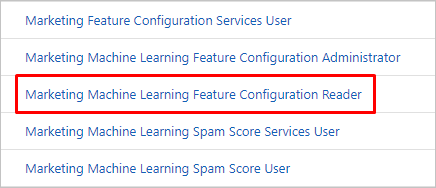

# Enable and configure artificial intelligence features

[!INCLUDE[consolidated-sku-rtm-only](../includes/consolidated-sku-rtm-only.md)]

Dynamics 365 Customer Insights - Journeys provides several artificial intelligence (AI), which include:

- **[Smart scheduler](automated-scheduler.md)**, which "learns" the days and times when each contact is most likely to be actively reading their email by analyzing the email results in your system. The more results you have in your system, and the more you use this feature, the "smarter" the system becomes.

When you first install Customer Insights - Journeys, the smart scheduler is disabled by default. This feature includes privacy settings that may affect compliance with privacy laws and regulations.

## Enable the smart scheduler in Customer Insights - Journeys settings

To enable the smart scheduler and make privacy settings for it:

1. Go to **Settings** > **Overview** > **Feature switches**.

    > [!div class="mx-imgBorder"]
    > 

1. Under **Machine learning** > **Smart scheduler**, set the **Enabled** slider to **On**.

1. For the **Consent level** setting, choose the level of consent that each contact must provide before being processed.
    - The **Smart scheduler** feature applies automated processing to data collected for each individual contact. Therefore, you probably need a required level of **(5) Profiling** to use this feature wherever certain privacy laws and regulations are in effect.

1. Select the **Save** button near the top of the page to save your settings.

The level of consent required for the smart scheduler depends on your geographic location and that of your contacts. It may also depend on the way you have set up the data-protection features of Dynamics 365 Customer Insights - Journeys. It is your organization's responsibility to ensure that you are following all applicable laws in the countries/regions where you operate. More information: [Data protection and privacy](privacy.md)

## Set security roles

Each user who needs access to the Customer Insights - Journeys AI features needs to be granted the **Marketing Machine Learning Feature Configuration Reader** role. To inspect and customize a user's security roles:

1. Open the **Settings** menu  at the top of the page and select **Advanced settings**.

1. The advanced-settings area opens in a new browser tab. Note that this area uses a horizontal navigator at the top of the page instead of a side navigator. Navigate to **Settings** > **System** > **Security**.

1. Select the **Security roles** icon.

1. You now see a list of security roles. Select a role to open the **Security role** window, which shows individual access levels for each available entity. Most entities are named intuitively to map to various features and areas of the app.

1. Ensure that the user's [**Business Unit**](business-units.md) contains the **Marketing Machine Learning Feature Configuration Reader** role.

    > [!div class="mx-imgBorder"]
    > 

[!INCLUDE[footer-include](../includes/footer-banner.md)]
