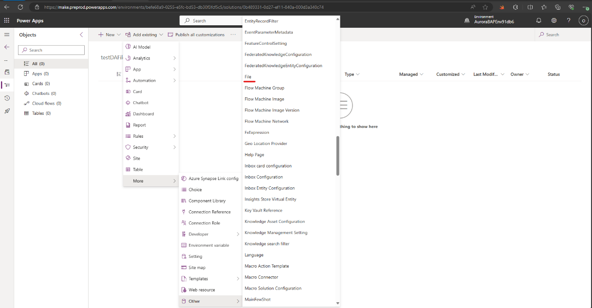
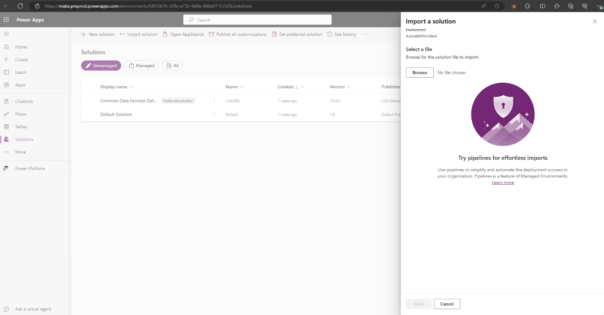

# How to use application lifecycle management for digital assets

Read this article to learn how to use application lifecycle management (ALM) for digital assets.

## Move digital assets between environments

When you use multiple Dynamics 365 environments for your application lifecycle management, ensure that you're migrating your production-ready digital assets between environments so your team can utilize them in your content.

You can learn more about the copy and restore of environments as described in [copy or restore environments](/dynamics365/customer-insights/journeys/copy-or-restore#copy-a-customer-insights---journeys-environment-to-another-environment).

## Import/export of digital assets files

To import or export digital assets, follow these steps:

### Step 1: Prepare and export your files

1. In your source Customer Insights application, click on the **settings** gear on the top right corner.
1. Click on **advanced settings**, a **power app** page opens.

1. Click on **solutions** and select **new solution**.

Choose a **name**, select a **publisher**, and then click **create**.
1. After creating a new solution, click on **add existing** > **more** > **other** > **file**.  

This opens all the files you have in your digital assets library.
1. Select the files you want to export and click **add**.
1. Go back to **solutions**, select the solution that you created and click **export solution**.
1. Click on **publish**.  
 
1. Once completed, click **next**.
1. Select **managed solution**, then click **export**.  
Managed solutions are ALM best practice and must be utilized for exporting. To learn more, see [solution concepts](/power-platform/alm/solution-concepts-alm#managed-and-unmanaged-solutions).

1. Click on **download** in the pop up to download your files.  

### Step 2: Import your digital asset files to the target environment

You need to download a zip folder to import your digital asset files to the new environment.

1. Go to your target Customer Insights environment.
1. Click on **advanced settings**.
1. Click on **solutions**.
1. Click on **import solution**.  

1. Browse and select the download zip file, then click **next**.
1. Click **import**.  
After the import is completed, you can see all your selected digital assets with their URLs referencing the target environment.

## Import/export emails that have digital assets

If you want to export emails that have references to digital assets files from one environment to another, and you want to have the links pointing to the new org, please follow these steps:

1. First, import/export your digital assets files to target environment.
1. Next, export another solution from the source environment for emails.
1. Import the solution to the new environment.  
During the import, all links within emails refer to the target environment you’re using. We’ll update the reference of the files that already exist in the target environment.

If you export and then import a solution for emails without first exporting or importing a solution for digital assets files, all the links in your emails will be referring to the source environment. If you want to fix that:

1. Go to your target Customer Insights environment.
1. Click on **advanced settings**.
1. Click on **solutions**.
1. Update the version of the solution for emails.
1. Import the solution for emails again.

> [!NOTE]
> Digital asset ALM for content blocks is not supported. This will be available in the July 2024 release.

## FAQ

*Can I add files and emails to the same solution and will that update the URLs of the files in the email?*

No. You have first to move the digital asset files then the email.

*Given that digital assets are a dependency on files, would the digital assets automatically be added to the solution if I add the email to the solution?*

No. Moving emails that have digital assets won't move the digital assets files. It’s important to move first the digital asset files then the emails.

*Can I delete digital assets from source environment after migration?*

It’s not possible to delete files from managed solutions. The reason is to ensure that your solution doesn’t have references to the deleted assets that leave you with orphan dependency. For example, emails that have a reference to digital asset. If you wish to delete digital assets, you have to delete the managed solution.
