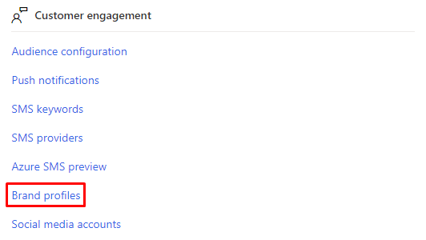
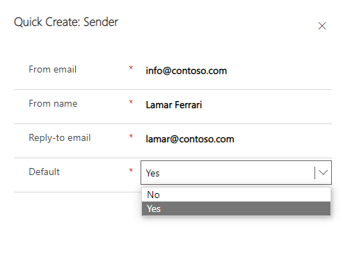
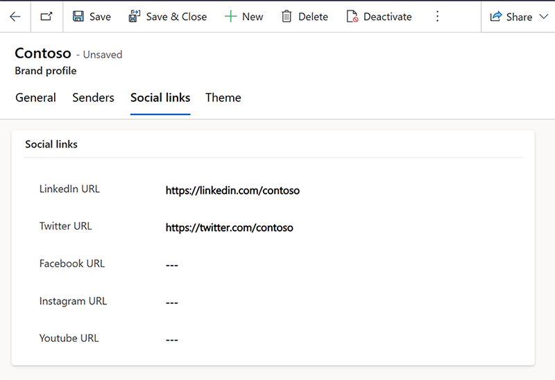
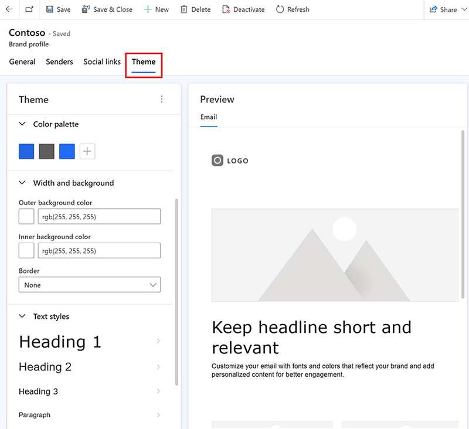

# Create consistent branding with brand profiles in Customer Insights - Journeys

[!INCLUDE [consolidated-sku-rtm-only](./includes/consolidated-sku-rtm-only.md)]

> [!NOTE]
> Unless style is explicitly set in the element properties, default style will be replaced with Email theme style.

Brand profiles allow you to create consistently branded content efficiently, even if your organization has multiple brands. You can create multiple brand profiles for your organization or profiles for each of your business units. You can also define default senders for emails and set default social links. You can even extend your brand profile entity with custom values that you can use when creating content. This article describes how to create a brand profile.

## How to enable the brand profiles preview

This article refers to a feature that is in preview and may not be enabled in your environment. If you don’t see this feature in your app, contact your admin who can activate it by going to **Settings** > **Other settings** > **Feature switches** > **Email editor** and enabling the **Brand profiles*** feature switch.

## Create a brand profile

Brand profile settings are available in the **Settings** area in the **Customer engagement** section.

> [!div class="mx-imgBorder"]
> 

To create a brand profile, select **+New** in the top navigation and define the profile's name. Optionally, you can also describe it. Make sure to save it when you're done.

> [!div class="mx-imgBorder"]
> 

### Add senders

The **Senders** tab in the brand profile allows you to define senders associated with your profile. To add senders, select the **Senders** tab then select **+New Sender**. You can add as many senders as your organization needs.

When adding a sender, specify the "From email," "From name," and "Reply-to email." You can also choose a default sender by setting the "Default" value to **Yes**. Make sure to select **Save and Close** to save the new sender.

> [!div class="mx-imgBorder"]
> 

### Define social links

To define social links for your brand profile, open the **Social links** tab and add the links you need.

> [!div class="mx-imgBorder"]
> 

After you've added your links, select **Save**.

### Define theme

Open the **Theme** tab in the brand profile and add the theme in accordance with your brand guidelines. You can specify any custom fonts in the theme section (the theme section in the email editor also contains these options). Once your theme is added, select **Save** and your theme will be automatically applied to all of the draft content that includes a brand profile. 

> [!NOTE]
> To create a theme from scratch, you can also use Copilot. [Learn more](email-theme.md)

> [!div class="mx-imgBorder"]
> 

And that’s it! Your profile is created and is ready to use in your emails. Learn more: [Use brand profiles in email](brand-profiles-email.md).

> [!IMPORTANT]
> The brand profile table is editable, so you can add new fields to it. For example, you could add fields to store URL links for more social platforms.

[!INCLUDE [footer-include](./includes/footer-banner.md)]
