# Create a marketing email and go live

> [!VIDEO https://www.microsoft.com/videoplayer/embed/17c3476e-9383-413b-98ec-0b1ac6659824]
[!INCLUDE [marketing-trial-cta](./includes/marketing-trial-cta.md)]

Email is a vital marketing channel for most modern organizations. It's also a core feature of Dynamics 365 Customer Insights - Journeys, which provides tools for creating graphically rich marketing emails with dynamic, personalized content. Customer Insights - Journeys can send large volumes of personalized marketing emails, monitor how each recipient interacts with them, drive customer-journey automation based on these interactions, and present results both for individual contacts and with aggregate statistical analytics.

> [!TIP]
> **Process overview**&mdash;to set up and execute a simple email campaign, you must do the following:
> 1. Create an email design that delivers your message and includes required elements such as a subscription-center link, your physical address, email subject, and email From address.
> 2. Publish the design by selecting **Go live**. This copies the design to the Dynamics 365 Customer Insights - Journeys email marketing service, which makes the message available for use by a customer journey (but doesn't deliver any messages yet). The go-live process also activates any dynamic code and replaces links with trackable versions that are redirected through Dynamics 365 Customer Insights - Journeys.
> 3. Set up a customer journey that, at a minimum, identifies a published target segment and a published email message to deliver to that segment.
> 4. Activate the customer journey by choosing **Go Live**. The journey then drives the email-delivery process and other automation features. It personalizes and sends each individual message, collects interaction data, and can follow up with additional processes based on those interactions.
> 
> This exercise describes how to do the first two of these steps. You'll set up the last two steps in the [next exercise](create-simple-customer-journey.md).

To create a marketing email and go live:

1. Go to **Customer Insights - Journeys** > **Channels** > **Emails**. You will see a list of existing marketing emails. Select **New** on the command bar.
    > [!div class="mx-imgBorder"]
    > 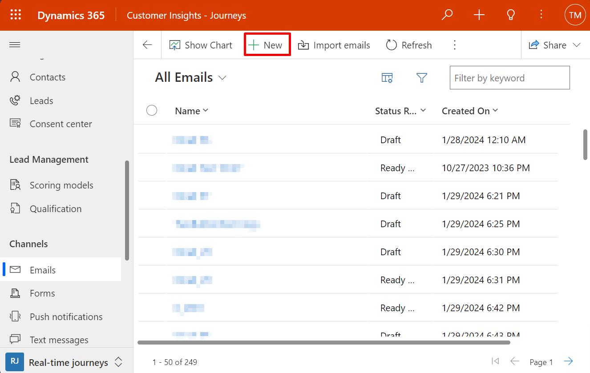

1. The **New Marketing Email** page opens with the **Select an Email Template** dialog box shown. Each template provides a starting point for designing a particular type of message. The template dialog box provides tools for searching, browsing, and previewing your template collection.

    > [!div class="mx-imgBorder"]
    > 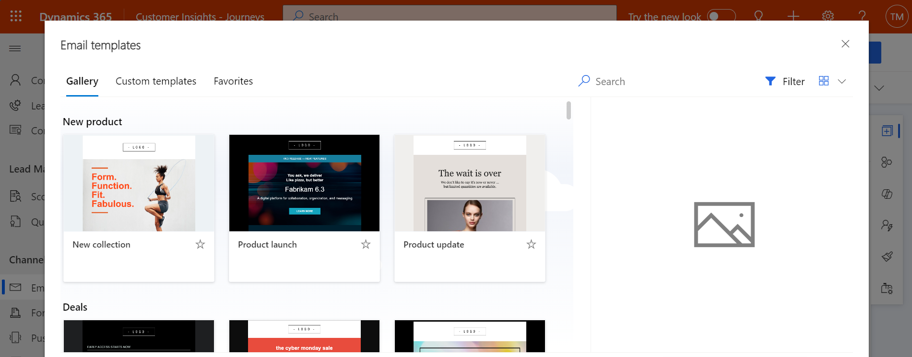

    For this exercise, select the **blank** template so that you can step through all the required content. Then choose **Select** to apply the template to your new message.

   > [!TIP]
   > Several standard templates are provided out of the box, and you can also create your own templates that feature your organization's graphical identity, required elements, and messaging standards. More information: [Create templates for emails, pages, forms, and journeys](create-templates.md)

1. The **Select an Email Template** dialog box closes and the content (if any) from your selected template is copied to your design. Select the **Header settings** button at the side of the header to open a drop-down dialog and then enter a **Name** for your new message.

    > [!div class="mx-imgBorder"]
    > 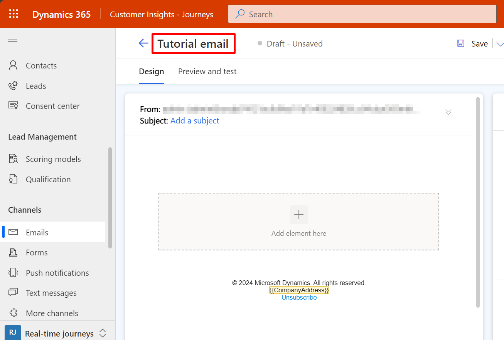

1. Enter a **Subject** for your message. The subject is an important setting because it's one of the first things recipients will see when they receive the email. Recipients may use the subject to decide whether to open or read the message. You can also specify a preheader for your message, which is shown just below the email subject in most email clients.

    > [!div class="mx-imgBorder"]
    > 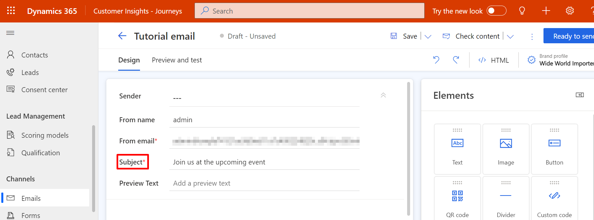

1. In the main part of the page, you now see the design canvas (on the left side), where you can drag, arrange, and enter content. If you chose the blank template, then your design includes just a single one-column section (layout) element with nothing in it. A **Toolbox** on the right side of the page provides design elements that you'll use to construct your message. Drag a **Text** element from the **Elements** tab in the toolbar into the section element. Release the mouse button to drop the element at that location.

    > [!div class="mx-imgBorder"]
    > 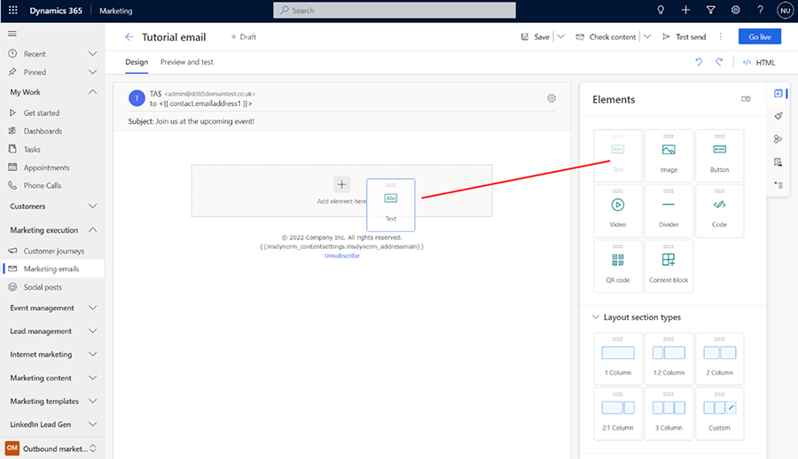

    > [!div class="mx-imgBorder"]
    > 

    You can also add elements directly on the canvas without having to navigate between the toolbar and the canvas. To do this, select the **[+] Add element here** button on the canvas and use the in-place menu to add the needed element.

    > [!div class="mx-imgBorder"]
    > 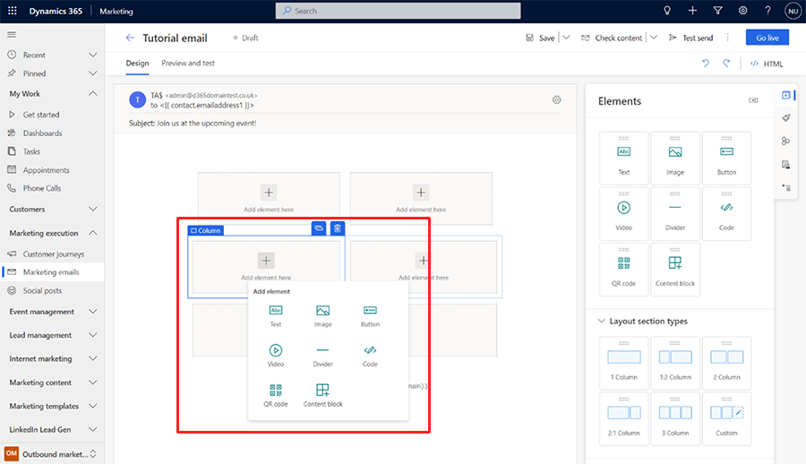

1. When you add the text element onto the canvas, you'll see a rich-text editor toolbar just below the header fields.  

    > [!div class="mx-imgBorder"]
    > 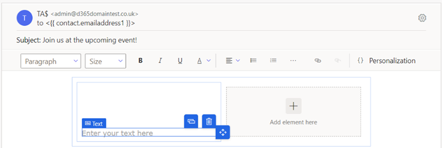

   Use the rich-text editor toolbar buttons to style your text as you would in a text editor like Microsoft Word (point to any toolbar button to see what it does). Most of the buttons are for styling text and paragraphs, but there are also buttons for creating links; adding personalized content (more on this later); and moving, copying, or deleting the entire text element.

    > [!TIP]
    > Unless you specify email preheader content in the email settings, most email clients will show the very first text that you enter in the email as preheader text. Here is how it looks in Microsoft Outlook:
    > 
    > [!div class="mx-imgBorder"]
    > 
    > 
    > Messages that come from a familiar sender that have an enticing subject and relevant preview text are much more likely to get opened than messages that have just some, or none, of those things.

1. An easy way to personalize the message is to include the name of the recipient in the greeting. Add the recipient's name as dynamic text by using the [personalization](dynamic-email-content.md#personalization) feature as follows:

    1. Working in the text element you just added, enter a suitable opening such as "Dear".

    1. On the rich-text editor toolbar, select the **Personalization** button . This opens the content assist dialog.

    1. Select the **Dynamic content** radio button, and then select **Contact** from the drop-down list. The **Dynamic content** setting means that you'll place a dynamic value related to the context where you use the message, while the **Contact** setting means that the context relates to the individual recipient (contact) of the message.

    1. Select **No relationship (Select a field from Contact)** from the second drop-down list. Choose which field you want to place. We're building the salutation, so we'd like to show the recipient's first name here. Start to type "first" into the combo box here. This searches the available fields for those that include the text "first," which greatly reduces the number of fields you need to look through. Select **First Name** from the list as soon as you can see it.

        > [!div class="mx-imgBorder"]
        > 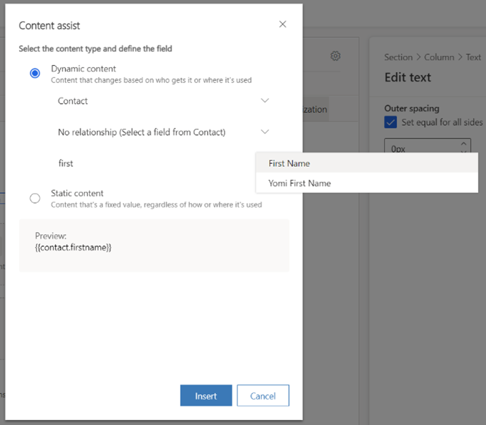

    1. Select **Insert** to place the expression you've built and close the personalization tool. The full salutation now looks like this: **Dear {{contact.firstname}},**. (If you prefer, you can enter that code directly without using content assist.)

    > [!NOTE]
    > [Calculated and rollup fields](/dynamics365/customerengagement/on-premises/developer/calculated-rollup-attributes) cannot be used for email personalization.
    
    > [!TIP]
    > You might have noticed that the **Subject** field also has a personalization button. This means that you can add personalized text (including the recipient's name) in the subject too.

1. The body of all email messages must include both a subscription-center link and your organization's physical address. These are required by law in many jurisdictions, and Dynamics 365 Customer Insights - Journeys won't let you publish any marketing email that doesn't have them. These values are provided by the [content settings entity](dynamic-email-content.md#content-settings), which enables you to store their values centrally and change them for each customer journey as needed. Therefore you'll place these as contextual dynamic values, just as you did with the recipient's name (though in this case, the relevant context is the journey rather than the recipient). Place them by using personalization as follows:

   1. Choose a suitable location for your *physical address*, and then use personalization to place it. Select **Dynamic content** and then **ContentSettings** in the first combo box/drop down field of the content assist tool. Select **No relationship (Select a field from ContentSettings)** and then pick the **AddressMain** field. Select **Insert** to place the expression `{{msdyncrm_contentsettings.msdyncrm_addressmain}}` into your message.

   2. Choose a suitable location for the *subscription-center link*, and then enter some anchor text there (such as "Manage your subscriptions"). Select the anchor text, and then select the **Link** button  from the rich-text editor toolbar, which opens the **Link** dialog box. Select the **Content assist** button  for the **Link** field. In the content assist dialog, select **Dynamic content** and then **ContentSettings** in the first field. Select **No relationship (Select a field from ContentSettings)** and then pick **SubscriptionCenter** in the third field. Select **Insert** to place the expression `{{msdyncrm_contentsettings.msdyncrm_subscriptioncenter}}` into the **Link** field.

        > [!div class="mx-imgBorder"]
        > 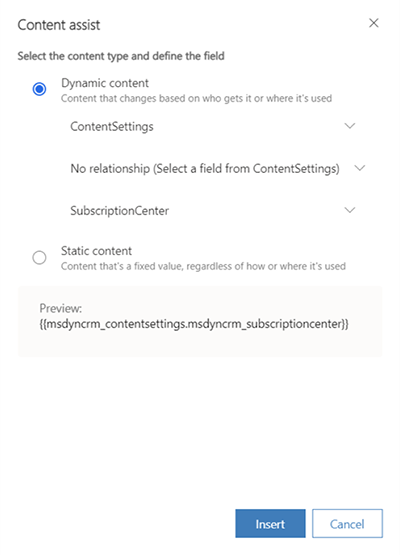

        > [!div class="mx-imgBorder"]
        > 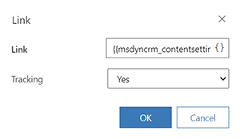

1. You should usually include at least one visible image in your design because this will invite recipients to load images, which is required for Dynamics 365 Customer Insights - Journeys to log the message-open event. Drag an **Image** element from the **Toolbox** onto the canvas. This time, when you drop the element, you'll see an image placeholder and the **Properties** tab, which shows configuration settings for the selected element.

    > [!div class="mx-imgBorder"]
    > 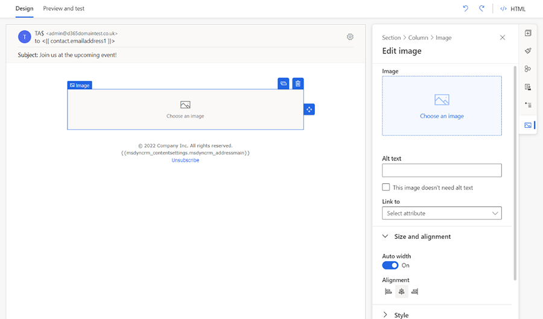

    > [!TIP]
    > You can easily navigate between the elements, columns, and sections either by using the navigation button available by the selected element on the canvas or using the breadcrumb menu in the element properties in the toolbar pane on the right side of the editor.
    >
    > 1. On canvas navigation between the elements:
    > 
    >    > [!div class="mx-imgBorder"]
    >    > 
    > 
    > 1. Breadcrumb navigation in the element properties pane:
    > 
    >    > [!div class="mx-imgBorder"]
    >    > 

1. On the **Edit image** pane, select the **Choose an image** link and the **Browse library** option from the drop-down. The **Select a file** dialog box opens.

    > [!div class="mx-imgBorder"]
    > 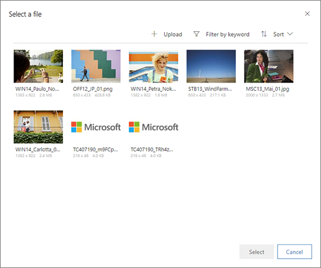  

    Here you can see all the images that have already been uploaded to your Dynamics 365 Customer Insights - Journeys server. Select an image, and then choose **Select** to place it in your message design. (If you don't see any images, choose **Upload** to add a new one.)

    > [!TIP]
    > When a message goes live, Dynamics 365 Customer Insights - Journeys uploads all relevant images from your library to its content-delivery network, where they become available as a single source to all recipients. The images aren't attached to each message, but instead are included as links that are redirected through Dynamics 365 Customer Insights - Journeys for tracking purposes. Recipients won't download any images until they open the message, which saves bandwidth both for you and them. When a recipient's email client requests the images, Dynamics 365 Customer Insights - Journeys knows that the message has been opened, and by whom.

1. Your message now includes all the minimal required and recommended content, so go to the **Preview and test** tab to see an approximation of how it will be rendered on various screen sizes and how its personalized content will get resolved.

    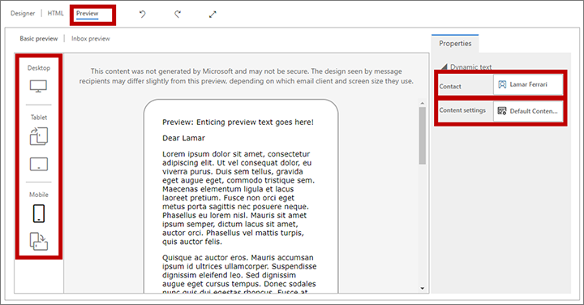  

    Use the buttons in the **Preview** pane to choose a screen size and orientation to preview. Use the **Preview as** and **Content settings** fields at the top of the preview tab to see how your personalized content will resolve for various recipients and settings.

1. To make sure your message includes all required content and is ready to send, select **Check content** in the command bar. Dynamics 365 Customer Insights - Journeys checks your message, and then displays results in the notification bar at the top of the page. If more than one error is found, then select the expansion button to see all of them.

    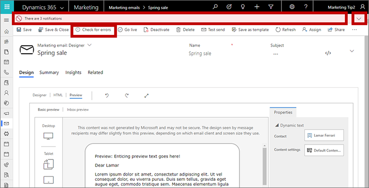

    If you followed this procedure, your message should pass the error check. If it doesn't, read the error message, fix the reported issue, and try again until it passes.

1. Until now, your previews and error checks have been simulated. The final test is to deliver the message to yourself, open it in your email program, and inspect the results. On the command bar, select **Test send**. The **Test send** dialog box opens.

    > [!div class="mx-imgBorder"]
    > 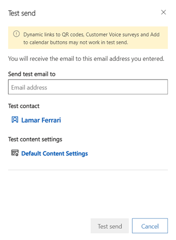

    Enter your own **Email Address** in the field provided and select the **Test contact** and **Test content settings** records to use when resolving personalized content (these work the same as for the simulated preview). Select **Test send** to send yourself the message. You should receive it in a few minutes.

1. If your message still looks good after you receive it in your inbox and open it, you're ready to publish it by selecting **Go Live** on the command bar.

    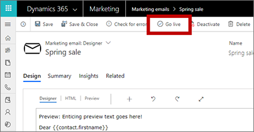

    Dynamics 365 Customer Insights - Journeys copies your design to the email marketing service, which makes the message available for use by a customer journey (but doesn't deliver any messages yet). The go-live process also activates any dynamic code and replaces links with trackable versions that are redirected through Dynamics 365 Customer Insights - Journeys (which identifies the recipient and logs the click). Finally, your message **Status reason** is updated to **Live**

    > [!TIP]
    > While the message is live, it's locked for editing in Dynamics 365 Customer Insights - Journeys. If you need to edit a live message, you must first open it in Dynamics 365 Customer Insights - Journeys, and then select **Deactivate** on the command bar.

[!INCLUDE [footer-include](./includes/footer-banner.md)]
