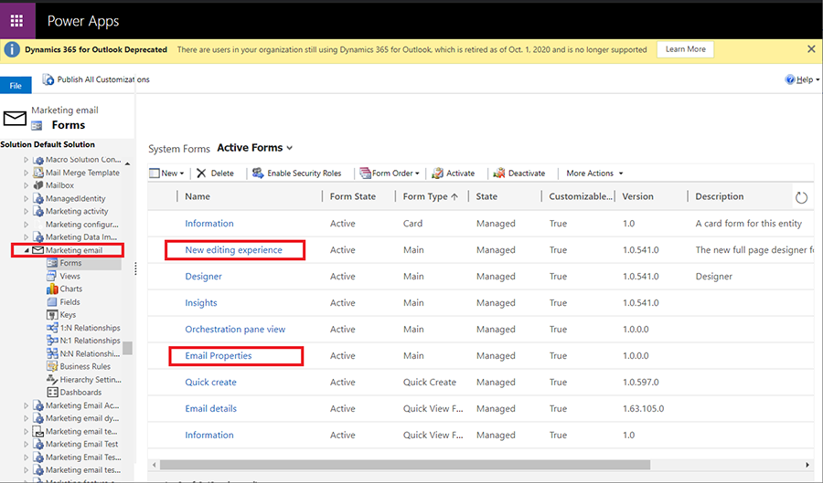
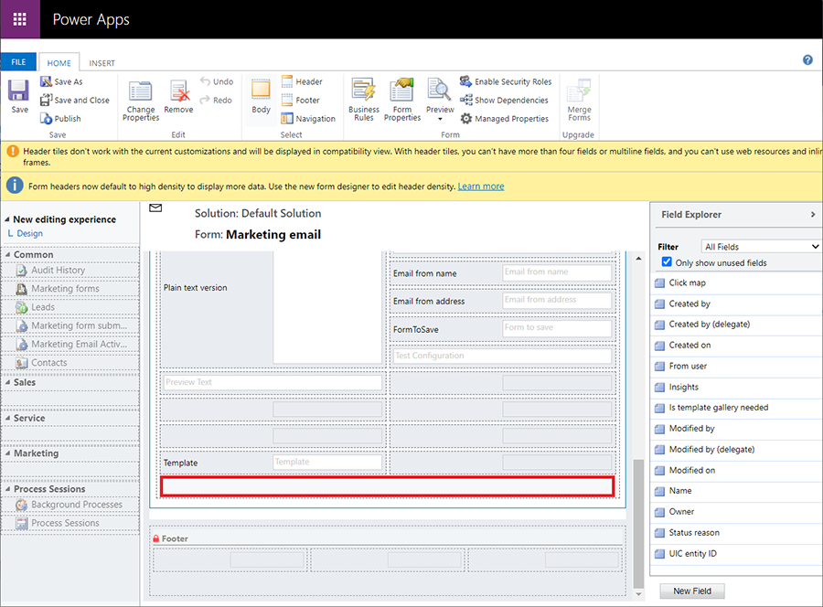

# Customize the email designer

[!INCLUDE[consolidated-sku-rtm-only](../../includes/consolidated-sku-rtm-only.md)]

The latest [email editor](../email-design.md) improves the design process by providing more screen real estate for the design canvas. You can further tailor the email designer to suit your needs by implementing your own customizations.

> [!IMPORTANT]
> As of April 2023, the following fields have been relocated from the right pane to the header area: From Name, From Address, Subject, and Pre-header. This change allows for easier access and editing of these fields.
>
> If you have customized these fields on the "Email Properties" form, you should copy the customization to the new "Email Header" form (real-time marketing form ID: 08732368-3f74-426e-9f96-595fbd6867e9, outbound form ID: e21ed42d-aa03-40b5-8dd8-57207fea78ba). Customizations may include handlers that control the visibility of these fields or react to changes in these fields.
>
> Customizations made to the main form or customizations adding new fields to the Email Property form *do not* require any action.

To customize the email designer:

1. Open the **Settings** menu  at the top of the Customer Insights - Journeys app window and select **Advanced Settings**. The advanced settings area then opens in a new browser tab. Note that this area uses a horizontal navigator at the top of the page instead of a side navigator.
1. In the **Settings** drop down menu on the left of the top bar, navigate to **Customizations**. On the page that opens, choose **Customize the System**.
1. A **Power Apps** customization pop-up window opens. Use the left panel to navigate to **Components** > **Entities** > **Marketing email** > **Forms**.
1. On the **Forms** page, locate the **Email properties** and **New editing experience** forms.
    > [!div class="mx-imgBorder"]
    > 
1. Open the **Email properties** form. You can customize the form as you would any CRM form. You can add or hide new fields and sections, change the order of the fields, or put extra logic in the WebResource handlers.
    > [!div class="mx-imgBorder"]
    > 
1. After you've made your desired changes, select **Save**.
1. Because the **Email properties** form works in the context of the main form (**New editing experience**), you must add any new attributes to the **New editing experience** form in order for the customizations to take effect. To add new attributes to the main form, open the **New editing experience** form and add any new attributes at the end. The attributes won't be visible to users.
    > [!WARNING]
    > If you add a subgrid to the **Email properties** form, you *should not* add it to the main form. If you add a subgrid targeting the same entity on both forms, the subgrids *must* have different names.

    > [!div class="mx-imgBorder"]
    > 

    > [!IMPORTANT]
    > The first field in the **New editing experience** form is reserved for the email editor. Adding any field before the first field will break the user experience.

    > [!NOTE]
    > If you enable the timeline functionality for a Customer Insights - Journeys email entity and would like to add a timeline visual to the **Email properties** form, you must also add it to the **New editing experience** form. In other words, the timeline functionality has the same requirements as field customizations.
1. Select **Save**, then **Publish** your changes.

[!INCLUDE[footer-include](../../includes/footer-banner.md)]
