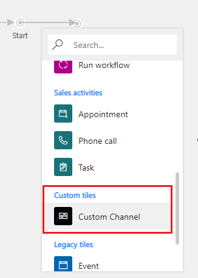

# Step 4: Test your custom channel tile

[!INCLUDE [consolidated-sku-rtm-only](.././includes/consolidated-sku-rtm-only.md)]

> [!IMPORTANT]
> This article only applies to [outbound marketing](/dynamics365/marketing/user-guide).

To make the custom channel tile available in the customer journey designer:

1. Create a solution. More information: [Create a solution](/powerapps/maker/common-data-service/create-solution).
1. Add the tile XML file as a **Data (XML)** web resource to the solution you created. The file name must end with 'CustomerJourneyDesignerTileConfig.xml’.
1. Save the solution and publish all customizations.
1. Create a customer journey to open the customer journey designer. Go to **Customer Insights - Journeys** > **Marketing Execution** > **Customer Journeys**, and then select **New**. For more information about creating a journey, see [Create a simple customer journey](../../journeys/create-simple-customer-journey.md).
    
    The tile should show up in the **Custom Content** section of the tile library in the customer journey designer.

    > [!div class="mx-imgBorder"]
    > 

> [!div class="nextstepaction"]
> [Publish custom channel on AppSource](publish-custom-channel-appsource.md)

[!INCLUDE [footer-include](.././includes/footer-banner.md)]
