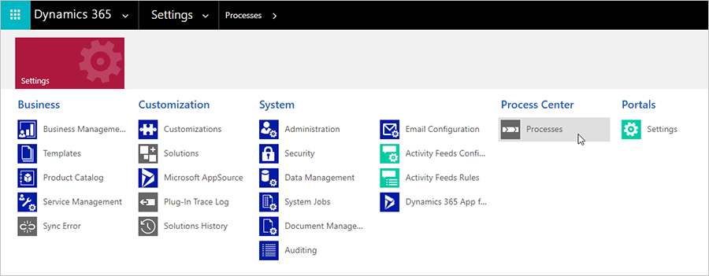
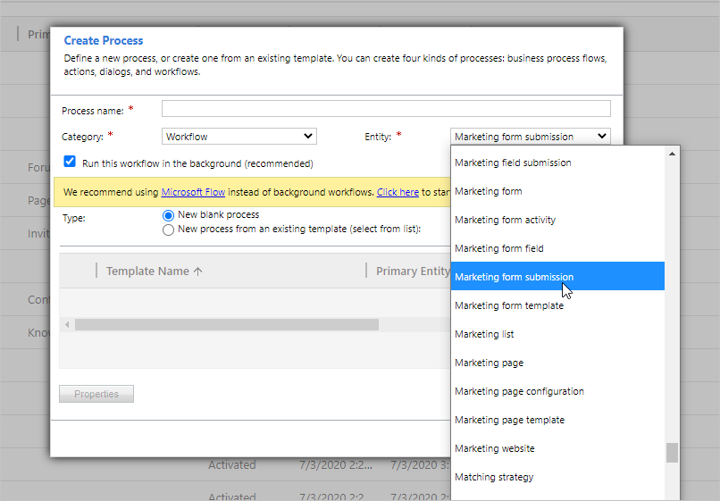
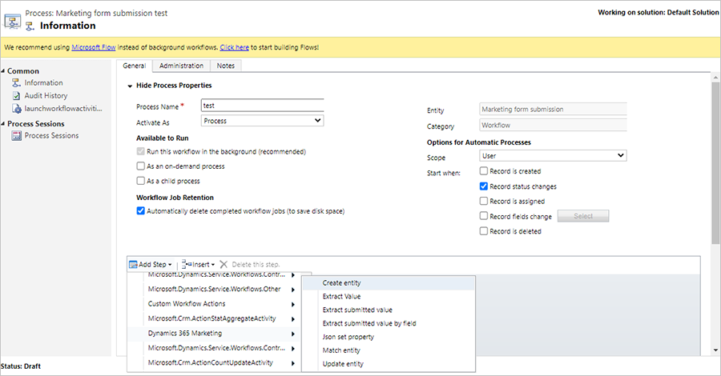
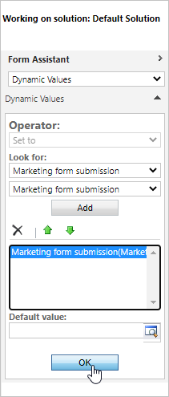
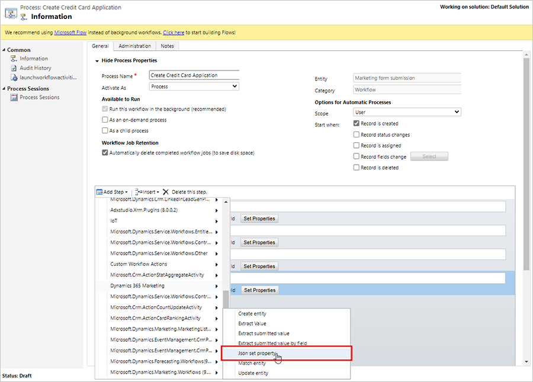
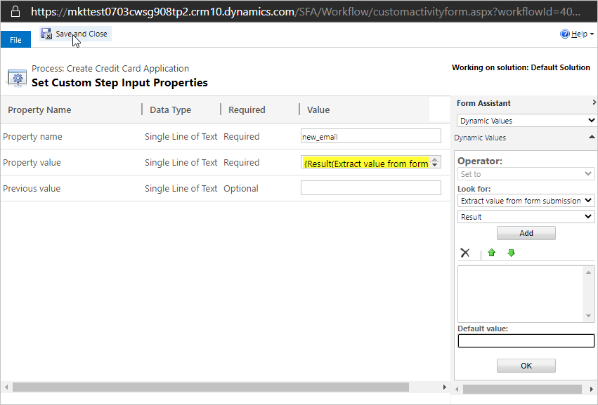
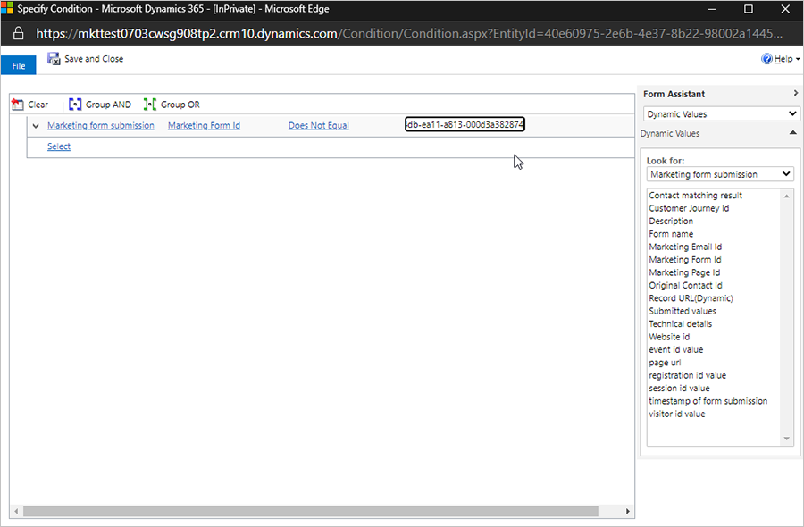

# Map form data to entities with custom workflows in outbound marketing

> [!IMPORTANT]
> This article only applies to [outbound marketing](/dynamics365/marketing/user-guide).

If you have configured a marketing form to collect form submissions without updating contacts or leads, you can create a Workflow to map the form submission data to any entity.
- Learn more about collecting form data without updating contacts or leads: [Create, view, and manage marketing forms](marketing-forms.md#do-not-createupdate-contacts-or-leads)
- Learn more about building workflows: [Use Workflow processes to automate processes that don't require user interaction](/dynamics365/customerengagement/on-premises/customize/workflow-processes)

> [!NOTE]
> You can build more advanced data flows triggered by form submissions using Power Automate. Learn more: [Overview of how to integrate Power Automate flows with Dataverse](/power-automate/dataverse/overview).

## Creating a Workflow

Create a Workflow to extract the values from a form submission. You can use this data to create a custom entity or to create or update any existing entity.

To create a Workflow:

1. In the navigation bar, go to **Settings** > **Process Center** > **Processes**.

    

1. Create new blank process, set the **Category** to **Workflow**, and add the entity that triggers your workflow. In this case, we'll add the marketing form submission.

    

1. Next, you will start adding steps to your Workflow. You will find flexible options to handle entities under **Add Step** > **Dynamics 365 Customer Insights - Journeys**.

    For example, you can start with **Extract a submitted value by field** to find a value inside a submission that you would like to store. Add a **Match entity** step to match the marketing form submission to the entity that you want to update. Add a **Json set property** step to be used in the other steps’ JSON properties.

    

## Example Workflow: Collecting credit card applications

In this example, we'll create a Workflow to update a custom entity called “Credit card applications.” The Workflow will allow a user to collect credit card applications through a marketing form and store the data under the new custom entity.

The credit card application Workflow requires the following general processes:
- Check if the submission is coming from a form the workflow can handle. The simplest method to do this is selecting submissions from a specific form.
- Extract the submitted values so that they available in the Workflow (**extract value**).
- Combine multiple values into a single structure that is suitable for entity matching or creation (**set JSON property**).
- Create an entity with properties that were set in the previous step. Alternatively, the Workflow can search for a matching entity and either update the found entity or create a new one if not found (**create entity**, **update entity**, and **match entity actions**).

The following steps detail the actions required to create the credit card application Workflow:

1. To create a custom entity, in the navigation bar, go to **Settings** > **Customize the System** > **Entities**.
1. Create a marketing form for the credit card applications containing the fields you want to use. Create fields under the new custom entity to use inside the form. Make sure the form is set to [not update contacts or leads](marketing-forms.md#do-not-createupdate-contacts-or-leads).
1. Next, you will create a Workflow to process the custom entities. Go to **Settings** > **Processes** and create a new **Workflow** process. In the **Entity** field, select the entity that triggers your Workflow. In this case, we'll select **Marketing form submission**. Then select **OK**.
1. To add a step, select **Add Step**, then go to **Dynamics 365 Customer Insights - Journeys** > **Extract submitted value by field**. This will allow you to extract a value from a form submission.
    1. Add a name for the step. We will name our step "Extract value from form submission (E-mail)."

        

    1. Select the **Set Properties** button.
    1. Next, we'll extract the email address from a submitted form. To extract the email address, go to the **Operator** pane and select **Marketing form submission** in the **Look for:** drop down menu. Then, select the **Add** button in the **Operator** pane. To add the dynamic value to the form submission property, select the **OK** button.

        

    1. To select the desired field to extract from the lookup, select **E-mail** under the **Value** column for the **Marketing form field** property.

        

1. Next, to match the result of the extracted e-mail value to the logical name of the e-mail entity in the CRM database, go to **Add Step** > **Dynamics 365 Customer Insights - Journeys** > **Json set property**.
    
    To find the logical name of the entity, go to **Customize the System** > **Entities**, and open the relevant entity. The logical name is the **Name** field of the entity.

      

1. Continue adding the previously set JSON values one by one.
    1. Insert the logical name.
    1. Insert the result from the **Extracted value from** field.
    1. Choose a previous JSON value to add on top of the extracted value. This ensures that you will combine all of the JSON entries into a combined value that will be used at the end.

        

1. Select the **Save and Close** button.
1. To create a credit card application record that results from each form submission, select **Dynamics 365 Customer Insights - Journeys** > **Create Entity**. Set the **JSON properties** value column to **Result of the last JSON set property**.
1. To insert an initial step into your process to filter submissions to only those coming from the form that is collecting the credit card applications, select **Add Step** > **Check condition**.

      

    1. Open the dropdown menu and select **Primary Entity** > **Marketing form submission**.
    1. Go to the marketing form you are using for the credit card application and find the **Form ID** in the form page URL.

          

    1. Place the **Form ID** into the condition step in the Worklflow.

          

    1. To find the specific form, you can set the condition logic to **Marketing form ID** to check if it is equal to the specific form ID. If yes, run the Workflow. If not, add a step to stop the Workflow with the reason for cancellation.

          

<!-- 1. You can find the submissions related to your custom entity by selecting the **Advanced find** button  on the top ribbon in the Customer Insights - Journeys app. In each submission, you can find submission values under the **Form** > **Submissions** tab. -->

[!INCLUDE [footer-include](./includes/footer-banner.md)]
