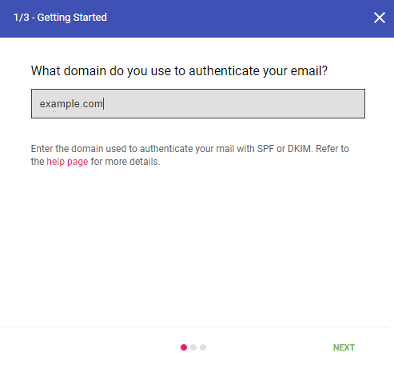
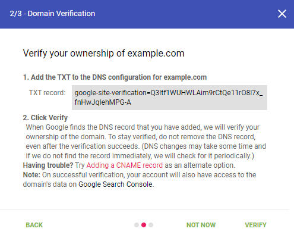
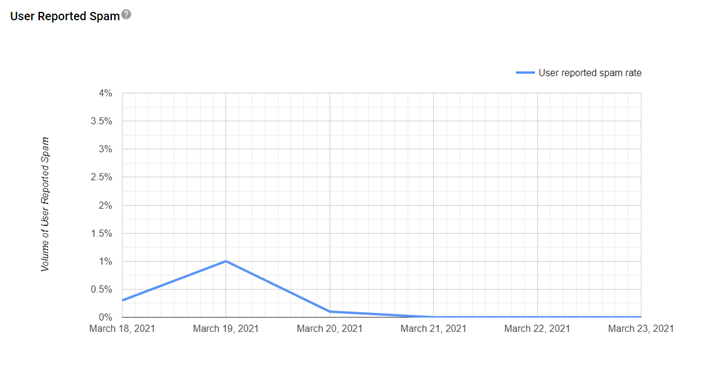
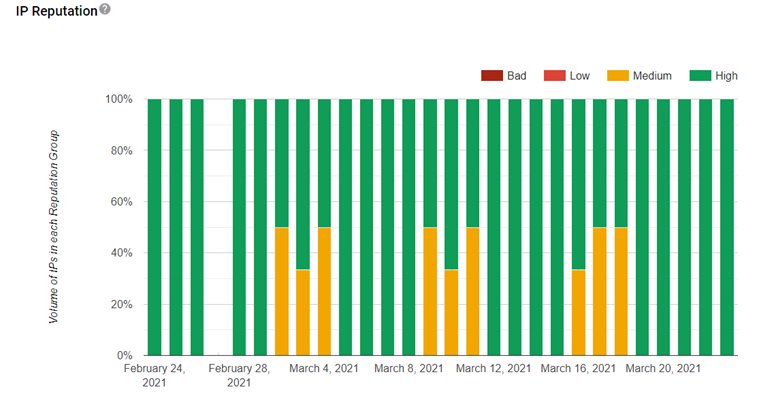
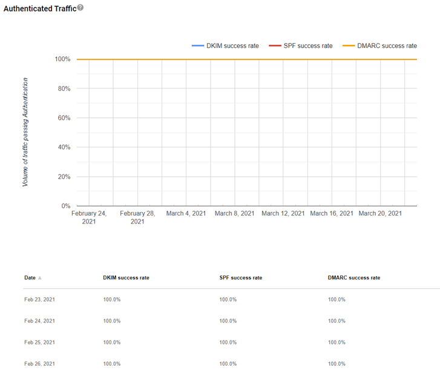
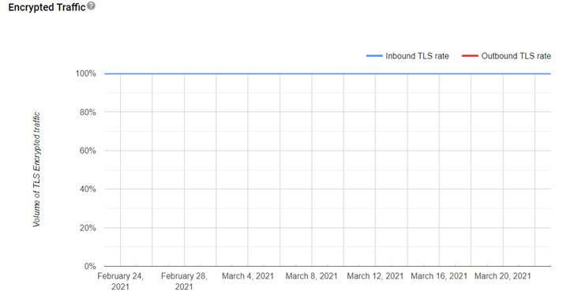
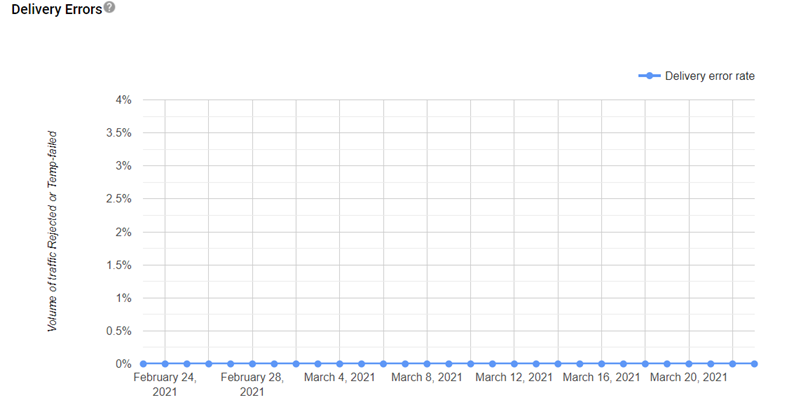

# Google Postmaster Tools - What it's and how it can help you

[!INCLUDE[consolidated-sku-rtm-only](./includes/consolidated-sku-rtm-only.md)]

Google Postmaster Tools is an awesome resource that allows senders to troubleshoot deliverability hiccups. The tools deliver essential insights into important metrics that can identify problem areas in email sending practices.

According to Gmail, using these tools can determine the health of your email program.

Even if Gmail isn't your primary target, understanding how your mail is viewed by Gmail can give you a better understanding of how you're perceived elsewhere.

Once you get set up and running, Google gives insights into several data points organized into different dashboards.

- Spam rate
- IP reputation
- Domain reputation
- Authentication
- Encryption
- Delivery errors

In this guide, we show you how to:

- Set up Google Postmaster Tools
- Interpret the dashboards

## Getting access to Google Postmaster Tools

> [!NOTE]
> To use Postmaster Tools, you need to have a Google account ([Google Workspace](https://workspace.google.com) or a Gmail address). If you don’t have a Google Account, you’ll need to create one.

After you have created a Google account, log in to [https://postmaster.google.com](https://postmaster.google.com). We recommend creating a new, custom Gmail account, which can be easily shared among users.

After selecting **Get started**, you'll be asked to add your domain:

> [!div class="mx-imgBorder"]
> 

Select **Next**. Now, it’s time to verify the ownership of your domain.

> [!div class="mx-imgBorder"]
> 

Access your DNS record, and add the TXT record provided by Google. Once completed go back to Google Postmaster and select **Verify**.
 
If the TXT record is not found, check that the TXT was added correctly and try again. If you have issues adding the TXT record, Google offers a second verification method that involves adding a CNAME record.

Once the DNS records have been properly published, you'll see the domain status flip to **Verified**.

> [!div class="mx-imgBorder"]
> 

## Understanding Google Postmaster dashboards

> [!NOTE]
> There a minimum daily email volume threshold for data to populate in the Google Postmaster Tools. Google doesn’t publish the specific threshold, but we’ve found that if you are sending over 100 messages per day to unique Gmail users, reputation data will be generated for that day.

Reports generated by Google update daily, providing insights into the prior day’s performance. All data is aggregated. Instead of giving you a score (for example, 0 to 100), Google gathers the results inside groups ranked from **Bad** to **High**.

## Interpret numbers on the dashboard

### Spam rate

The spam rate is the percentage of emails marked as spam by users versus emails sent to the inbox for active users. If a substantial number of emails are delivered directly to spam folders, you may see a low spam rate, even though users may still be marking your inboxed emails as spam.

> [!div class="mx-imgBorder"]
> 

### IP reputation

A higher IP reputation means emails sent from this IP are more likely to go to a recipient’s inbox instead of their spam folder. For example, if you send a lot of emails, and users mark them as spam, your IP reputation number will go down.

To reduce negative user feedback, you should regularly check your sending list. Be sure to only send emails to users who want them. If you have mixed categories (Bad/Low/Medium/High), you can identify which sending IPs are in each category by selecting the bar color.

The definitions of spam below include email detected as spam by Gmail’s spam filter, and mail reported by users as spam.

- **Bad:** A history of sending a high volume of spam. Email coming from this entity will almost always be rejected at connection time or marked as spam.
- **Low:** Known to send a considerable volume of spam regularly. Email from this sender will likely be marked as spam.
- **Medium/Fair:** Known to send good email, but has occasionally sent a low volume of spam. Most of the email from this entity will have a fair deliverability rate, except when there’s a notable increase in spam levels.
-   **High:** Has a good track record of a very low spam rate, and complies with Gmail's sender guidelines. Email will rarely be marked by the spam filter.

> [!div class="mx-imgBorder"]
> 

### Domain reputation

A higher domain reputation means emails from your sending domain are less likely to get filtered to a recipient’s spam folder or inbox.

The definitions of spam below includes mail detected as spam by Gmail’s spam filter, and mail reported by users as spam.

- **Bad:** A history of sending an enormously high volume of spam. Email coming from this entity will almost always be rejected at SMTP or marked as spam.
- **Low:** Known to send a considerable volume of spam regularly. Email from this sender will likely be marked as spam.
- **Medium/Fair:** Known to send good email, but has occasionally sent a low volume of spam. Most of the email from this entity will have a fair deliverability rate, except when there’s a notable increase in spam levels.
- **High:** Has a good track record of a very low spam rate, and complies with Gmail's sender guidelines. Email will rarely be marked by the spam filter.

> [!div class="mx-imgBorder"]
> 

### Feedback loop

Currently, Dynamics 365 Customer Insights - Journeys doesn't offer this feature, however we're working on getting this data available to our senders.

### Authentication

This dashboard shows the percentage of your emails that passed SPF, DKIM, and DMARC over all received traffic that attempted authentication.

- **SPF graph:** Shows percentage of email that passed SPF versus all email from that domain that attempted SPF. This excludes any spoofed email. 
- **DKIM graph:** Shows the percentage of email that passed DKIM versus all email from that domain that attempted DKIM.
- **DMARC graph** (only if you have a valid DMARC record published): Shows percentage of email that passed DMARC alignment versus all email received from the domain that passed either of SPF or DKIM.

> [!div class="mx-imgBorder"]
> 

### Encryption

This dashboard shows what percentage of your inbound and outbound traffic is encrypted.

> [!IMPORTANT]
> The Encryption graph should show a consistent 100%. If not, please reach out to our [Email Deliverability team](mailto:dynmktdeliverability@microsoft.com).

- **TLS Inbound:** Shows the percentage of incoming email (to Gmail) that passed TLS versus all email received from that domain.
- **TLS Outbound:** Shows the percentage of outgoing email (from Gmail) that was accepted over TLS versus all email sent to that domain.

> [!div class="mx-imgBorder"]
> 

### Delivery errors

This graph monitors what percentage of your total emails were rejected or temporarily failed as compared to all authenticated traffic. Under the graph, you can view a list of reasons an email failed.

- **Rate limit exceeded**: The Domain or IP is sending traffic at a suspiciously high rate and temporary rate limits have been put in place.
- **Suspected spam**: The traffic is suspected to be spam by Gmail.
- **Email content is possibly spammy**: The traffic is suspected to be spammy specifically because of the content.
- **Bad or unsupported attachment**: Traffic contains attachments not supported by Gmail.
- **DMARC policy of the sender domain**: The sender domain has set up a DMARC rejection policy.
- **Sending IP has a low reputation**: The IP reputation of the sending IP is very low.
- **Sending domain has a low reputation**: The Domain reputation of the sending domain is very low.
- **IP is in one or more public RBLs**: The IP is listed in one or more public [Real-time Blackhole Lists](https://en.wikipedia.org/wiki/DNSBL) (RBLs). Work with the RBL to get your IP de-listed.
- **Domain is in one or more public RBLs**: The Domain is listed in one or more public [Real-time Blackhole Lists](https://en.wikipedia.org/wiki/DNSBL). Work with the RBL to get your domain delisted.
- **Bad or missing PTR record**: The sending IP is missing a PTR record.

> [!div class="mx-imgBorder"]
> 

That’s pretty much it. We hope this helps you getting Google Postmaster Tools up and running. If you need more insights into these tools, let us know. We can help.

[!INCLUDE[footer-include](./includes/footer-banner.md)]
