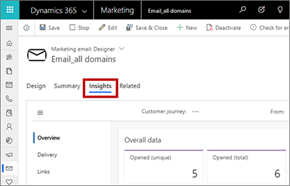
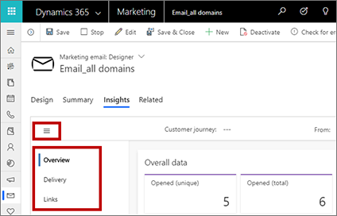
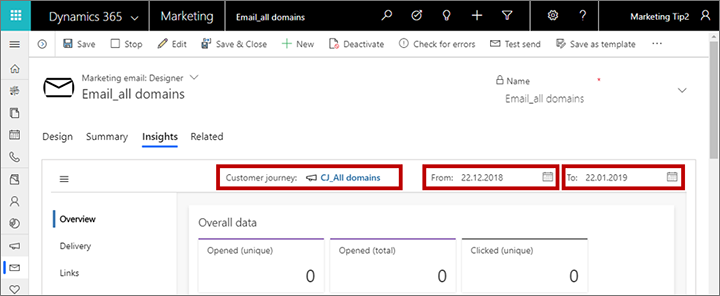
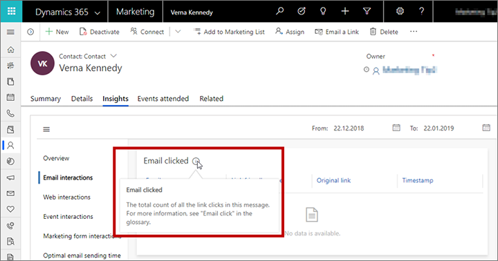
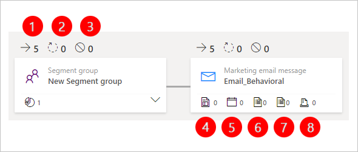
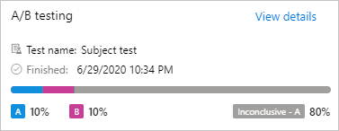

# Analyze results to gain insights from your marketing activities

> [!IMPORTANT]
> This article only applies to [outbound marketing](/dynamics365/marketing/user-guide).

Dynamics 365 Customer Insights - Journeys keeps track of the way your contacts react to your marketing initiatives and provides detailed analytical views to help you understand your impact and learn what works best. Each of the following entities provides statistics, analytics, and key performance indicators (KPIs) based on your marketing results:

- Contacts
- Leads
- Segments
- Customer journeys
- Email messages
- Lead scoring models
- Marketing pages
- Marketing forms
- Websites
- Redirect URLs

> [!NOTE]
> To learn how to access and interpret analytics in Customer Insights - Journeys, see the [Access and interpret analytics](real-time-marketing-analytics.md) article.

## Open and use the insights

For nearly all entity types, you can view related results and analytics by opening a record and then switching to the **Insights** tab.

> [!IMPORTANT]
> Marketing analytics are processed in less than 10 minutes per 100,000 items (emails sent, contacts, etc.). Processing, however, can take up to 1 hour, especially when processing a large number of items. For example, 1,000,000 items may take up 6 hours to process. The processing speed decreases when the number of items exceeds the maximum limit listed in the [fair use policy](fair-use-policy.md).

### Move between insight categories

Some **Insights** tabs include two or more categories of insights. You can navigate between these categories by using the vertical navigator at the side of the page. Use the **Menu** button  at the top of the tab to open or close the navigator.

### Filter insights by date range and usage

At the top of most insights tabs, you'll find settings that let you filter the information shown, for example, by date (**From** and **To** settings) or usage (such as which **Customer journey** an email was used in).

### Read and understand insights and KPIs

When you're reviewing your insights, you'll see graphs, timelines, and values for a wide variety of results, interactions, and key performance indicators (KPIs). To learn more about what each display is telling you, hover your mouse pointer near the value you're interested in until the info icon  appears, then hover on this icon to view a tool tip with a description of that value.

For more information about many of the most-used insights and how they are calculated, see the [Insights glossary](insights-glossary.md). Many of the tool tips also reference this glossary.

## Contact insights

To view contact insights, go to **Outbound marketing** > **Customers** > **Contacts**, select a contact record, and then open its **Insights** tab.

Here you can find a complete history of how your selected contact has interacted with your marketing initiatives. This can help you to understand what this specific contact is interested in and which types of messages they respond to. Marketers might use this information to get deeper knowledge about specific decision makers so they can better target future initiatives, while salespeople might use this to find out how best to talk to this person should they choose to contact them directly.

Contacts provide the following [insights categories](#categories):

- **Overview**: View a timeline of all interactions the contact has made and a chart of interactions broken down by type.
- **Email interactions**: View complete details of email results for the selected contact, including a list of all messages sent to them, plus lists of all opens, clicks, bounces, and more.
- **Web interactions**: See which pages and links from your websites and marketing pages the contact has opened, and which links they selected. Also lists each redirect URL this contact has clicked on.
    > [!NOTE]
    >- Only pages that include a [Dynamics 365 Customer Insights - Journeys tracking script](register-engagement.md#monitor-visitors) are counted here.
    > - The **Websites visited** list shows all tracked pages that were visited by this known contact.
    > - The **Websites clicked** list shows all of the links this user clicked on when viewing a tracked page. Each visited link is show as a full URL, and repeat visits are listed just once, with a counter.
    > - If you [embed a marketing form](embed-forms.md) into an external webpage, a tracking tag is included and visits to that page are therefore shown here.
    > - Results from anonymous visits and redirect-URL clicks that occurred prior to becoming a known contact are shown as insights against the known contact.
- **Event interactions**: See a timeline of event interactions, and event registration, check-in, and cancellation records for the current contact.
- **Marketing form interactions**: See which marketing forms the contact has submitted and the content of each submission.
- **Subscription list interactions**: See which subscription lists the contact joined or left, and when.
- **Email open times**: See the days and times when the contact usually opens your emails and how long they usually wait before opening them. This information also informs the [automated scheduling feature](automated-scheduler.md), which adds a **Predicted best send times** chart here when enabled.

## Lead insights

To view lead insights, go to **Outbound marketing** > **Customers** > **Leads**, select a lead record, and then open its **Insights** tab.

Most of the insights displayed for a lead are the same as those shown for contacts and are taken from the contact record associated with the current lead, as previously described in [Contact insights](#contact-insights). One exception to this is the **Overview** tab, which also tracks lead-specific information such as the lead's age (how long the record has been active) and its progress over time.

For leads associated with an account rather than a single contact, the insights combine interactions made by all contacts that belong to that account.

> [!NOTE]
> Because interaction records relate only to contact records, not lead records, most insights are only available for leads that are associated with a contact record (or with an account record, which itself relates back to contact records). More information: [Use leads to register and track expressions of interest](manage-customer-information.md#leads-in-marketing)

## Account insights

To view account insights, go to **Outbound marketing** > **Customers** > **Accounts**, select an account record, and then open its **Insights** tab.

Most of the insights displayed for an account are the same as those shown for contacts as previously described in [Contact insights](#contact-insights), except that subscription list interactions are not provided. These insights represent the combined interactions of all contacts associated with that account (these are contacts that have that account listed as their **Account name**; they usually represent employees of that company).

> [!NOTE]
> The Account's Insights will only display interactions that occurred after the Contact was associated with the Account. Any interactions that occurred before this association will not be shown.

## Segment insights

To view segment insights, go to **Outbound marketing** > **Customers** > **Segments**, select a segment record, and then open its **Insights** tab. Here you can see how the membership of your selected segment has changed over time.

  

## Customer journey insights

To view customer journey insights, go to **Outbound marketing** > **Marketing execution** > **Customer journeys** and select a journey. Journeys show some insights on the **Designer** tab and others on the **Insights** tab. Insights are only available for customer journeys that are (or have been) live.

Customer journeys provide three [categories of insights](#categories): **Designer**, **Insights** > **Overview**  and **Insights** > **Incomplete journeys**.

### Designer insights

For live journeys, the **Designer** tab is a read-only version of your journey pipeline. It looks the same here as when you were designing the journey, but now it presents results and doesn't include a toolbox or editing controls. Above each tile, you can see an overview of how contacts flowed through that tile, as shown in the following illustration. By inspecting these values, you can get a quick overview of how your various contacts flowed through the structure, which path they chose, and which problems they may have had. (Each of these KPIs is also shown in the **Data** panel when a tile is selected.) 

Below email tiles, you'll see the dependencies for the email.

Legend:

1. **Inflow**: Shows the number of contacts who entered this tile (only displayed in the old designer).
1. **Processing**: Shows the number of contacts that are still being processed by this tile. For example, they may be waiting on a trigger tile until the trigger condition (or timeout period) is met.
1. **Stopped**: Shows the number of contacts that were stopped from continuing the journey at this tile. There are two main reasons that a contact might get stopped: they got added to the journey's suppression segment, or they lowered their consent level below the minimum threshold set for the journey.
1. **Marketing page**: Shows a marketing page dependency (only displayed in the old designer).
1. **Event**: Shows an event dependency (only displayed in the old designer).
1. **Customer Voice survey**: Shows a Customer Voice survey dependency (only displayed in the old designer).
1. **Dynamics 365 Customer Voice survey**: Shows a Dynamics 365 Customer Voice survey dependency (only displayed in the old designer).
1. **Marketing form**: Shows a marketing form dependency (only displayed in the old designer).

For even more information about what happened on a tile, select it from the pipeline and look at the **Data** panel. The information shown here depends on the tile type.

All types of tiles provide a **Volume** section on the **Data** panel with the following information:

- **Volume** > **Total**: Shows the total number of contacts in the tile in all states. Processed , processing and not processed.
- **Volume** > **In progress**: Shows the total number of contacts in progress. This number is the total of the following:
  -  **Processing**: Counts how many contacts are still waiting for the tile to finish processing them. For trigger tiles, for example, this value indicates the number of contacts that are waiting for the trigger condition to be met or for the timeout to arrive.
  -  **Queued**: Shows the number of contacts in the customer journey that have not yet reached the selected tile.
- **Volume** > **Not processed**: Shows the total number of contacts that have already entered the tile but are not processed due to one of the following reasons:
  - **Stopped**: Counts the number of contacts that were stopped from continuing the journey at this tile. There are three reasons that a contact might get stopped at a tile during a journey: (1) they [unsubscribed](customer-journeys-create-automated-campaigns.md#target-subscription-list) from the mailing list targeted by the journey, (2) they got added to the journey's [suppression segment](customer-journeys-create-automated-campaigns.md#general-options), or (3) they lowered their [consent level](privacy-use-features.md#view-and-set-the-consent-level-for-each-contact) below the [minimum threshold](privacy-use-features.md#set-the-minimum-required-consent-level-for-a-customer-journey) set for the journey. The stopped value is also displayed as the second value above the tile in the pipeline. Some tile types provide a **Save as segment** button  here; select this button to [generate a segment](generate-segment-from-journey.md) that includes all contacts that were stopped at this tile in the journey. You can see a detailed breakdown of which contacts were stopped here and why by going to the [Incomplete journeys](#incomplete) view.
  - **Expired**: This value is only used for email tiles (for other tiles, the value is always zero). It shows the number of contacts that expired in the email tile. A contact expires when an [email expiration](email-expire.md) date is set for the tile. 
- **Volume** > **Processed**: Counts the number of contacts that were successfully processed by the tile and passed on to the next tile. Some tile types provide a **Save as segment** button  here; select this button to [generate a segment](generate-segment-from-journey.md) that includes all contacts that were successfully processed by this tile in the journey. This value is also displayed as the first value shown above the tile in the pipeline.

In addition to the **Volume** section, some tiles also show additional sections and links in the **Data** panel, depending on the tile type. These can include the following:
)

- **KPIs**: For tile types that collect key performance indicators (KPIs), such as email tiles, you can read detailed results here. For more information about many of the terms that might be shown here, see the [Insights glossary](insights-glossary.md).
- **Paths**: Trigger and splitter tiles include this section, which tells you how many contacts went down each available path.
- **View details**: This link is provided on the **Data** panel for tile types that have even more information available. Select this link to open the associated record, where you can explore its full insights panels. For example, email and event tiles provide this link, which opens the insights panels for the specific message or event associated with the tile.

The Insights tab for A/B test email tiles has a special section above the **Volume** section that shows the progress of any live A/B tests. The percentages show the percent of contacts in the segment each test email message will go to, as well as the percent of contacts that will receive the winning email message.

In the screenshot below, 10% of contacts received message A, 10% received message B, and the remaining 80% received the inconclusive default, which was set to message A.

### Insights > Overview

Open the **Insights** tab and select **Overview** to view basic email results, plus information about how many contacts interacted with the emails and marketing pages used by this journey.

  

### Insights > Incomplete journeys

When you're analyzing the results of a customer journey, one of the most important things to find out is whether all your messages were delivered as expected&mdash;and if not, who was affected and what went wrong?

Open the **Insights** tab and select **Incomplete journeys** to view each reason why a contact might fail to complete the journey and lists each contact that falls into each of these categories for the current journey.

#### Stopped contacts

*Stopped contacts* are contacts that got stopped in the middle of a journey. Contacts will stop their journey as soon as any of these situations occur, so no further messages or other journey actions will be applied thereafter to the affected contact(s). A contact can get stopped for any of the following reasons:

- **Contact joined the suppression segment**: The contact joined the suppression segment for the customer journey.
- **Contact lowered consent below threshold**: These are contacts that lowered their data protection consent level, and are now below the minimum level of consent for this journey. This is an important part of compliance with certain privacy laws and regulations. More information: [Data protection and privacy](privacy.md).
- **Contact lowered external consent below threshold**: This is the same a Contact content not given but applies when consent is being managed by an external system rather than the internal one provided with Customer Insights - Journeys.

Select a reason in the left column of the table to see a list (in the right column) of contacts that were stopped for that reason.

#### Blocked emails

A *blocked email* is a message that the system didn't attempt to send even though it was scheduled. Usually, this is related to contact preferences or a technical problem with the message itself, such as missing data or a missing setting. Contacts will continue on the journey even if a message gets blocked, so later messages might still get sent successfully. A message might get blocked for any of the following specific reasons:

- **Contact has do-not-email set**: A setting on the [contact record](manage-customer-information.md) indicates that that contact doesn't wish to receive marketing email (or any email) from your organization.
- **Duplicate recipient address**: The journey already sent the message to this email address. You probably have more than one contact record with the same email address.
- **Recipient address isn't valid**: There is something wrong with the recipient address (such as no "@"), which means that the message can't be delivered.
- **Sender address isn't valid**: The email is designed with a sender address that is blank or malformed. This may affect your entire send (if you are using an invalid static address or expression), or it may affect just a few messages if you are using a dynamic expression that only fails for some contacts for which data is invalid or missing.
- **Reply-to address isn't valid**: Same as for the invalid sender address, but this applies to the reply-to field.
- **Email contains block listed links**: Customer Insights - Journeys analyzes the content of outgoing messages to make sure they don't contain any blaok listed links. If one is found, the message is blocked. The system keeps an internal list of block listed sites that are known to be used for phishing, hosting malware, and other issues. This feature helps make sure that you don't accidentally include a link to one of those sites in your marketing messages.
- **Email is missing required fields**: A required field (such as the subject) contains no value. Usually, this type of error would be found when you error-check the message, but if you are using a dynamic expression on a required filed, then the expression could fail to evaluate for some or all recipients.
- **Contact deleted**: The target segment included a contact that has since been deleted.
- **Contact is inactive**: The target segment included a contact that has been set to inactive.
- **Insufficient email credits**: Your organization has used up your email credits for the month. More information: [Quota limits](quota-management.md)

Select a reason in the left column of the table to see a list (in the right column) of contacts that weren't sent a message for that reason.

  

## Email insights

To view email insights, go to **Outbound marketing** > **Marketing execution** > **Marketing emails**, select an email message, and then open its **Insights** tab. Insights are only available for email messages that are (or have been) live.

Here you can find a complete history of how various contacts have reacted to the selected message, which links they selected, and where they were when interacting with the message. You can also see delivery details.

Because you can reuse an email message in several different journeys, the [filter settings](#filter) for email insights include a field for specifying which journey you would like to analyze. If you don't select a journey, then the information you see applies to all journeys where the message was used. As with most other entities, you can also filter email insights by date range.

Marketing email messages provide the following [categories](#categories) on the **Insights** tab:

- **Overview**: Provides a general overview that includes KPIs, top-10 links, responses over time, geographical data, and more.
- **Delivery**: Provides details about your delivery results (such as processed, delivered, blocked, or bounced), including lists of contacts affected by each type of result. There is also a table of overall results by recipient domain.
- **Links**: Provides an analysis of each link included in the message. It includes a graphical reproduction of the message that shows a heat map highlighting your links. The heat map shows a red overlay to indicate the most clicked link, and follows the spectrum down to blue, which indicates the least clicked link. Hover your mouse pointer over a link to see the number of total clicks, unique clicks, and the click-through rate (total number of unique clicks for a given link divided by the total number of unique clicks overall). Use the drop-down list at the top of the heat map to choose which KPI to use when coloring the links. All links are also listed in a table below the heat map.
- **Interactions**: Provides full lists of recipients that were counted for each of several KPIs (such as opens, clicks, and forwards), plus a timeline of interactions.

For more information about the carious types of email results and KPIs listed on these pages, see [Insights glossary](insights-glossary.md).

> [!NOTE]
> Date filtering doesn't apply to top-10 links or links insights.

## Lead scoring model insights

To view lead scoring model insights, go to **Outbound marketing** > **Lead management** > **Scoring models**, select a model, and then open its **Insights** tab. Insights are only available for models that are (or have been) live.

Here you can find a timeline showing the number of leads processed by the model over time.

## Marketing page insights

To view marketing page insights, go to **Outbound marketing** > **Internet marketing** > **Marketing pages**, select a marketing page, and then open its **Insights** tab. Insights are only available for pages that are (or have been) live.

Here you can find a complete history of how various contacts have interacted with the page and the submissions made using it.

Because you can reuse each marketing page in several different journeys, the [filter](#filter) controls for page insights include a field for specifying which journey you would like to analyze. If you don't select a journey, then the information you see applies to all journeys where the page was used. As with most other entities, you can also filter marketing page insights by date range.

Marketing pages provide the following [categories](#categories) on the **Insights** tab:

- **Overview**: Provides a general overview that includes KPIs, responses over time, geographical data, and more.
- **Submissions**: Provides a table that lists the full content of each submission made through the page. Metadata and several important field values are shown in the table columns for each submission; hover your mouse pointer over a value in the **Form submissions** column to open a tooltip that shows all values included in a given submission.
- **Visits**: Provides a table that lists information about each time the page was opened.

## Marketing form insights

To view marketing form insights, go to **Outbound marketing** > **Internet marketing** > **Marketing forms**, select a form, and then open its **Insights** tab. Here you can find a complete history of how various contacts have interacted with the form and the submissions made using it.

Although you can use each form on multiple pages and in multiple journeys, all form insights combine data from all usages, though you can still filter results by date range.

Customer Insights - Journeys forms provide the following [categories](#categories) on the **Insights** tab:

- **Overview**: Provides KPIs such as the total number of form submissions, contacts created or updated, and leads created or updated by the form.
- **Submissions**: Provides a table that lists the full content of each submission made through the form. Metadata and several important field values are shown in the table columns for each submission; hover your mouse pointer over a value in the **Form submissions** column to open a tooltip that shows all values included in a given submission.

## Website insights

To view website insights, go to **Outbound marketing** > **Internet marketing** > **Marketing websites**, select a website record, and then open its **Insights** tab.

Marketing pages provide the following [categories](#categories) on the **Insights** tab:

- **Overview**: Provides a list of the most popular website pages that include the script created and tracked by this website record, and a map that shows where people were when opening those pages.
- **Visits**: Shows a table that provides details about each time a page that includes the script created and tracked by this website record was loaded.
- **Form visits**: Shows a table that lists each time an anonymous or known contact opened a page on this website that included an embedded or captured marketing form.
- **Form submissions**: Shows a table that lists each time a contact submitted an embedded or captured marketing form from this website. Hover your mouse pointer over a value in the **Form submissions** column to view the values sent with any listed submission.

## Redirect URL insights

To view redirect URL insights, go to **Outbound marketing** > **Internet marketing** > **Redirect URLs**, select a redirect URL record, and then open its **Insights** tab.

Redirect URLs provide the following [categories](#categories) on the **Insights** tab:

- **Overview**: Displays a map that shows where people were when they selected the redirected link.
- **Timeline**: Shows a table with details about each time the redirect URL was selected.

[!INCLUDE [footer-include](./includes/footer-banner.md)]
