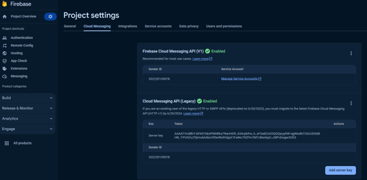
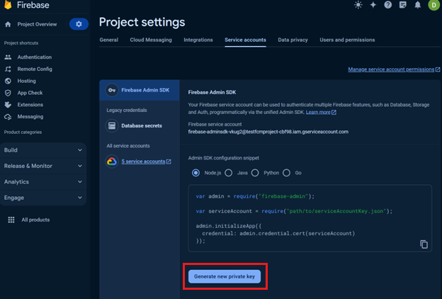

# Transition Android push notifications to Firebase Cloud Messaging (FCM) tokens for authentication

In June 2024, Google Firebase is deprecating authentication using an API key in favor of using a Service Account JSON token. Customers currently using the API key method need to change to the token. Doing so requires creating the token in Firebase, downloading it, and switching authentication methods in Customer Insights - Journeys. Learn more from [Google Firebase](https://firebase.google.com/docs/cloud-messaging/migrate-v1).

## Instructions

In June 2024, Firebase is deprecating the FCM API key authentication approach for Android push notifications. A service account JSON file-based approach replaces this method. You need to replace an existing FCM token with the JSON file generated within your Google Firebase account.

To generate the JSON file, sign in to your Firebase account, navigate to the Firebase project for your application, and open the project settings by selecting the gear icon next to Project Overview.

> [!div class="mx-imgBorder"]
> 

Then, go to the **Service accounts** tab and select **Generate a new private key**.

> [!div class="mx-imgBorder"]
> 

Generating a new private key creates and downloads a JSON file that you can save.

> [!div class="mx-imgBorder"]
> 

Once you have the new file, navigate to the **Settings** > **Push notifications** area of Customer Insights - Journeys. Open the push notification configuration for the application you wish to update. Here, you can change your FCM authentication mode from **API Key** to **Service Account JSON**.

Doing so allows you to upload the JSON file you created. Once saved, the authentication method is updated and push notifications continue sending successfully.

> [!IMPORTANT]
> If you have multiple applications, including a test and production differentiation, it’s important to ensure that you upload the FCM token that was generated for the right application to ensure that push notifications continue sending. Failure to do so results in failed authentication, preventing push notifications from sending.

Additionally, it's recommended that you test this process with a test or development account before making the updates in production.

[!INCLUDE [footer-include](./includes/footer-banner.md)]