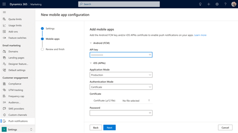

# Set up push notification applications

Push notifications are messages sent to customers who installed your mobile app. Push messages allow you to quickly convey offers, messages, or other information directly to users of your app.

You can send push messages as part of your journeys, similar to other outbound messages like text messages.

To learn more about the overall approach to setting up push notifications in Customer Insights - Journeys, visit the [push notification setup overview](push-setup-overview.md).

To enable push notifications in Customer Insights - Journeys, you need to complete the following steps:

1. [Push notification application configuration](push-notifications-setup.md)
1. [User mapping for push notifications](real-time-marketing-push-user-mapping.md)
1. [Device registration for push notifications](developer-push-device-registration.md)
1. [Receiving push notifications on devices](developer-notifications.md)
1. [Interaction reporting for push notifications](developer-push-interactions.md)

## Create a mobile app configuration

To send push notification messages to your customers, you first need to set up at least one *Mobile app configuration*.

> [!IMPORTANT]
> If the user or team who is going to create a mobile application has admin privileges, then no further action is required.
>
> If the user or team who is going to create a mobile application doesn't have admin privileges, then an admin needs to complete the following steps:
>
> 1. Open the **Settings** menu  at the top of the page and select **Advanced settings**.
> 1. On the advanced settings page, select **Settings** on the top bar, then go to **System** > **Security** > **Field Security Profiles**.
> 1. Go to **Marketers - Mobile app secrets** and add the corresponding user or team as members. Save and close.
> 1. Go to **Marketers - Mobile app channel instances secrets** and add the corresponding user or team as members. Save and close.

To create a new mobile app configuration, go to **Settings** in Customer Insights - Journeys, then go to **Customer engagement** > **Push notifications** and select **+New mobile app** on the top ribbon. The mobile app configuration connects your existing mobile application (already published on the App Store, Google Play, or both) to Customer Insights - Journeys.

To create a configuration, complete the following steps:

1. Start by adding a **Name** and **Description** for the configuration.
    > [!div class="mx-imgBorder"]
    > 
1. For the next step of the configuration, an app developer needs to help you get the iOS APNs certificate or tokens or Android FCM key for your mobile application. Learn more: [Push notification setup for application developers](developer-push-device-registration.md)

You can choose to configure an iOS application, an Android application, or both at the same time. Customer Insights - Journeys handles both apps under a single mobile configuration.

> [!div class="mx-imgBorder"]
> 

Select the tab that corresponds with your device's operating system:

# [iOS](#tab/ios)

For iOS applications, Customer Insights - Journeys uses the Apple Push Notification service (APNs), a platform service that enables application developers to send push notifications to iOS users. You can choose from two authentication modes:

- **Certificate**: Uses a certificate to authenticate. Consult Apple developer documentation on how to create a .p12 (PKCS #12) certificate file that you can upload into Customer Insights - Journeys.
- **Token**: Uses a [token-based connection to the APNs](https://developer.apple.com/documentation/usernotifications/setting_up_a_remote_notification_server/establishing_a_token-based_connection_to_apns). For token authentication, the following strings are required:
  - *Signing key*: The content of the .p8 file providing the signing key.
  - *Key ID*: The 10-character Key ID string.
  - *Bundle ID*: Created together with the APNs certificate for your app.
  - *Team ID*: Refer to Apple developer documentation to determine how to get your Team ID.

# [Android](#tab/android)

For Android applications, Customer Insights - Journeys uses the Firebase Cloud Messaging (FCM) service.

> [!IMPORTANT]
> In June 2024, the FCM Token authentication approach for Android push notifications will be deprecated and replaced with a service account JSON file-based approach. You'll need to replace an existing FCM token with the JSON file generated within your Google Firebase account.
>
> To generate this file, login to your Firebase account, navigate to the Firebase project for your application, and open project settings. Then, visit the service accounts tab and select **Generate a new private key**. This creates and downloads a JSON file that you can save and then upload to your push notification settings in Customer Insights - Journeys.
>
> Once you have the new file, navigate to the push notifications settings area of Customer Insights - Journeys. Open the push notification configuration. Here, you can change your FCM authentication mode from "API Key" to "Service Account JSON." Doing so allows you to upload the JSON file you created. Once saved, the authentication method is updated and push notifications continue sending successfully.

There are two FCM authentication modes: Service Account JSON and API key.

- **Service Account JSON**: Upload the Service Account JSON file generated in the Firebase project settings. Service Account JSON is the preferred authentication method that will be supported long-term.
- **(Deprecated) API key**: Enter the API key provided in your Firebase account.

---

3. Review and save your app configuration, then find and select your newly created mobile app configuration in **Settings** > **Customer engagement** > **Push notification**. Go to the **Developer information** tab, copy the details, and share them with your app developer as they need them to connect your app.

> [!NOTE]
> To learn more about the developer configuration for push notifications, see [Push notification setup for application developers](developer-push-device-registration.md)

---

[!INCLUDE [footer-include](./includes/footer-banner.md)]