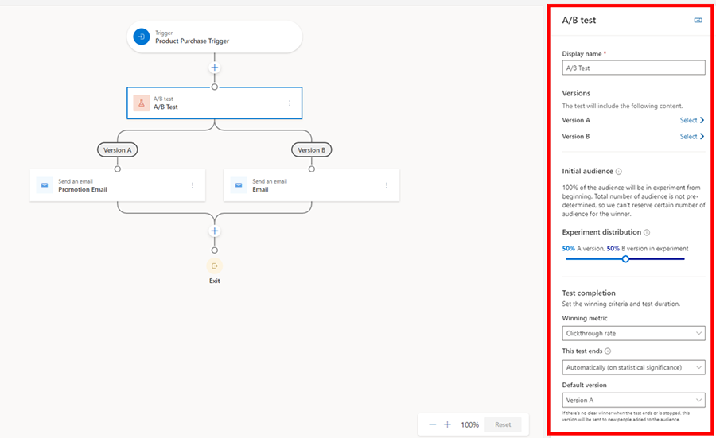
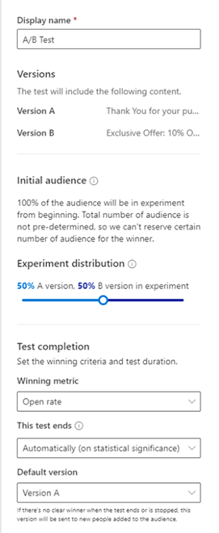
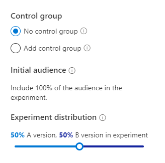
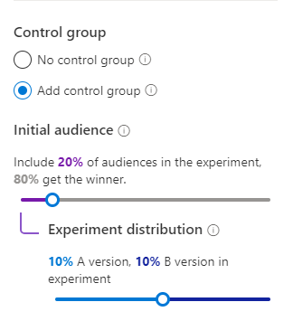

# A/B tests in Dynamics 365 Customer Insights - Journeys

Customer Insights - Journeys uses powerful A/B tests to examine your trigger-based customer journeys, allowing you to gain insights into how best to reach your customers.

Using A/B tests, you can measure which channel or content messaging strategy leads to higher success. Each test compares a control group of users (version A) against a variant (version B). The control group receives a default experience. The variant group receives a different experience or message. By comparing the results of the groups, you can determine which is the most effective.

A/B testing requires a significantly sized audience to be effective. Running tests on audiences of less than one thousand can produce unexpected results such as unequal distributions in the variants. Running tests on extremely small groups will definitely produce disproportionate distributions. For example, if your audience only has ten members, it's possible that one might go to variant A while nine might go to variant B. This is expected behavior when the audience size is so small, the statistical model doesn't have enough data to reach the required distribution. 

## Example 1: Creating an A/B test for trigger-based journeys

Let’s imagine you want to test two different emails on a trigger-based journey that gets activated when someone completes a purchase.

1. Create your initial content in the email editor, as usual. Perfect the content and be sure to check it for errors to make sure it can go live.
1. When your content is ready, go to **Customer Insights - Journeys** > **Engagement** > **Journeys** and select an existing journey or create a new one.
1. After you select a journey, select the plus sign (**+**) to add an element, and then do the following:
    - Select **Test which variation performs better**.
    - Select your channels that you want to test. In this example, you want to test two emails: select one for version A and one for version B, then select **Create test**.
1. When you select the A/B test tile, the side pane opens.

    > [!div class="mx-imgBorder"]
    > 

    The pane contains the following parameters:

    - **Display name**: To identify your test, enter a name for it. This name is displayed in the A/B test panel and in the customer journey analytics when you're looking at which tests are running.
    - **Versions**: Pick the content for the channel you prepared in step one (in this case, the two emails you wish to test). You can do this through a dropdown list by either selecting the child tiles in the journey builder, or by making a selection on the side panel.
    - **Initial Audience**: This is the audience group you would want to hold back from the A/B test before you get the results. This option is only available for segment-based journeys since you already have a total number of customers to help you decide how many you wish to hold back. Trigger-based journeys don’t have this option as customers enter when they complete an action. As such, the total number of customers who enter the journey is unknown.
    - **Experiment distribution**: Choose the audience distribution you would like. The slider is automatically on 50-50, but you can set the slider to your desired distribution. The minimum a version can receive is 10 percent, and the maximum is 90 percent. Remember that, traditionally, version A is your control group and version B is your variant.
    - **Winning metric**: You can set the winning condition for your test by choosing a winning metric: The version with the most journey goal events hit, the most clicks, or the most opens. For this case, you want to increase your open rates so you'll choose the open rate option.
    - **This test ends**: You can also choose between ending the test automatically or at a specific date and time. Letting the test determine a winner automatically when the results reach statistical significance. This means once a clear winner is determined, the system sends the winning version to the rest of your audience. The losing version is discarded. If you choose statistical significance as an option to end the A/B test but there's no clear winner after 30 days, the system automatically sends the default version. If you end the test early, it can take up to four hours to release the control group. 
    - **Default version**: Lastly, choose a default version in case the test doesn't end successfully. In cases where a winner hasn't been determined by the deadline specified through the date and time, the default version is automatically sent.
1. The A/B test should look like this by the time you configure everything and you're ready to publish the journey:

    > [!div class="mx-imgBorder"]
    > 

## Example 2: Creating an A/B test for segment-based journeys

Let’s imagine you want to create a journey to welcome new members that have joined your loyalty program this month. You want to increase your open rate by testing two different subject lines.

You'll complete steps one through three outlined in the first example, but you'll notice that the side pane looks different. This is because with segment-based journeys, you have a total number of customers to begin with; this allows you to create two types of A/B tests.

1. **A/B test with no control group**: This A/B test behaves similar to trigger-based journeys where customers funnel through the test as they come until a winner is determined.
 
    > [!div class="mx-imgBorder"]
    > 

1. **A/B test with a control group**: This allows you to tell the system exactly how many customers you want to test on. For instance, your segment has 100 loyalty members then you wish to first test on 20 percent or 20 members where each version will receive 10 members respectively. After the A/B test, the remaining 80 members will receive the winning version. You can always adjust the initial audience and the distribution to your liking.
 
    > [!div class="mx-imgBorder"]
    > 

For this example, we're going with A/B test with a control group. All the other settings are the same as in example one.

## Monitor the lifecycle of your A/B tests

After you've published your journey, you can open it to track the lifecycle of your tests.

- **Draft**: These tests haven't run yet, so you can still edit the settings.
- **In progress**: These tests are currently being run. The settings are locked and you can’t make significant changes.  
- **Stopped**: Theses tests are stopped and the marketer can choose which version to send.
- **Ended**: These tests were completed by finding a statistically significant winner or by timing out when scheduled to end at a set date and time. Ended tests can't be reused.

## Understand your results

:::image type="content" source="media/real-time-marketing-goal-analytics.png" alt-text="Goal analytics screenshot." lightbox="media/real-time-marketing-goal-analytics.png":::

There are three possible A/B test result outcomes:

- **Test concluded with a clear winner**: The test concluded that one version is performing better than the other. The winning version has a “winner” badge and is distributed to any new customers that funnel through the journey.
- **Test was not conclusive**: The test concluded that recipients are as likely to engage with version A as with version B. In this case, the default version is sent to any new customers that funnel through the journey.
- **The test was stopped**: This means that you or one of your coworkers stopped the test before it could conclude. In this case, the version specified by you or your coworker is sent to any new customers that funnel through the journey.

## FAQ

1. Can I have an A/B test with more than two versions?
    - Not at the moment.
1. Why am I not seeing the control group option for segment-based journeys?
    - If you put an attribute branch or any tile that will change the total number of the segment, the control group option goes away because the system won't know how many customers to hold back until the test is completed.
1. Why is my test ending unexpectedly?
    - If you chose to end the test with statistical significance, the system tries to get a winner within the first 30 days from the time you publish the journey. If no version is declared a winner, the test ends and the default version is sent to the remaining audience.
 
[!INCLUDE [footer-include](./includes/footer-banner.md)]
