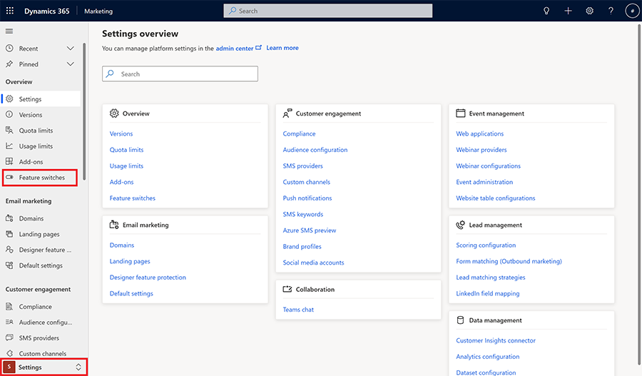
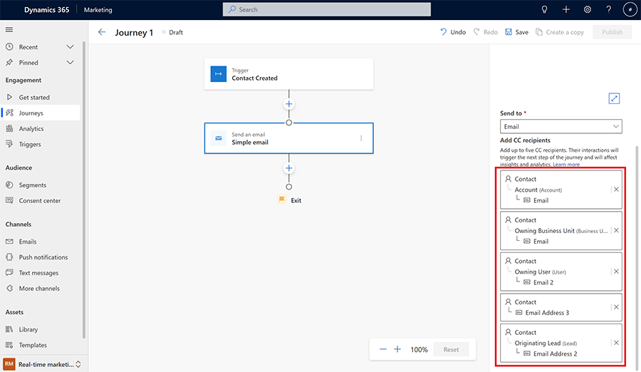

# Add email carbon copy recipients to journeys

[!INCLUDE[consolidated-sku-rtm-only](./includes/consolidated-sku-rtm-only.md)]

> [!VIDEO https://www.microsoft.com/videoplayer/embed/RW10sVQ]

You can add carbon copy (CC) recipients to your journeys when sending emails. When designing your journey, you can select up to five recipients for your emails from the email tile. You can dynamically choose your CC recipients by mapping them to your marketable contacts.

> [!IMPORTANT]
>
>- When you add CC recipients to your emails, the sent email will be identical for both primary and CC contacts. The interactions from CC recipients with sent emails (open, forward, clicks, unsubscribe) will be counted as a primary recipient interactions and will have direct impact on your insights and analytics.
>- If a CC recipient clicks on the unsubscribe button for marketing emails, they will unsubscribe the primary contact.
>- The CC recipient interaction will trigger the next step in the journey if you are utilizing the **Respond to an action** element in your journey based on the customer interaction.
>- CC contacts are counted for marketable contact quota.
>- CC contacts interactions are counted for interaction quota.
>
> CC recipients will receive the same amount of emails as the overall emails sent to primary recipients, meaning, if you send 1,000 emails to primary recipients with two people in CC, your overall sent emails will be 3,000. It's recommended that you select people in the CC field who are aware of how this feature functions.  
>

## Enabling the CC feature

The CC feature is disabled by default. To enable the feature:

1. Go to **Settings** and select **Feature Switches**.
    > [!div class="mx-imgBorder"]
    > 

2. Enable the feature in the Customer Journey section.
    > [!div class="mx-imgBorder"]
    > 

## How to use the CC feature in customer journeys

1. In your journey, select the **Send an email** action.

    > [!div class="mx-imgBorder"]
    > 

1. Select the **Select a recipient** to dynamically select the CC recipient. You have to select the relation to your target audience (contact or lead).

    > [!div class="mx-imgBorder"]
    > 

1. Select up to five recipients. Make sure you're selecting entities that contain email addresses. If you select an entity that doesn't contain an email, it's ignored when sending the email.

    > [!div class="mx-imgBorder"]
    > 

[!INCLUDE[footer-include](./includes/footer-banner.md)]
