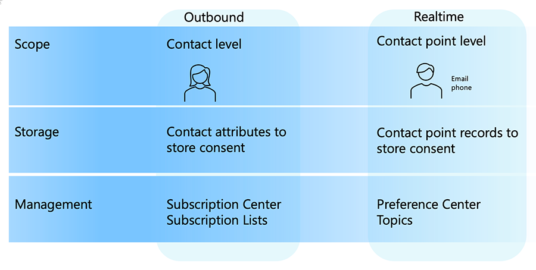
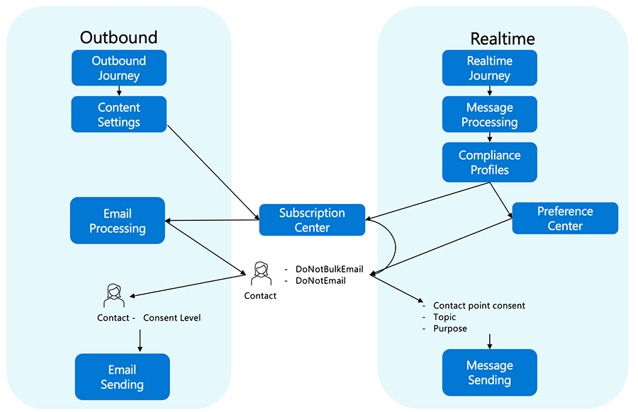
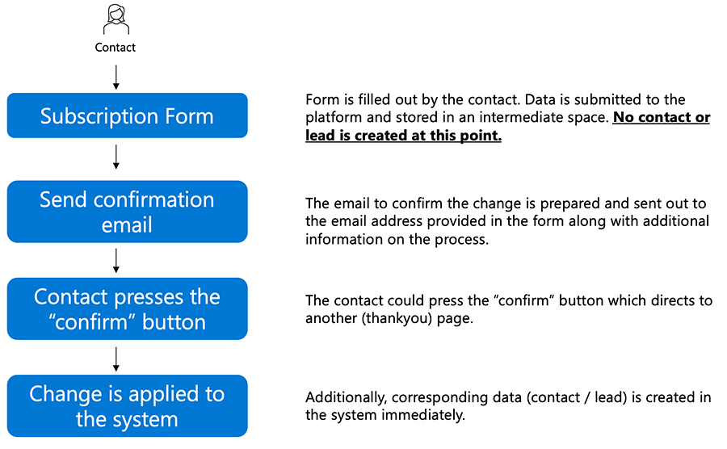
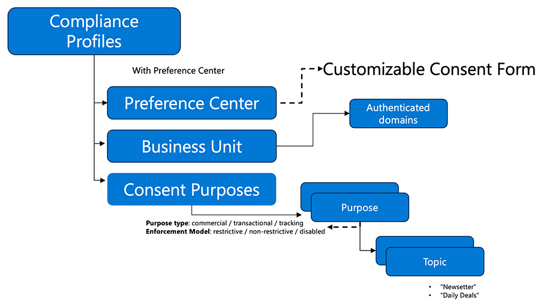
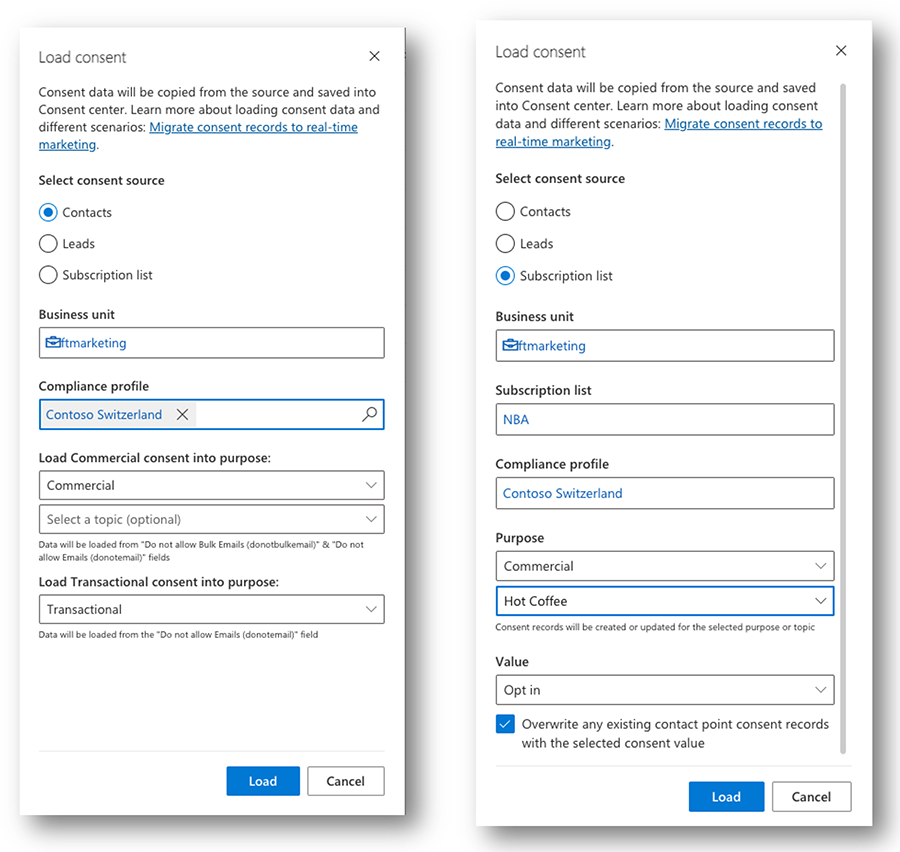

# Consent management and double opt-in transition guidance

> [!IMPORTANT]
> **The [outbound marketing](user-guide.md) module will be removed from Customer Insights - Journeys on June 30, 2025.** To avoid interruptions, transition to real-time journeys before this date. More information: [Transition overview](transition-overview.md)

More functionality and features are added Dynamics 365 Customer Insights - Journeys each month. Currently, there are two engines to engage customers in the Customer Insights - Journeys app: the outgoing outbound marketing engine and the current Customer Insights - Journeys engine. The two engines work differently, so feature parity can come in different forms. You should consider this when transitioning from outbound marketing to Customer Insights - Journeys.

This is an introductory article to explain how consent works in real-time journeys and the differences from outbound marketing. For a more detailed discussion, see [Understanding consent management in Dynamics 365 Customer Insights - Journeys - Dynamics FastTrack Blogs](https://community.dynamics.com/blogs/post/?postid=8b2a4ee8-1069-ee11-a81c-000d3a7a1a66)

When it comes to consent management and related topics, the two Customer Insights - Journeys engines have their own concepts:

> [!div class="mx-imgBorder"]
> 

To determine if a message was sent out to a contact or lead, the following processing takes place:

In outbound marketing, the journey verifies the information within the indicated content settings to identify the relevant subscription center and use that information to start email processing. The system then checks the attributes **DoNotBulkEmail** and **DoNotEmail** on the contact profile before proceeding to an evaluation of the contact’s consent level versus the consent level indicated for the journey.

In Customer Insights - Journeys marketing, the processing is different. As the journey starts and when a message is to be processed, it checks against the compliance profile selected for the message to be sent. Real-time marketing uses two types of compliance profiles (preference center and subscription center), which are configured by an administrator depending on the type of consent management page to be used in the message. With both types of compliance profiles, processing checks the attributes **DoNotBulkEmail** and **DoNotEmail** on the contact profile and uses the information on the topic and purpose for the compliance profile to finish preparing and eventually send the message.

> [!div class="mx-imgBorder"]
> 

One characteristic to note is that the use of the **DoNotBulkEmail** and **DoNotEmail** attributes on the contact profile is common to both outbound and Customer Insights - Journeys. Additionally, Customer Insights - Journeys is able to use subscription centers as the page where consent can be captured, making the transition from outbound marketing to Customer Insights - Journeys easier.

One important consideration with outbound marketing is that the consent given by a contact is tracked on contact level, which has the following consequences:

- It's not possible to distinguish between two different marketing communications, for example, for two different products.
- There's no support to manage consent for other channels within the product.

The Customer Insights - Journeys module follows a different concept from the beginning, allowing marketeers to use channels other than email. For example, you can instead use text message or push notifications. A contact (or lead) potentially can receive messages through multiple channels and all the different contact points can have different consent preferences. For example, the contact allows commercial marketing through email, but doesn't want commercial marketing through text messages.

As of today, the outbound and real-time modules both respect the settings on the contact level in the attributes **DoNotBulkEmail** and **DoNotEmail**, which reflect a general opt-in or opt-out (see also [Consent Preview](real-time-marketing-email-text-consent.md)). While Customer Insights - Journeys checks the **DoNotEmail** and **DoNotBulkEmail** fields on the contact entity, updates made to consent from real-time messages don't update the **DoNotEmail** and **DoNotBulkEmail** fields on the contact. Updates from real-time messages only update the contact-point consent records for the email address. This means that outbound marketing messages won't be affected by changes made to consent records based on messages sent by Customer Insights - Journeys.

## Double opt-in and GDPR

In certain geographies, to be able to execute marketing campaigns and target customers, it's required that those customers agree (opt-in) to that communication.
According to [the general data protection regulation (GDPR)](https://gdpr-info.eu/), only a single opt-in is required to comply with the regulation. However, this is probably not the only legislation that needs to be considered. Companies also have to comply with additional local regulations or internal policies that can be stricter than the GDPR and require double opt-in (see, for example, [Is double opt-in really required for email marketing in Germany? | Demodia](https://www.demodia.com/articles/data-processes/is-double-opt-in-really-required-for-email-marketing-in-germany)).

Customers provide their consent typically through a form and a checkbox, which explicitly needs to be checked by the customer to submit the form (single opt-in). In situations where double opt-in is required, the submission of the form alone doesn't satisfy the privacy requirements. Companies are required to send a confirmation email that their customers must open and click on a confirmation link to verify that it was indeed their idea to opt in.

> [!div class="mx-imgBorder"]
> 

This process applies too on the update of marketing preferences (opt-in or opt-out).

## Global vs. form-based double opt-in

Management of double opt-in is currently only available using outbound marketing features. However, it's possible to use Customer Insights - Journeys with the double opt-in settings in outbound marketing. This means that customers can use Customer Insights - Journeys for the execution of their marketing campaigns while using outbound marketing to manage the double opt-in process. As described previously, both engines provide an evaluation marketing preferences attributes on a contact level (**DoNotBulkEmail** and **DoNotEmail**). [This article](https://community.dynamics.com/blogs/post/?postid=24df8cbc-5724-4734-b898-24cfe57d3c33) describes how to set everything up to use double opt-in in Customer Insights - Journeys.

When global double opt-in is enabled, a customer always receives an email message to confirm a new subscription or if a change of consent occurs. This could also be set up for specific forms only (instead of globally).

## Real-time marketing enhancements to consent

Compliance profiles summarize and bundle specific consent settings. There's always at least one compliance profile in the system. Compliance profiles for Customer Insights - Journeys are linked to a preference center – a customizable form, which provides the ability to change the consent settings. Compliance profiles allow an organization to define consent settings using purposes. One compliance profile can contain different consent purposes, which represent a reason for which consent is collected, typically **Commercial**, **Transactional**, or **Tracking**. These are created by default when a new compliance profile is created.

For **Transactional** and **Commercial** purposes, it's also possible to define topics. Topics allow you to further refine the communication preferences. For each commercial purpose, it's possible to add general topics such as “Newsletter” or “Daily Deals.” Topics can be seen as a successor of subscription lists.

The following picture shows the connection between these entities.

> [!div class="mx-imgBorder"]
> 

It's possible for an organization to have multiple compliance profiles in place, for example, for each subsidiary or country and each with different consent purposes.

## Scenarios

Now that we've discussed the differences between opt-ins and the capabilities in the product, let’s take a look at some scenarios and how compliance settings can be utilized.

### Migrate consent from outbound marketing

Real-time marketing stores the contact-point consent information in the consent center, which is available as a menu item in the site map. To migrate consent settings from outbound marketing, there's a **Load consent** button, which initiates a copy of the consent settings to the Customer Insights - Journeys consent center. With the enhanced options in Customer Insights - Journeys mentioned above, it's possible to copy the outbound marketing consent information to a specific compliance profile and define which commercial and transactional purpose the data should be copied. For the commercial purpose, it's also possible to optionally define a topic to store the consent for. This results in a contact-point consent record of type **topic** and could potentially be used to migrate a subscription list to a Customer Insights - Journeys topic.

This can be used for the following procedures:

1. Copy contact consent to a specific purpose or topic for a purpose.
1. Copy lead consent to a specific purpose or topic for a purpose.
1. Copy the opt-in information of a subscription list to a purpose or a topic for a purpose.

The following picture shows the different settings:

> [!div class="mx-imgBorder"]
> 

The **Load consent** function loads the data from the **DoNotBulkEmail** and **DoNotEmail** attributes for contact and lead consent. The function should be used when the contact-point consent center is populated because Customer Insights - Journeys relies on those settings. The function can also be used multiple times, for example, if multiple subscription lists should be migrated to different topics in Customer Insights - Journeys. See also: [Adding consent data to Customer Insights - Journeys](real-time-marketing-migrate-consent.md)

Once subscription lists have been migrated as described above, you can create segments based on topic and purpose opt-in and opt-out data captured in the consent center. This allows you to create target lists of customers that have opted-into a topic in a similar manner that outbound marketing supports subscription lists.

An important point to consider in the creation of topic and purpose-based segments is that the available criteria for the segment is “will send” or “will not send.” This takes into account not just the existence of an opt-in/opt-out record but also the enforcement model of the topic (restrictive, non-restrictive, or disabled). For example, if a topic has been configured in a non-restrictive model and then used in the segment creation, the resulting list of contacts would be all who could actually receive the communication, which is all available opt-ins and any contacts that have not opted out. Conversely, if the model was restrictive, the segment will include only explicitly opted-in contacts.

Because the contact-point consent settings are only updated when using preference centers, outbound marketing forms and pages that update consent shouldn't be used once the migration has been done.

### Implement double opt-in in real-time journeys

Double opt-in is now available in real-time journeys. To enable double-opt-in, see [Double opt-in in real-time journeys](real-time-marketing-double-opt-in.md).

### Use Customer Insights - Journeys and lead consent, manage consent on contact-point level

In this scenario, Customer Insights - Journeys compliance settings must be used since contact-point level consent isn't available in outbound marketing. Managing consent for leads is also not available in outbound marketing. Purposes and topics should be used to handle the consent. The process of creating the required artifacts is described here: [Manage consent for email and text messages in Customer Insights - Journeys](real-time-marketing-email-text-consent.md). Once the consent is available in Customer Insights - Journeys and leads are able to change their consent using a preference center, no outbound marketing artifacts like forms should be used anymore.

### Multiple brands and consent by topic

In this scenario, a customer has multiple brands, each one needing to capture consent for their own purposes and would like to have their own topics to which consumers can opt in or out. This can be achieved by creating multiple compliance profiles, one for each of the involved brands. Within the compliance profiles, each brand can define their own topics that are appropriate for their communication. Once topics are set, they can be added to the brand’s preference center to allow customers to opt in or out for the areas that are of interest.  

### Operating in multiple countries and/or requiring preference centers in multiple languages

This is similar to the multiple brand scenario, but in this scenario, the company is looking to structure around the multiple geographies it operates in rather than by the brands used. This too can be addressed with multiple compliance profiles created for each country. Once defined, each compliance profile has its own preference center page with content written in the appropriate language and referencing the appropriate supporting material.
