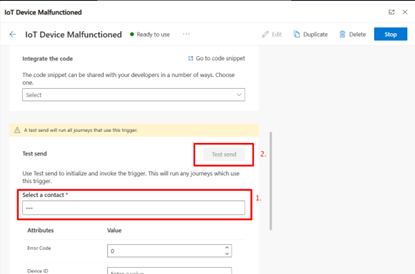
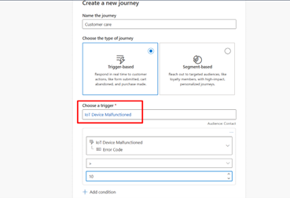
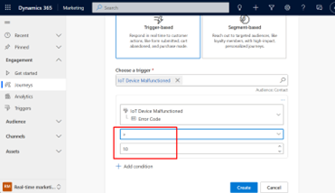
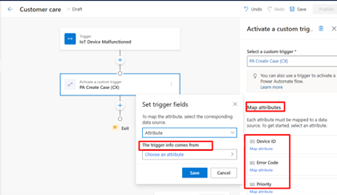
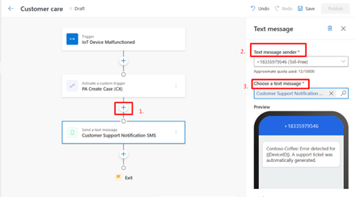
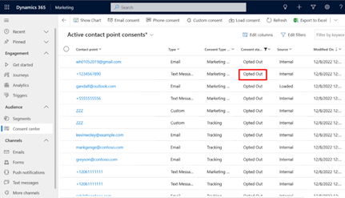
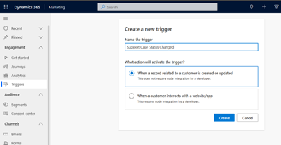
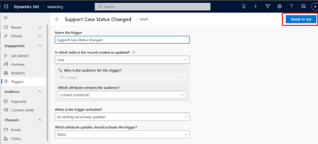

# Identify and resolve errors with real-time customer care journeys

[!INCLUDE[consolidated-sku-rtm-only](../includes/consolidated-sku-rtm-only.md)]

As people have more ways to connect with companies, delivering a consistent and smooth customer experience has never been more important. Dynamics 365 Customer Insights - Journeys allows you to identify and resolve customer issues seamlessly. 

This article guides you through three stages of a customer care journey: (1) identifying and processing the customer's issues and notifying them through a text message, (2) opening a support ticket to monitor care progress, and (3) updating the customer through a communication channel (email) on the status of their support ticket.

Here are some of the activities involved in the customer care lifecycle:

- **Identify critical errors**: A device that you sold to a customer has significant errors that will be noted in Dataverse and communicated to the customer through text message. Keep in mind that the severity of the device problem needs to be determined first before sending a text.
- **Create a support ticket**: A ticket is created following the text message and will include the error code and device ID for easy tracking for customers and owners.
- **Support ticket status**: This is the final stage in which, if there's an update on the status of the ticket, an email with the status is sent.

Here, you'll learn how to use journeys in Customer Insights - Journeys to send a text message when there’s a critical error with the device, create a support ticket with error code and device ID mapped attributes, and send an email when there’s a status change in the support ticket.

## Prerequisites

To create the customer care journey, you need access to the following assets:

- **Custom triggers**: These allow you to call a Power Automate flow and respond to customer activities in real time. You’ll use two triggers that are **Internet of Things (IoT) device malfunctioned** and **PA create case**. Custom triggers allow you to create multiple journeys that logically function together. Triggering custom actions works as the glue between journeys or between journeys and custom processes. Learn more: [Raise triggers from a journey to run another journey or Power Automate flow](real-time-marketing-custom-actions.md).
- **Text message**: One text message is required for the support notification to be sent to customers. Text messages allow you to communicate with customers directly through their mobile devices. Learn more: [Create outbound text messages](real-time-marketing-outbound-text-messaging.md).
- **Power Automate flow**:You need one flow to create a new case every time a customer ping. This helps you in activating your custom trigger. [Get started with Power Automate](/power-automate/getting-started).

## Step 1. Send a text message when there’s a critical error with the device

The first thing you need to do is to create a journey. This assists you in identifying the critical error codes that customer devices are generating and differentiate them based on their criticality. It will only activate when the error code exceeds the stated value.

1. It’s a good idea to test your trigger before using it in a customer scenario. You can test the trigger within the Customer Insights - Journeys app, which avoids the need to create any proxy website or Python script. To test the critical error trigger, go to **Triggers** and select the **IoT device malfunctioned** trigger. In the **Test send** section, select a **contact**, enter the **Error Code** and **Device ID** and run the test against it by selecting **Test send**. If the trigger functions as intended, you can move onto the next step to create your journey.

    > [!div class="mx-imgBorder"]
    > 

1. Go to **Customer Insights - Journeys > Journeys** and select **+ New Journey** in the top toolbar.
1. Give the journey a name, select **Trigger-based** as the journey type, and search for the **IoT device malfunctioned** trigger. 
**Note**: This is a custom trigger, not an out-of-the-box trigger included with the Customer Insights - Journeys app. The trigger starts the journey each time a new device error code is added to a Dataverse table. Learn more: [Create custom triggers in Customer Insights - Journeys](real-time-marketing-custom-triggers.md).

    > [!div class="mx-imgBorder"]
    > 

1. Next, select the **+ Add condition** as your **attribute** which will help in determining when a text message can be sent to a customer whose machine has a critical error. You can select a value range that determines when a text message notification should be sent out. 

    > [!div class="mx-imgBorder"]
    > 

    In this case, if the selected Error Code is larger than 10, an SMS message is delivered. Because the error code is more than the specified value, the customer has opened a case. The consumer wouldn't be able to begin the journey if the error code was less than the stated value.

    > [!NOTE]
    > **Note**: We've added the condition of picking an error code before initiating a customer journey since it helps us better understand the journey inflow and obtain more insights into customer analytics by allowing just the critical number of cases opened by customers.

1. After adding the condition, select the **Create** button and the journey will begin.

## Step 2. Create a support ticket with error code and device ID mapped attributes

After the customer has started the journey, a case must be created. Customer Insights - Journeys enables users to create custom triggers that hold and transfer any sort of information that a customer journey may respond on. Users of Customer Insights - Journeys have complete control over what custom triggers signify and what information they communicate. To create a case, we create another tile to active a custom trigger:

1. Next, select the + sign below the IoT Device Malfunctioned trigger on the journey designer canvas to add another tile to the journey. Select the **Activate a custom trigger** tile. Now, you can select a custom trigger **PA Create Case (CX)** from the right pane under **Select a custom trigger**.

    > [!div class="mx-imgBorder"]
    > 

1. Now, in the right pane under **Map attributes**, you can see several sections where you can map the attributes with different values. Select the Device ID and Error Code and map the attributes as **Attribute>IoT Device Malfunctioned>Device ID** and **Attribute>IoT Device Malfunctioned>Error Code**. We're doing this because the custom trigger activated has to know where to receive the customer information that it carries when a customer reaches this step of the journey. 

    > [!div class="mx-imgBorder"]
    > 

1. When the Power Automate flow is triggered, this goes through a priority and assist you in evaluating if a journey **with critical errors** is triggered. Select **Priority**, and then **Value** to define that when a case is created, it has a critical value flag.

    > [!div class="mx-imgBorder"]
    > 

1. Next, select the + sign below the PA Create Case (CX) trigger on the journey designer canvas to add another tile to the journey. Select the **Send a text message** tile.

    > [!div class="mx-imgBorder"]
    > 

    In this situation, an SMS is sent to the customer informing them that an error has been identified and that a support ticket has been generated. Also, with this text message, the customer gets a link wherein they can easily track their support ticket status.

    > [!NOTE] 
    > Messages are now undelivered or bounced for several reasons when they're sent to customers. This behavior is shown in the **Delivery interaction details**. When messages are sent, you may see this in the **right pane** under the **Analytics** section. This informs you of every potential reason why each channel, whether email or SMS, wasn't sent.

    You can go to the **Consent Center** and select your desired contact point to find out why the text message wasn't sent or bounced under the **Consent status**.

    > [!div class="mx-imgBorder"]
    > 

1. Now, in the bottom left pane, select **Outbound marketing**, and then in the left pane, select **Customers>Contacts**. You can view marketing interaction data here, which can be useful to your salespeople in determining how customers are reacting to the text message, email, or push notification that was delivered to them.

## Step 3: Send an email when there’s a status change in the support ticket

For the support ticket status changes, you need to create a [**Dataverse trigger**](real-time-marketing-dataverse-trigger.md#how-to-create-a-dataverse-trigger). This allows you complete control over the beginning, personalization, and measurement of your customers' journeys. For example, anytime the status of a support ticket changes, whether it has been resolved or is still being worked on, it will immediately provide updated case status information to the customer.

1. Go to **Customer Insights - Journeys > Triggers** and select **+ New trigger**. In this instance, name your trigger as **Support Case Status Changed** and the action as **When a record related to a customer is created or updated**.

    > [!div class="mx-imgBorder"]
    > 

1. Next, select the table from Dataverse that contains the information related to a support case. Here, the "Case" table is selected.
1. Because a Dataverse table can have more than one audience attribute, the next step ("Which attribute contains the audience?") allows you to select the attribute that contains the intended audience.
1. In the final step, you can select the action that activates the Dataverse trigger. This includes selecting which columns need to be part of the update or change.

    > [!div class="mx-imgBorder"]
    > 

1. Once created, you can publish the trigger by selecting the **Ready to use** button. This enables the trigger to be used as part of a live journey.
1. Now, you can use this Dataverse trigger into a journey and for that, you create a new journey using this trigger ([Trigger a journey based on a Dataverse record change](real-time-marketing-dataverse-trigger.md#using-a-dataverse-trigger-inside-a-journey)).
1. Give the journey a name, select Trigger-based as the journey type and select the **+ Add condition** as your attribute **as Support Case Status Changed>incident>Status Reason**.
1. Next, you can select your value to trigger this journey only when the status has been changed to a case resolved. This trigger starts an action each time a support ticket status is changed.
1. Next, select the **+** sign below the support case status changed trigger on the journey designer canvas to add another tile to the journey. Select the **Send an email** tile saying that” **Your case has been solved**”.

## Customer care journey key takeaways

Your customers are likely to engage with various departments and services throughout the lifetime. Each of these interactions, such as a completed application, or the closing of a support problem, provides a chance to connect your customers more intimately. Notifying customers about critical errors with their devices via the appropriate notification channel, and customizable tracking of the status of the support request, gives them a wonderful heads-up in this case. This Customer Insights - Journeys journey won't only assist you in building a case and following its status, but it will also assist customers in tracking how their salespeople may utilize analytics data. The data can be to track useful insights such as reasons why their messages were undelivered or bounced and so on.

[!INCLUDE[footer-include](../includes/footer-banner.md)]
