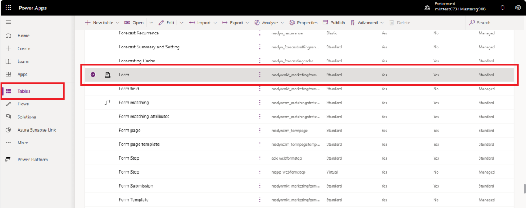
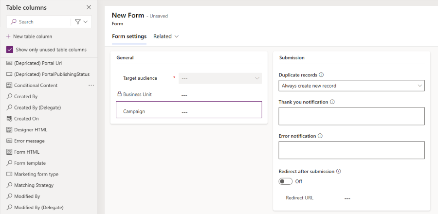
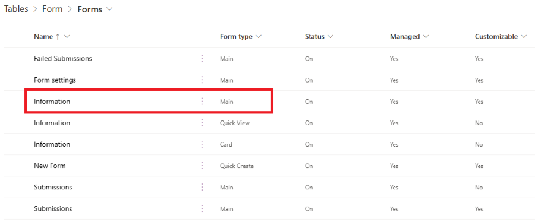
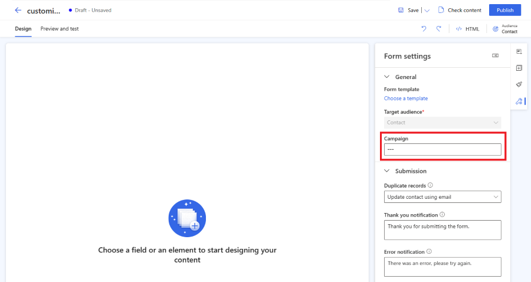

# Customize the form editor

[!INCLUDE [consolidated-sku-rtm-only](./includes/consolidated-sku-rtm-only.md)]

The latest [form editor](real-time-marketing-form-overview.md) simplifies the design process of a form or a simple landing page by providing more screen real estate for the design canvas. You can further tailor the form editor to suit your needs by implementing your own customizations.

The list of customizable form entities:

- Form (msdynmkt_marketingform)
- Form Submission (msdynmkt_marketingformsubmission)

Customizations made to the main form or customizations adding new fields to the Form Settings form *don't* require any action.

For example, you can extend the form editor, adding custom fields through Dataverse to streamline your business processes for higher efficiency. Customization allows you to add fields such as "Campaign" to your forms.

## Customizing form editor step-by-step

Let's add "Campaign" field to your forms in this step-by-step guide.

1. Go to Power Apps, and find the ‘Form’ table (msdynmkt_marketingform) under Dataverse -> Tables

    > [!div class="mx-imgBorder"]
    > 

1. Create a new column of Form table, which is used to store the reference to your campaign. Select button New and select Column. Changing Data type to *Lookup* adds drop-down menu Related table. Select Campaign in Related table. Add Display name and Save the new column.

    > [!div class="mx-imgBorder"]
    > 

1. Go to Data experiences -> Forms to access the new form editor form

    > [!div class="mx-imgBorder"]
    > 

1. Select Form Settings from the list

    > [!div class="mx-imgBorder"]
    > 

1. Drag and drop the Campaign field from the left column to the designate place in the form

    > [!div class="mx-imgBorder"]
    > 

1. It's important to add the Campaign field to the main form, otherwise the custom field can't be rendered. Go to Data Experiences -> Forms and select form *Information* with Form type *Main*

    > [!div class="mx-imgBorder"]
    > 

1. Select the Campaign field in the left column to add it to the form. Once you see the Campaign field properties in the right column, select Hide checkbox to hide this field on the main form

    > [!div class="mx-imgBorder"]
    > 

1. Select “Save and publish” button in the top right corner to save your changes
1. Once you create a new marketing form in Customer Insights – Journeys, you're able to see the Campaign field in the form Settings. You might need to reload the Customer Insights – Journeys app to reflect the customization changes, press F5 to reload the browser tab
    > [!div class="mx-imgBorder"]
    > 

> [!IMPORTANT]
> It is recommended to deploy changes of forms entity within a managed solution. [Learn more](https://learn.microsoft.com/power-platform/alm/solution-concepts-alm)

[!INCLUDE [footer-include](./includes/footer-banner.md)]
