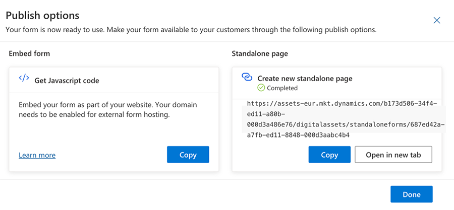
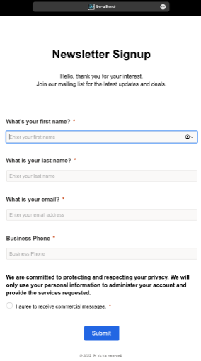
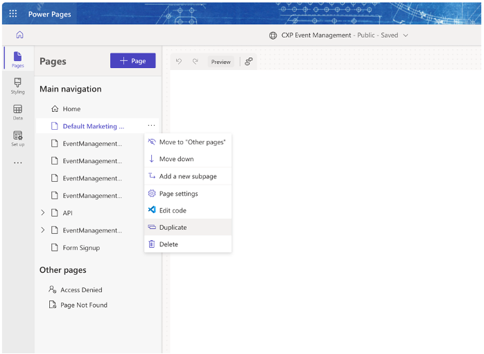
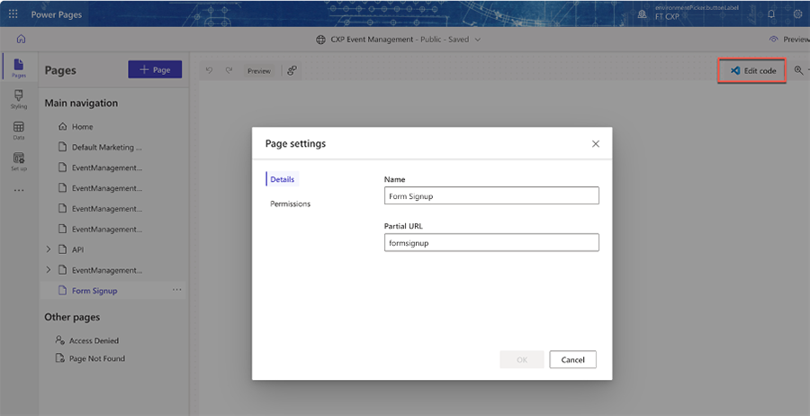
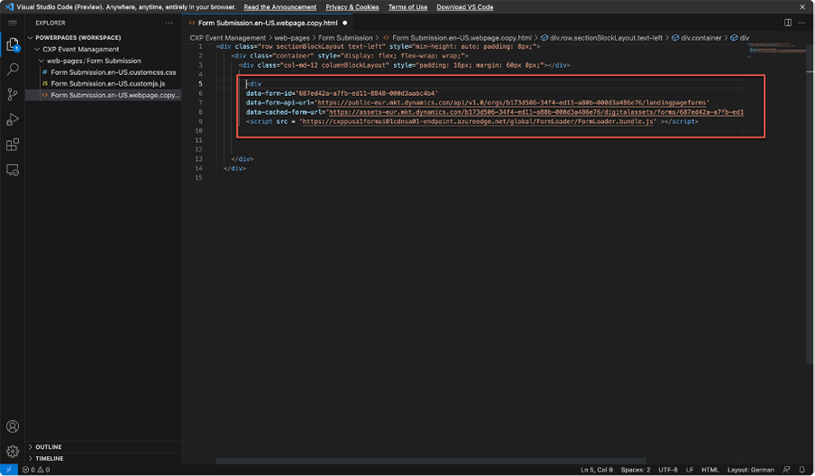
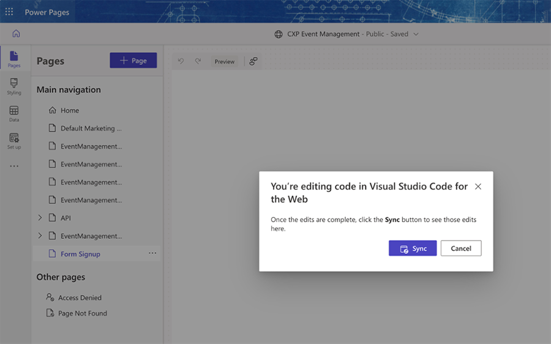

# Deploy pages that contain Customer Insights - Journeys forms

[!INCLUDE[consolidated-sku-rtm-only](../includes/consolidated-sku-rtm-only.md)]

Once you've [created a form](real-time-marketing-form-create.md) in Customer Insights - Journeys, you need to publish it in a place where customers can access it. This article discusses the various hosting options for Customer Insights - Journeys forms.

## Hosting options

Typically, forms are hosted on content management system (CMS) where, in the context of a product or service, forms allow the customer to request further information or to be regularly informed. Currently, Customer Insights - Journeys forms have two publishing options. The first option generates a JavaScript code snippet that allows you to embed the form on your website. The second option creates a standalone page with your form.

> [!div class="mx-imgBorder"]
> 

Although this looks like only two options, the JavaScript code option could be used in different ways to publish the form anywhere. To publish a form in your own CMS however, you must authenticate the domains with Dynamics 365 Customer Insights - Journeys. Learn more: [Authenticate your domains in Customer Insights - Journeys](domain-authentication.md).

It's worth mentioning that the publishing options aren't exclusive to a given location, meaning you can publish the same form in multiple locations.

The following sections take a closer look at the non-Javascript code publishing options.

> [!IMPORTANT]
> The ability to capture the content of forms not created with Customer Insights - Journeys does not currently exist.

## Use a standalone page

Standalone pages are useful where there's no other publishing option available or not wanted. For example, you may want to use a standalone page if a high volume of access is expected. In those cases, you can publish a form on a standalone page that is hosted in Microsoft's content delivery network (CDN). This guarantees a short loading time and high availability for the form.

As shown below, selecting the **Create** button on the right side of the "Create new standalone page" dialog creates a standalone page and makes the form available right away.

> [!div class="mx-imgBorder"]
> 

Currently, the domain provided for the standalone page is provided by Customer Insights - Journeys. Soon, however, you'll be able to add your own domain for use with these standalone pages.

With a standalone page, there's a caching mechanism in the background to deliver the page as fast as possible. Because there's a caching system, if the form is changed, the changes *aren't* reflected immediately on the page. It may take up to 10 minutes for the cache to be updated.

> [!NOTE]
> To force the infrastructure to load the updated (non-cached) version of the form, append “#d365mkt-nocache” to the end of the URL. When you add the "nocache" parameter, the page ignores the cache and loads the form directly from Customer Insights - Journeys.

## Host using a single page application (SPA)

The Customer Insights - Journeys form experience uses a JavaScript API that utilizes various events to change the behavior of the form. This design allows the form to be included and rendered through the API and to be used within a single-page application with React (SPA). The process is described the developer documentation: [Extend Customer Insights - Journeys forms using code](./developer/realtime-marketing-form-client-side-extensibility.md#custom-events).

The following screenshot shows an embedded Customer Insights - Journeys form on a React page:

> [!div class="mx-imgBorder"]
> 

If your form is hosted using an SPA, you need to replace the identifier of the form (msdynmkt_marketingformid), the organization (organizationid), and the endpoint for that organization. This information is provided in the code snippet that is generated after publishing the form.

## Host on Power Pages

Customer Insights - Journeys forms can also be hosted on [Power Pages](/power-pages/introduction) (formerly known as Power Apps Portals). Using this hosting method, there's no need to connect the corresponding website to the Customer Insights - Journeys app. The process to host on Power Pages is as follows:

1. Create a new page, or duplicate and edit an existing page in Power Pages Studio.

    > [!div class="mx-imgBorder"]
    > 

1. Select the option to edit the page in Visual Studio Code.

    > [!div class="mx-imgBorder"]
    > 

1. Insert the code generated by the form where you want the form to show up. Close the editor and sync the changes back to the portal.

    > [!div class="mx-imgBorder"]
    > 

1. Select the **Sync** button to sync the changes back to the portal.

    > [!div class="mx-imgBorder"]
    > 

1. Select the **Preview** button in Power Pages to see how your page looks.

    > [!div class="mx-imgBorder"]
    > 

You won't be able to preview the form in the design mode in the Power Pages Studio. But, if you select the **Preview** button to preview the page in the browser, the form shows up and can be used.

## Summary

The Customer Insights - Journeys form designer offers flexible options to create and publish forms for use with Customer Insights - Journeys. Here are some general guidelines to remember when creating and publishing forms in Customer Insights - Journeys:

- In Customer Insights - Journeys, there's no need to connect the app with Power Portals / Power Pages.
- An easy and effective way to build a single landing page is to publish the form as a standalone page.
- If you need to create a complex marketing web site with multiple pages, you can use Power Pages Studio.

[!INCLUDE[footer-include](../includes/footer-banner.md)]
