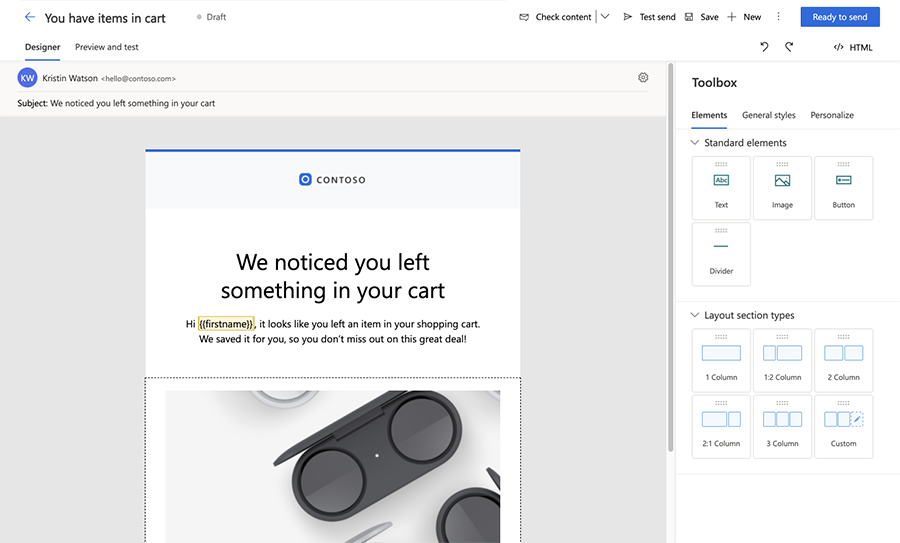
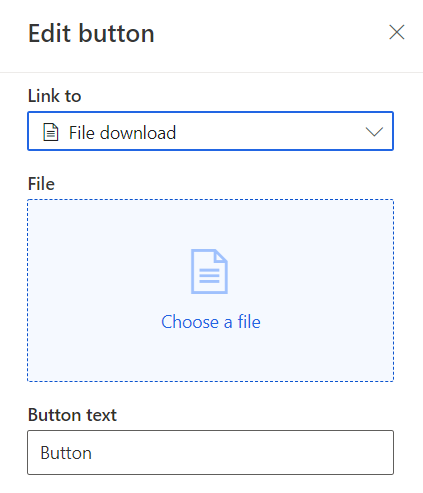
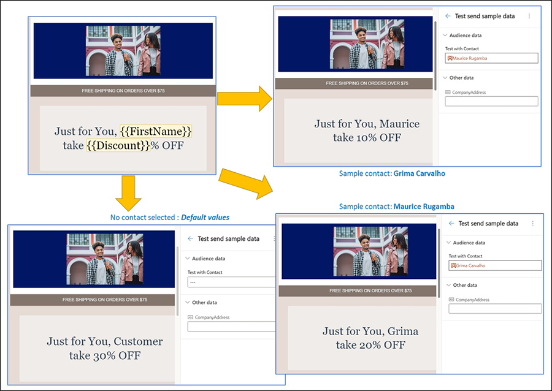
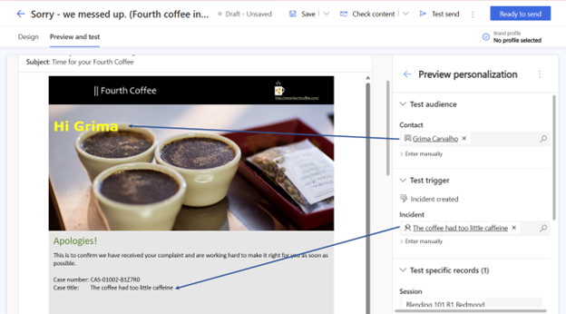

# Create Customer Insights - Journeys emails

The Customer Insights - Journeys email editor shares much of its look and feel with the [outbound marketing email editor](prepare-marketing-emails.md). As with the outbound marketing email editor, the Customer Insights - Journeys editor allows you to quickly create personalized emails to capture your customers' attention.

Learn more about creating email in Dynamics 365 Customer Insights - Journeys: [Create a new email and design its content](email-design.md)

## Features unique to the Customer Insights - Journeys email editor

In addition to the standard email editor features, the Customer Insights - Journeys email editor includes unique personalization capabilities and AI-driven image suggestions.

### Powerful email personalization

The Customer Insights - Journeys email editor has a new assist edit control to bind personalized data. Use personalized data to dynamically populate information that is unique to each email recipient.

#### Add personalized data to a Customer Insights - Journeys email

1. Create a placeholder by adding a text field and then selecting the **Personalization** button  in the toolbar.
1. Select **Select a data field** to choose a data source. Your data source can be based on an **Audience**, a **Trigger**, or **Compliance**.
1. After choosing the data source, you can search for the specific attribute or trigger you're looking for.
1. Add a **Label** to quickly identify your dynamic text in the message content.
1. Personalized dynamic text is highlighted in the content designer.
1. You can see and edit all your dynamic text in the **Personalize** tab in the **Toolbox**.

> [!div class="mx-imgBorder"]
> 

### Link to documents and videos stored in the asset library

Add feature-rich links to emails by directly linking to documents stored in the asset library. To link to a document or video:

1. Add some text, a button, or an image to a Customer Insights - Journeys email.
1. In the button or image editing pane (or in the text link dialog), select the **Link to** dropdown then select **File download**.
1. To link to a document in the image library, select **Choose a file** then select **Browse library** and choose your file.
1. Alternatively, you can upload a new file to link to by selecting **Upload to library**.

> [!div class="mx-imgBorder"]
> 

### Working with Image Versions in Emails
When you upload images to the asset library, each image is assigned a unique identifier along with a ts (timestamp) element. This timestamp indicates a specific version of the image. For example, an image URL might look like this:

https://assets-eur.mkt.dynamics.com/xxxxxxxxxxx/digitalassets/images/ffa161c6-d5f5-ef11-be1f-7c1e52775df0?ts=638796358277348175

When a new version of the image is uploaded, the image identifier remains the same, but the ts element changes.

**Adding Images to Emails**

By default a specific version of the image will be added since it contains the "?ts" element, if you always want the latest version of the email to show remove the "?ts" element in the HTML version of the email or use the 'insert from URL' option and exclude the ?ts= part as shown below: 

https://assets-eur.mkt.dynamics.com/xxxxxxxxxxx/digitalassets/images/ffa161c6-d5f5-ef11-be1f-7c1e52775df0

> [!NOTE]
> It's important to note that removing the ?ts= element does not address [caching issues](https://learn.microsoft.com/en-us/dynamics365/customer-insights/journeys/upload-images-files#edit-assets).

### Link to surveys, events, marketing pages, Microsoft Teams events, or calendar items

Using text, images, or buttons in the Customer Insights - Journeys email editor, you can link to surveys, events, or marketing pages. You can also create text, button, or image links that allow recipients to join a Microsoft Teams event or that create a new calendar item.

  > [!div class="mx-imgBorder"]
  > 

The **Link to** dropdown allows the following options for Teams check-ins and calendar items:

- **Teams check-in**: Select a specific Teams event or session that your button or image should link to.
- **Add to Calendar**: Link to an iCalendar file. Choose the information you want to include in the iCalendar file using the **What should be added to calendar** dropdown. The options include:
    - **Only the event**: The iCalendar file contains only the event the contact has registered for.
    - **Event and sessions registered**: The file contains information for the event and the sessions the contact has registered for.
    - **Only sessions registered**: The file contains only the event sessions the contact has registered for.

### Select a compliance profile, purpose, and topic for the message

Within the compliance section of the email settings, you need to choose a compliance profile and purpose for the email. This ensures that consent checks are performed as required by the compliance profile and purpose's enforcement model. Optionally, you can choose a topic for the email, which allows you to collect more granular consent data to enable your customers to receive exactly the communications they want. Learn more: Learn more: [Manage consent for email and text messages in Customer Insights - Journeys](real-time-marketing-email-text-consent.md)

## Preview and test send your email

Before sending emails to a large number of recipients, it's important to test the email with sample audience members to ensure that the content, layout, and design are displayed correctly. This can be easily accomplished using the **Preview and Test** tab in the email designer tool. In the **Preview and Test** tab, you can select a sample audience member's (for example, a contact or lead) record trigger data or other personalization data and preview the exact content that will be delivered to that recipient. The preview includes dynamically generated content based on the selected audience member data, providing a realistic preview of what the recipient will see.

To see preview for a specific audience member:

1. In the email designer, go to the **Preview and test** tab and select **Edit sample data**.
1. In the **Audience data** side pane, select a sample audience member.
1. To verify that default values for all dynamic text are set up correctly, don't select any audience member record. The preview will show the default values.

> [!div class="mx-imgBorder"]
> 

To see a preview of personalized content sourced from trigger, follow the steps above and select or enter the data for the trigger. Below is an example where the email will be sent when the business trigger “Incident is created” is raised and will include the incident number and title (data that comes from the trigger).

> [!div class="mx-imgBorder"]
> 

> [!NOTE]
> For dynamic text that is not bound to the audience, you can enter sample values to see how the content will look. You can also override the actual data that comes from the selected audience record or trigger. To override the data, select **Enter manually** for the chosen item and provide your own value. This is a quick and easy way to check for edge cases.

You can send the preview email to yourself or another test email address to verify how the received email renders on different devices and different email apps. Preview emails automatically include “[Test]” in the subject header.

### See also

[Grow your business with multi-brand, custom preference centers](real-time-marketing-compliance-settings.md)

[!INCLUDE [footer-include](./includes/footer-banner.md)]
