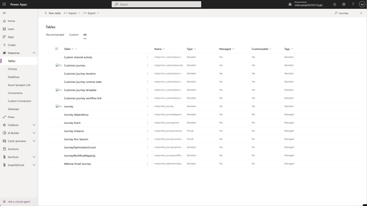
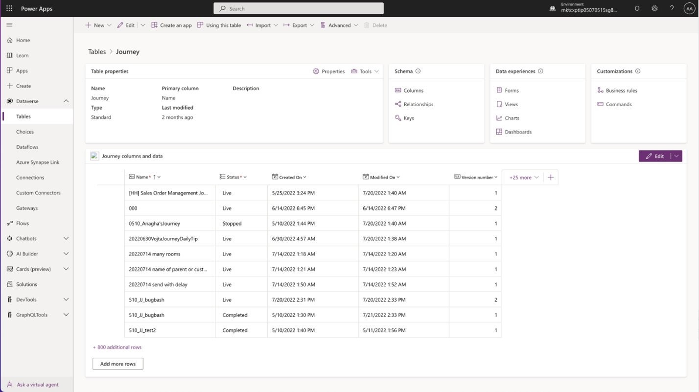
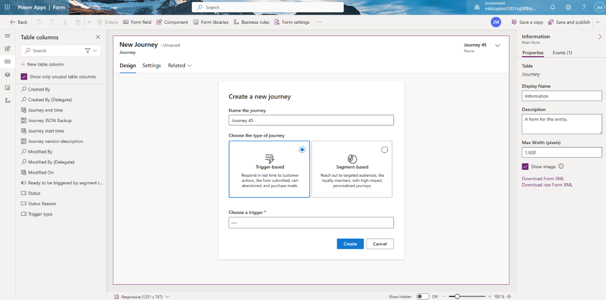
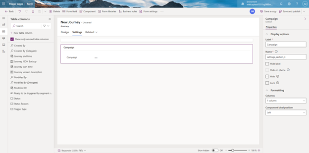
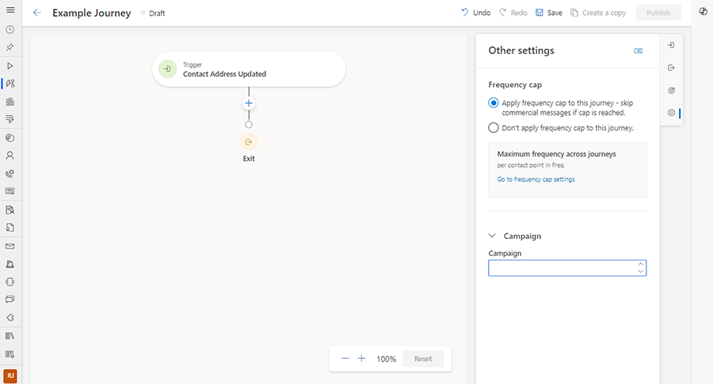

# Customize the journey designer in Customer Insights - Journeys

Customization of your customer journeys is now available in Dynamics 365 Customer Insights - Journeys. Not only can you use out-of-the-box Customer Insights - Journeys capabilities to engage customers, but you can also now create personalized, flexible, and efficient solutions through Power Apps to better tailor Customer Insights - Journeys to meet your specific business needs.

For example, you can extend the journey canvas, adding custom fields through Dataverse to streamline your business processes for higher efficiency. For example, you could add a custom "Campaign" field to your journeys to better manage your assets, collaborate with your team members, and give you more flexibility to create customized analytics reports.

Here's how you can achieve the above scenario by adding a campaign field in the new journey designer in Customer Insights - Journeys:

1. Go to [Power Apps](https://make.powerapps.com/) for the Customer Journeys - Insights environment and find the **Journey** table under **Dataverse** > **Tables**.

    > [!div class="mx-imgBorder"]
    > 

1. To access the new journey designer form, go to **Data experiences** > **Forms**.

    > [!div class="mx-imgBorder"]
    > 

1. Choose **Main** under **Form type** to get started.

    > [!div class="mx-imgBorder"]
    > 

1. You should see a form designer that looks like the new journey creation experience under the **Design** tab. Navigate to the **Settings** tab in the new journey form.

    > [!div class="mx-imgBorder"]
    > 

    > [!IMPORTANT]
    > The **Settings** tab may be hidden by default. To view hidden elements, enable the **Show hidden** switch at the bottom of the form designer.

1. Add the fields you want to show on the journey designer on the **Settings** tab. You can add sections to organize your fields. In this example, a section labeled *Campaign* is added to the form with a custom *Campaign* field.

    > [!div class="mx-imgBorder"]
    > 

    > [!CAUTION]
    > Only sections and fields under **Settings** will show up in the **Other Settings** side pane in the journey designer. Other tabs added in the form designer aren't rendered in the journey designer.

1. The fields added on the **Settings** tab are visible in the **Other Settings** pane in the journey designer.

    > [!div class="mx-imgBorder"]
    > 

[!INCLUDE [footer-include](./includes/footer-banner.md)]
