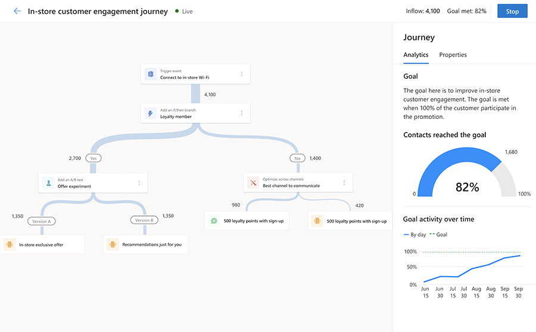

# Customer Insights - Journeys overview

> [!IMPORTANT]
> **[Outbound marketing](user-guide.md) will be removed from the product on June 30, 2025.** To avoid interruptions, transition to real-time journeys before this date. More information: [Transition overview](transition-overview.md)
 
> [!VIDEO https://www.microsoft.com/videoplayer/embed/RW17thC]

Dynamics 365 Customer Insights - Journeys isn't just for marketers anymore. With AI and natural language input assistance, business users can build trigger-based journeys that reach customers across multiple touch-points, growing relationships from prospects, through sales and support. Customer Insights - Journeys enables organizations to:

- **Engage customers in real time**
    - With [trigger-based customer journeys](real-time-marketing-trigger-based-journey.md) using [email](real-time-marketing-email.md), [text message](real-time-marketing-outbound-text-messaging.md), or [push notification](push-messages.md) channels, organizations can trigger customer journeys in real time, pick the right channel for each individual, and react to customer-led actions in the moments that matter.
- **Win customers and earn loyalty faster**
    - Working across all customer touchpoints, real-time customer journeys are truly an end-to-end experience.
- **Personalize customer experiences with AI**
    - Turn insights into relevant action with AI-driven recommendations for content, channels, and analytics. 
    - [Customer Insights - Data segment and profile integration](real-time-marketing-ci-profile.md) allows organizations to seamlessly leverage the deep customer understanding in Customer Insights - Data.
- **Grow with a unified, adaptable platform**
    - Easily customize and connect with tools you already use.
    - Efficiently manage compliance requirements and accessibility guidelines.

## How to engage with customers in Customer Insights - Journeys

> [!div class="mx-imgBorder"]
> 

When reaching out to your customers with Customer Insights - Journeys, there are three important things to consider: **who**, **what**, and **when**.

The **who** is your audience – who is this communication for? In Customer Insights - Journeys, your audience is defined by a *segment*. This is a subset of your contacts that meet some criteria. For example, you could have a segment containing customers over the age of 60 who live in North America, a segment for customers who earn more than $100,000 per year, or a blanket segment with all your active contacts. Learn more about segments:

- [Build segments in Customer Insights - Journeys](real-time-marketing-build-segments.md)

The **what** is the content and form of your communication - what are you sending? In Customer Insights - Journeys, this can be an *email*, a *push notification*, or a *text message*. These channels can be used separately or together in one campaign. Learn more about channels:

- [Create an email](real-time-marketing-email.md)
- [Create a push notification](push-messages.md)
- [Create a text message](real-time-marketing-outbound-text-messaging.md)

The **when** can be as straightforward as a planned time when you want to send the communication, but with Customer Insights - Journeys, it can also be an event that triggers the communication as part of a *journey*. You can combine emails, push notifications, and text messages into journeys that can operate over either a segment of contacts at a planned time or that can respond to a *trigger* to reach customers in the moments that matter. Learn more about journeys:

- [Create a segment-based journey](real-time-marketing-segment-based-journey.md)
- [Create a trigger-based journey](real-time-marketing-trigger-based-journey.md)

[!INCLUDE [footer-include](./includes/footer-banner.md)]
