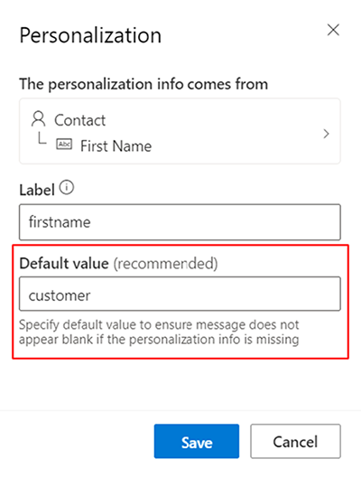
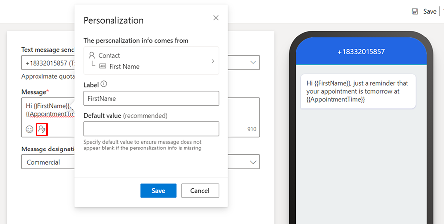
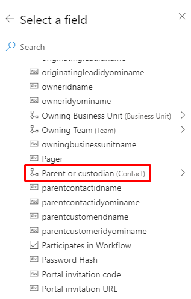
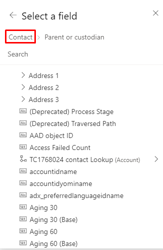
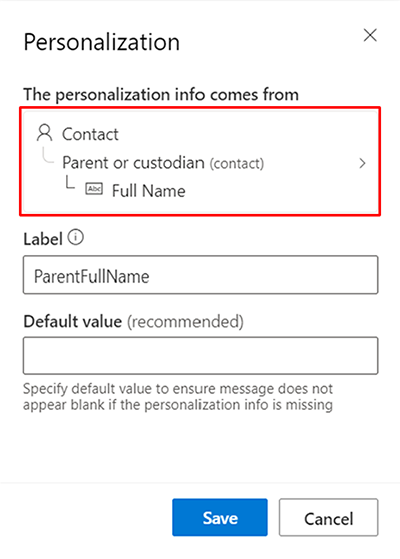

# Personalize content

[!INCLUDE [consolidated-sku-rtm-only](./includes/consolidated-sku-rtm-only.md)]

Dynamics 365 Customer Insights - Journeys's features offer powerful personalization capabilities. In this article, you'll learn how to set default values for personalized data, preview personalized content, personalize text messages and push notifications, and use related tables.

## Default values

Use default values to ensure your message always has appropriate content, even if the data is missing or blank. For example, if you're personalizing your message with a customer’s first name, you can add “customer” as the default value. That way your message will always be complete.

To set a default value:

1. Add a personalized element.
1. Enter the default content in the **Default value** field.

> [!div class="mx-imgBorder"]
> 

## Personalize text messages and push notifications

You can add personalized content to your messages by selecting the  icon:

> [!div class="mx-imgBorder"]
> 

## Related tables

Related tables are signified with the  icon next to the item in the data source selection screen. For example: 

Select this field to navigate to the related table:

> [!div class="mx-imgBorder"]
> 

You can also search for fields in the related table (only the currently selected table will return results).

> [!div class="mx-imgBorder"]
> 

To navigate between levels, select the breadcrumbs:

> [!div class="mx-imgBorder"]
> 

Once you’ve selected a field, the full path to that field is displayed in the data binding.

> [!div class="mx-imgBorder"]
> 

## Limitations

- Option sets aren't supported for use in dynamic text. Option sets are supported in conditions, so an inline condition can be used to output option values in messages.
- Personalization can only use triggers. However, messages that use personalization based on a trigger can only be used in journeys that are started by those triggers. If such a message is included in a journey where the trigger is received mid-journey, the journey designer will give an error message.

[!INCLUDE [footer-include](./includes/footer-banner.md)]
