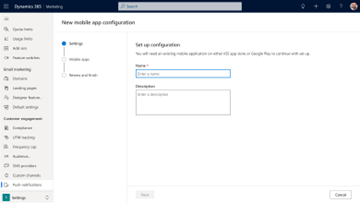

# Set up push notifications

[!INCLUDE [consolidated-sku-rtm-only](./includes/consolidated-sku-rtm-only.md)]

Push notifications are messages sent to customers who have installed your mobile app. Push messages allow you to quickly convey offers, messages, or other information directly to users of your app.

You can send push messages as part of your journeys, similar to other outbound messages like text messages.

## Create a mobile app configuration

To send push notification messages to your customers, you'll first need to set up at least one *Mobile app configuration*. 

> [!IMPORTANT]
> If the user or team who is going to create a mobile application has admin privileges, then no further action is required.
>
> If the user or team who is going to create a mobile application doesn't have admin privileges, then an admin needs to complete the following steps:
>
> 1. Go to **Advanced Settings** > **Security** > **Field Security Profiles**.
> 2. Go to **Marketers-Mobile app secrets** and add the corresponding user or team as members. Save and close.
> 3. Go to **Marketers - Mobile app channel instances secrets** and add the corresponding user or team as members. Save and close.

To create a new mobile app configuration, go to **Settings** > **Customer engagement** > **Push notifications** and select **+New mobile app** on the top ribbon. The mobile app configuration connects your existing mobile application (already published on the App Store, Google Play, or both) to Dynamics 365 Customer Insights - Journeys.

To create a configuration, complete the following steps:

1. Start by adding a **Name** and **Description** for the configuration.
    > [!div class="mx-imgBorder"]
    > 
1. For the next step of the configuration, an app developer will have to help you get the iOS APNs certificate or tokens or Android FCM key for your mobile application. Learn more: [Push notification setup for application developers](real-time-marketing-developer-push.md)

You can choose to configure an iOS application, an Android application, or both at the same time. Customer Insights - Journeys will handle both apps under a single mobile configuration.

> [!div class="mx-imgBorder"]
> 

Select the tab that corresponds with your device's operating system:

# [iOS](#tab/ios)

For iOS applications, Customer Insights - Journeys uses the Apple Push Notification service (APNs), a platform service that enables third-party application developers to send push notifications to iOS users. You can choose from two authentication modes:

- **Certificate**: Uses a certificate to authenticate. Consult Apple developer documentation on how to create a .p12 (PKCS #12) certificate file that you can upload into Customer Insights - Journeys.
- **Token**: Uses a [token-based connection to the APNs](https://developer.apple.com/documentation/usernotifications/setting_up_a_remote_notification_server/establishing_a_token-based_connection_to_apns). For token authentication, the following strings are required:
  - *Signing key*: The content of the .p8 file providing the signing key.
  - *Key ID*: The 10-character Key ID string.
  - *Bundle ID*: Created together with the APNs certificate for your app.
  - *Team ID*: Refer to Apple developer documentation to determine how to get your Team ID.

# [Android](#tab/android)

For Android applications, Customer Insights - Journeys uses the Firebase Cloud Messaging (FCM) service. To configure your Android application to work with Customer Insights - Journeys, you need to enter the FCM API key string.

---

3. Review and save your app configuration, then find and select your newly created mobile app configuration in **Settings** > **Customer engagement** > **Push notification**. Go to the **Developer information** tab, copy the details, and share them with your app developer as they'll need them to connect your app.

> [!NOTE]
> To learn more about the developer configuration for push notifications, see [Push notification setup for application developers](real-time-marketing-developer-push.md)

[!INCLUDE [footer-include](./includes/footer-banner.md)]