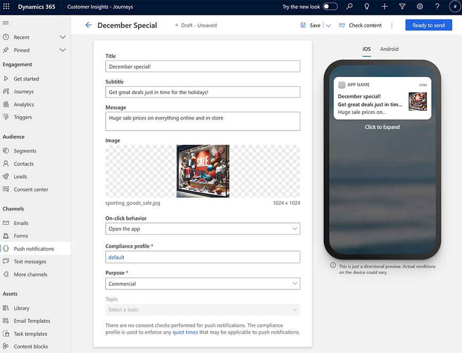
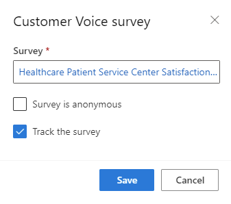

# Create push notifications

Push notifications are messages sent to customers who installed your mobile app. Push messages allow you to quickly convey offers, messages, or other information directly to users of your app.

You can send push messages as part of your journeys, similar to other outbound messages like text messages.

## Set up push notifications

To set up push notifications, you need administrator privileges. If you have the correct credentials, the first setup step requires [creating a mobile app configuration](real-time-marketing-push-notifications-setup.md). The second setup step requires [developer setup within your mobile app](real-time-marketing-developer-push.md).

## Create push notification messages

After you create your mobile app configuration, you can start creating push notification messages by going to **Customer Insights - Journeys** > **Channels** > **Push notifications** and selecting **+New push notification** in the top ribbon. **+New push notification** will take you to the push notification message editor.

> [!div class="mx-imgBorder"]
> 

In the push notification message editor, you can enter a title, a subtitle, a message, an image, and preview how your message would appear in iOS and Android.

Using the On-click behavior field, you can also specify the message behavior when customers tap on the message in their mobile phones.
- **Open the app**: Opens the mobile application.
- **Open the browser**: Opens a specified URL.

Try test-sending the push notification to your mobile app configuration or add it to a journey to see how it can be used.
To stop messages from being sent, you can deactivate or delete them.

## Push notification images

To add images to push notifications, select any image from the Library or upload a new one by selecting the **Choose an image** field on the push notification message editor. When you add images, Copilot suggests images that match your content.

There are some other considerations for images in push notifications:

* Images might be subject to platform size limits for iOS and Android.
* The image ratio should be 2:1 for best viewing in push notifications.
* You can preview the message and image in both iOS and Android.

## Personalize your push notifications

As with the email editor, you can personalize push notifications to insert dynamic data that is unique to each notification recipient.

To personalize a push notification:

1. Select the **Personalization**  button in the **Message** field.
1. Select **Select a data field** to choose a data source. Your data source can be based on an **Audience**, a **Trigger**, or **Compliance**.
1. After choosing the data source, you can search for the specific attribute or trigger you want.
1. Add a **Label** to quickly identify your token in the message content.

When you send the push notification from a journey, it automatically populates the token according to the attribute you selected.

## Add a Customer Voice survey to a push notification

Adding a Customer Voice survey link to a push notification or [text message](real-time-marketing-outbound-text-messaging.md#add-a-customer-voice-survey-to-a-text-message) allows you to seek feedback from customers on the channels they use the most.

To add a Customer Voice survey to a push notification:

1. Select the **Customer Voice survey** button  in the **Message** field.
1. Choose a Customer Voice survey in the lookup field.
1. Select whether you want the survey to be anonymous and whether you want to track the survey link after customers select it. If you select the **Survey is anonymous** option, no user data is saved with the answers.
    > [!div class="mx-imgBorder"]
    > 
1. Select **Save**.

When you send the push notification from a journey, it automatically populates the token with the survey and options you selected.

## Consent and compliance in push notifications

Push notifications require you to set a Compliance Profile and Purpose for a push notification. There are no consent checks performed for push notifications. The compliance profile is used to enforce any quiet times that might be applicable to push notifications.

## Send push notification messages in a journey

When creating a Customer Insights - Journeys, you can send push notification messages by:
1. Specifying the mobile application configuration.
1. Then choosing the push notification message you want to send from the journey.

## Track your push notification messaging metrics from channel insights

You can see how customers reacted to your push messages by checking the push notification analytics in the message itself and within journeys.

---

[!INCLUDE [footer-include](./includes/footer-banner.md)]