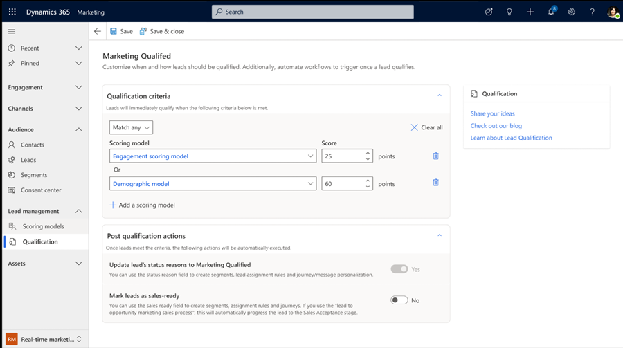

# Qualify the best leads

[!INCLUDE [consolidated-sku-rtm-only](./includes/consolidated-sku-rtm-only.md)]

Define qualification criteria and post-qualification actions to grow your pipeline while ensuring that each qualified lead receives attention from your sales teams. With proper scoring and qualification criteria, you can prioritize the best leads and empower the sales team to spend more time winning deals and less time chasing lukewarm opportunities.

Dynamics 365 Customer Insights - Journeys allows you to set the qualification criteria that trigger a set of “post qualification actions.” For example, you can define qualification criteria that allow only high-potential leads to trigger the qualification actions. Once a lead meets this value, then the lead is flagged as Sales-Ready or Marketing qualified. You can use this flag in multiple ways inside the Dynamics 365 ecosystem, including triggering journeys or sales assignment.

## Enable the feature

To use scoring models and qualification, an administrator needs to enable the feature switch in settings. To enable the features:
- Go to **Settings** > **Overview** > **Feature switches**.
- Enable the **Lead Management** feature switch and select **Save** in the upper right corner.

Once the feature switch is enabled, two new features appear on your Customer Insights - Journeys navigation bar: **Scoring models** and **Qualification**.

## Define your marketing qualification criteria and qualification actions

> [!div class="mx-imgBorder"]
> 

The real-time journeys qualification allows you to define (1) qualification criteria and (2) actions when a lead meets the criteria. The qualification criteria are based on scoring models. To add new criteria:

1. Go to **Lead management** > **Qualification** > **Qualification criteria** and add a scoring model. You can only qualify leads based on scoring models that are live. 
1. Input a score that qualifies a lead. You can add multiple models and create more sophisticated criteria. For example, you could create an engagement scoring model and a demographic scoring model, then use both models to qualify leads that meet both models, or at least one of those models.
1. Define actions when the criteria is met. Actions are updates to the **Status Reason** (as Marketing Qualified) or **Sales-Ready** (as Yes) attribute of the lead entity.
1. Select **Publish** to make sure that the qualification is live and starts qualifying your leads.

Once the lead entity is updated, you can:
1. Trigger a journey to market to qualified leads using real-time journeys and triggers. 
1. Assign leads to your sales team using Dynamics 365 Sales assignment.
1. Trigger a sales sequence to maximize your sales team’s efficiency.

## How qualification criteria works

There are multiple paths that a lead can take on their journey from open lead to an opportunity. The lead stage can be automatically updated through automation or by manual updates. To prevent unwanted outcomes, only leads in an open status can be marketing-qualified. This means that if a lead is already qualified (for example, "Status" or "Status Reason" is "Qualified") and meets the qualification criteria, then the lead won’t be marked as Marketing Qualified or Sales Ready.

Additionally, if a lead has already been Marketing Qualified and then the lead scores diminish below the qualification criteria threshold, the lead remains as Marketing Qualified.

## Modifying or adding new qualification criteria 

To add or modify new qualification criteria, you need to stop the current qualification model. Once the model is stopped, you can add new criteria, modify existing qualification thresholds, or even delete any of the added criteria. Once you’re done, you can publish the model again and start qualifying your leads.

[!INCLUDE[footer-include](./includes/footer-banner.md)]
