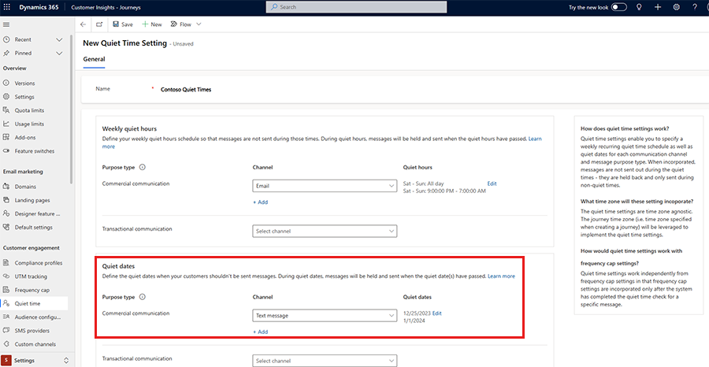
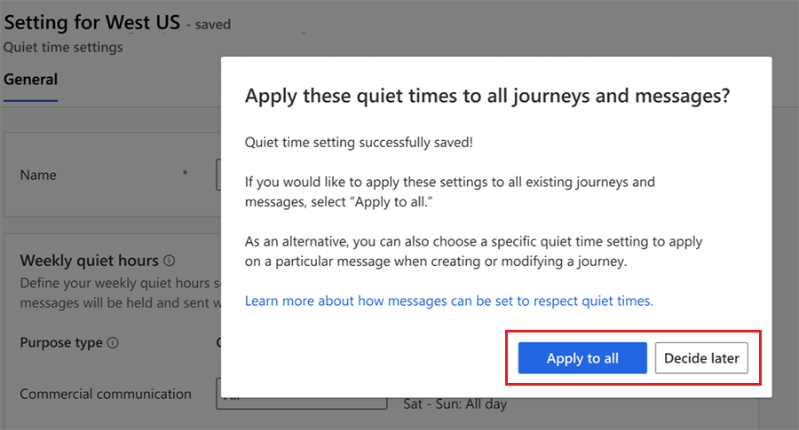
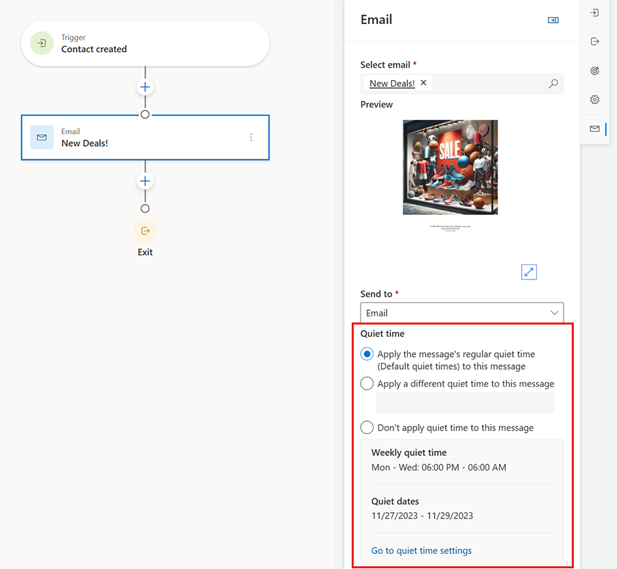

# Set quiet times to prevent messages from sending during unwanted hours

Quiet times enable you to configure specific times when messages won't send to customers to avoid contacting them when it's inappropriate. You might not want to send messages at specific times due to regulations, business policies, or other factors. Typically, quiet times are configured for overnight hours, weekends, or holidays. When quiet times are in place, the system holds the messages until the quiet times end.

To set up quiet times, visit **Settings** > **Customer engagement** > **Quiet times**. If no quiet time setting exists, use the **New** button in the ribbon to get started.

The **New Quiet Time Setting** page allows you to configure weekly quiet hours and quiet dates for your messages. You can also specify different quiet times for commercial and transactional message types. For instance, many organizations want to prevent commercial messages from sending at odd hours, but they expect transactional messages to send immediately.

In addition, you can differentiate your quiet times by message channel, such as email, text message, and custom channels. Often, customers are more sensitive about receiving text messages during off-hours than they're to receive an email, so you can have different quiet times for each channel, if desired.

## Set up quiet times

To set up quiet times, first choose a channel for the quiet times and then select **Edit** next to "No quiet time" for that channel. You can choose specific times and days for the quiet times, and you can use the **Add** button to specify multiple times and days of the week. For instance, you could set up quiet times for email to be all day on the weekends and between 9:00 PM and 7:00 AM during the work week. Once you configure the quiet times for the channel, you see the settings reflected directly on the page next to that channel. 

> [!NOTE]
> You can set up quiet times for maximum of 3 consecutive days.

## Set up overnight quiet times

To set up quiet times overnight, you need to create a separate evening quiet time and morning quiet time for each day. For instance, if you never want to send messages after 6:00 PM and before 8:00 AM, you can create two quiet time settings for the channel:

- One time for every day from 6:00 PM to midnight
- One time from midnight to 8:00 AM

> [!div class="mx-imgBorder"]
> 

## Set up quiet dates

To set up quiet dates, choose the channel and then edit the "Quiet date." Here, you can choose specific start and end dates when messages shouldn't be sent. You can use this interface to set up specific holidays or dates to prevent messages from sending by channel.

> [!div class="mx-imgBorder"]
> 

## Initial quiet time setting

The first time you create and save a quiet time setting, the system asks if you wish to apply it to all existing journeys and messages. If you select "Apply to all," the system applies the quiet time setting to all Compliance profiles. If you select "Decide later," you can add the quiet time setting directly to any compliance profiles you wish later. Once a quiet time has been added to a compliance profile, all messages designated with that compliance profile begin to respect the quiet times configured.

> [!div class="mx-imgBorder"]
> 

## Quiet times and journeys

Because journeys have a time zone set on them, quiet times respect the time zone set on the journey. For example, if you set the journey time zone to be (GMT-5:00) Eastern Time (US & Canada), the quiet times and days applied to messages in that journey apply to that time zone.

The number of messages held for quiet times shows on the journey to provide information.

You can also choose to change or disable quiet times for a specific message on a journey to support scenarios when a particular message in a journey shouldn't be subject to regular quiet times settings.

> [!div class="mx-imgBorder"]
> 

## Quiet times and frequency caps

Quiet times and frequency cap settings are independent. If a message is held for quiet times, the frequency cap is evaluated when the message is released from the quiet times hold.

## Quiet times and compliance

For many organizations, quiet times are a regulatory requirement. To enable quiet times for messages, the quiet time must be set on the compliance profile that the messages use. Setting the quiet times on a compliance profile enables you to have some compliance profiles that apply quiet times and others that don't. When you set up your first quiet time, the system asks you if you wish to apply it to existing journeys and messages. If you choose "Yes," the quiet time applies to existing compliance profiles automatically and current journeys and messages begin to apply it. If you choose "No," you can always choose the quiet time you'd like to enforce later on specific compliance profiles.

## Quiet times and business units

If you use business units, the quiet times you create are available to all compliance profiles, journeys, and messages within your business unit. If you want to have quiet times for separate business units, you can create an individual quiet time setting within that business unit. If Business Unit Scoping for real-time is enabled and you have access to multiple business units, you can choose which business unit the quiet time is for.

[!INCLUDE[footer-include](./includes/footer-banner.md)]