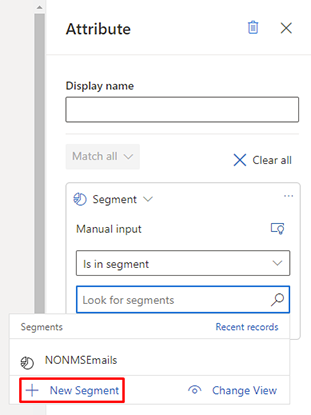
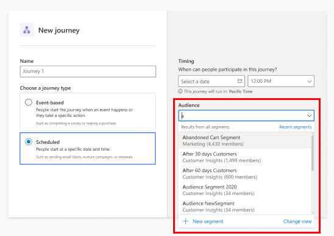

# Work with segments in Customer Insights - Journeys

[!INCLUDE[consolidated-sku-rtm-only](../includes/consolidated-sku-rtm-only.md)]

Customer Insights - Journeys uses [segments](segmentation-lists-subscriptions.md) directly from outbound marketing and [Customer Insights - Data](/dynamics365/customer-insights/index). You can view the segments available to you in Customer Insights - Journeys by going to **Audience** > **Segments**.

## Segments from outbound marketing

To create a journey based on a segment from outbound marketing:

1. Go to **Audience** > **Segments**.
1. Select any segment, then select **+New journey** in the top ribbon.

A new screen will open allowing you to use your selected segment to start your **Segment-based** journey.

You can also start a new journey from the segment details page.

To create a journey from the details page:

1. Go to **Audience** > **Segments**.
1. Select the name of any segment.
1. From the details page, select **+New journey** in the top ribbon.

## Create a new segment within your customer journey

You can create a new segment directly within the customer journey editor by selecting any **Attribute** tile, then going to **Segment** > **Look for segment** > **+New segment** in the right-side pane.

This will take you directly to the segment builder, where you can create and save your segment.

> [!div class="mx-imgBorder"]
> 

## Edit your segment

To edit your segment, select any segment name from the segments list. This will take you to the details view. Select **Open Segment** on the top ribbon. This will open the selected segment in its source builder. In the builder, select **Edit** to edit your segment.

You can determine the source of a segment by looking at the **Source** column in the segments list.

## Segments created in Customer Insights - Data

If you've connected your [Dynamics 365 Customer Insights - Data](/dynamics365/customer-insights/index) instance to Dynamics 365 Customer Insights - Journeys, segments from Customer Insights - Data will also be available to you in Customer Insights - Journeys.

Learn more: [Use Customer Insights - Data profiles and segments in Customer Insights - Journeys](real-time-marketing-ci-profile.md)

As shown in the following image, you can see whether a segment is a Customer Insights - Journeys segment or a Customer Insights - Data segment when you make a segment selection in your customer journey.

> [!div class="mx-imgBorder"]
> 

Learn more about [setting up and managing a Customer Insights - Data connection to Dynamics 365 Customer Insights - Journeys](/dynamics365/customer-insights/audience-insights/manage-environments).

## Exclusion segment

To exclude a segment in your customer journey, go to the right-side pane in the journey editor and select **Entry criteria**. Then, go to **Exclude this segment** and select any segment you want to exclude.

> [!NOTE]
> The segments shown for exclusion are based on the entry audience entity type. For example, if the entry audience segment is based on the **Contact** entity, only contact-based segments will be shown.

## Conditioning your customer journey based on a segment

To add a segment to a condition, select an **Attribute** in your customer journey, and then add a condition in the pane on the right side of the page.

## Suppression segments

You can use a segment as an exit criterion for your customer journey.

To use a suppression segment, select **Exit criteria** in the right-side pane in the customer journey editor. Then, choose a segment under **Exit by segment**.

> [!div class="mx-imgBorder"]
> 

[!INCLUDE[footer-include](../includes/footer-banner.md)]
