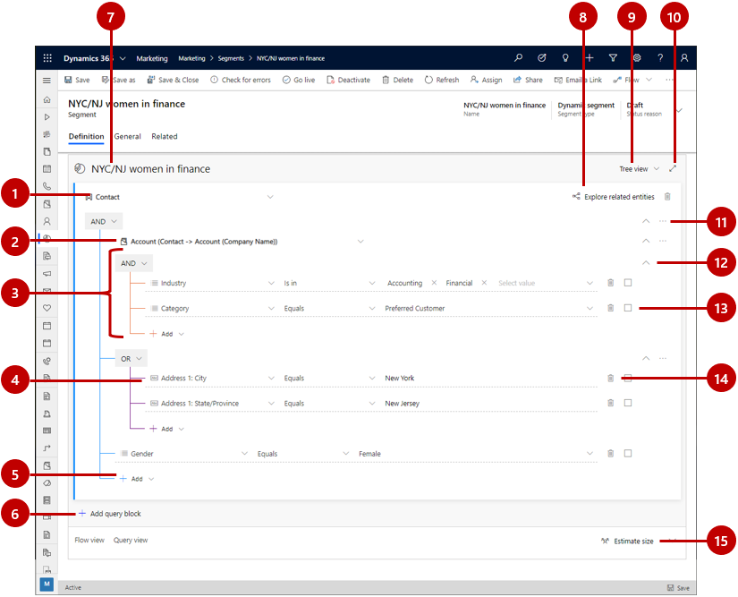
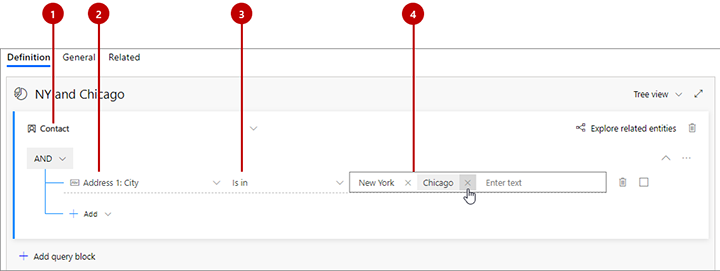
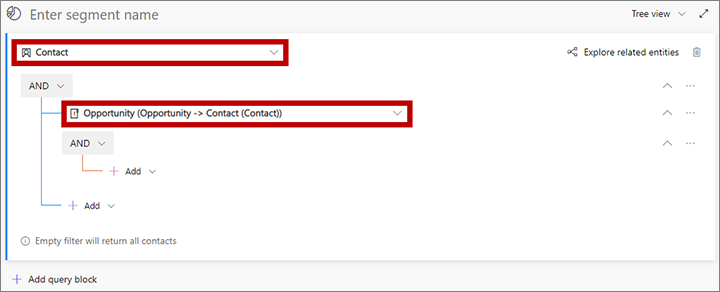
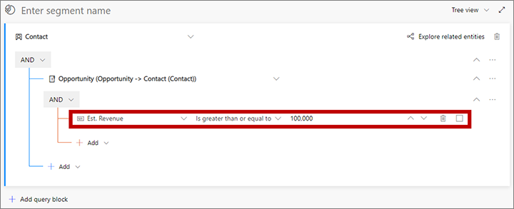
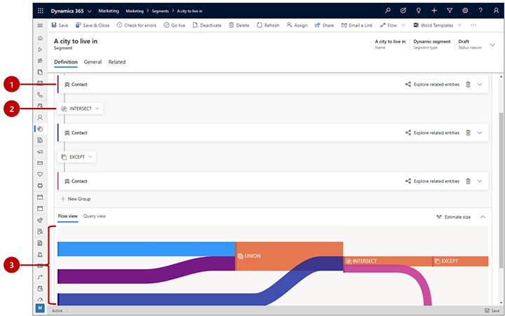

# Design dynamic demographic or firmographic segments

[!INCLUDE[consolidated-sku-rtm-only](./includes/consolidated-sku-rtm-only.md)]

> [!IMPORTANT]
> This article only applies to [outbound marketing](/dynamics365/marketing/user-guide).

_Demographic and firmographic segments_ are dynamic segments that query _profile records_ stored in the marketing insights database. Profile records include the entities you normally work with in the Dynamics 365 Customer Insights - Journeys UI, such as contacts, accounts, leads, and any other entities. They are synced between your Customer Insights - Journeys organizational database (where you can work with them in the UI and other Dynamics 365 apps) and the marketing insights database (where you can query them from a segment).

This type of segment is called _dynamic_ because its membership is defined as a query, which provides a logical description of the contacts the segment should contain, but doesn't list any contacts by name. Member ship in dynamic segments can change from moment to moment in response to new contacts being added or updated in the database.

Both demographic and firmographic segments are examples of dynamic profile segments. The only difference is that new firmographic segments are created with a relation to the accounts entity by default (which you are free to remove). For more information about other types of segments, and links to articles about how to work with them, see [Working with segments](segmentation-lists-subscriptions.md)

## Create or edit a demographic or firmographic segment

To manage your segments, go to **Outbound marketing** > **Customers** > **Segments** and then do one of the following

- Select any listed segment to open it for editing.
- To create a new demographic or firmographic segment, select **New** on the command bar. The **Segment templates** dialog box opens; select **Cancel** to close it, and then select the **Demographic** or **Firmographic** option, as described in [Working with segments](segmentation-lists-subscriptions.md).

Now design the logic for your demographic or firmographic segment as described in the remainder of this article. For more information about other types of segments, and links to articles about how to work with them, see [Working with segments](segmentation-lists-subscriptions.md)

## Elements in a query block

A *query block* is a collection of logical clauses and clause groups. A query block can be simple (possibly with just one clause), or complex (featuring multiple nested groups and relations). Your segments can also include multiple query blocks combined with union, exclude, and/or intersect operators, but often you'll have just one query block.

Each query block in your segment must result in a list of contacts, which are selected by the logic defined in that block. Each block must therefore establish a path through various entities, each linked through relations, and which ends with the contact entity. A simple query block might query the contact entity alone, but a more complex one could reference or pass through several entities.

The following image shows an example of typical query block in a dynamic profile segment query. It highlights the key features of the designer that you'll use to create your query.

Legend:

1. **Entity**: You can query any entity that's synced to the [marketing-insights service](mkt-settings-sync.md). However each query block must end with the **Contact** entity. You'll typically choose to start with the **Contact** entity and simply remain there (possibly adding clauses that query-related entities), but you can also choose to begin with another entity and then link through one or more relations to end with **Contact** entity as the last one in your query block.
1. **Related entity**: Related entities link the current entity to a related entity through a specific field of one of the two entities. In this example, you see a relation from the contact entity to the account entity, annotated as **Account (Contact -> Account (Company name))**. That means that we are linking to the **Account** entity, which relates back to the **Contact** entity&mdash;in this case through a lookup field on the contact entity called **Company name**. This relation opens a clause group that will find some accounts based on the criteria nested below this relation, and then relates back to the base entity (contact) by finding all of the contacts that work for the found companies (contacts that link to those companies through the contact **Company name** field). If needed, you can nest related entities within each other as your work farther and farther away from the base entity.
1. **Clause group**: Clause groups are collections of logical clauses (rows) that are combined using either AND or OR operators. The AND operator is more exclusive; it only finds records that meet all of the criteria of each clause in the group. The OR operator is more expansive; it finds all records that meet any of the criteria for the group. Use the drop-down list at the top of the clause group to select the operator. You can nest clause groups inside one another. The system resolves the most deeply nested groups first and then works its way up. The example shown here will find _accounts_ (the parent entity) that are either in the _financial_ or _accounting_ industry, but only those that also have a category of _preferred customer_.
1. **Single clause (row)**: Clauses represent the basic building blocks of the query. Each asks a specific question about a specific field value and finds records that answer that question. Each row starts by naming a field from the parent entity, followed by an operator (such as equals, contains, starts with, or ends with), followed by a value. Use the drop-down lists and fields provided to define the field, operator, and value for each new clause that you add, as needed. The example shown here finds contacts where the _city_ part of their address _equals_ _New York_.

    > [!NOTE]
    > [Calculated and rollup fields](/dynamics365/customerengagement/on-premises/developer/calculated-rollup-attributes) cannot be used for segmentation.

1. **Add item**: Use the **Add** buttons to add a new row, clause group, or related entity at that location in the query structure. Select the button to open a drop-down list, and then select which type of item you want to add there (**Add row**, **Add group**, or **Add related entity**). Finally, configure the new row, clause group, or relation as needed using the drop-down lists and fields provided for the new item.
1. **Add query block**: Use this button to add a new block to the query. Each query block resolves to a collection of contacts, which you then combine using union, exclude, and/or intersect operators. A Sankey diagram is provided at the bottom of the page to help you visualize how your query blocks combine and flow into each other. The effect is similar to creating a compound segment, but in this case you are combining query blocks within a single segment rather than individual existing segments.
1. **Segment name**: View and edit the name of your segment here.
1. **Explore related entities**: Select this button to open a diagram that illustrates how various entities relate to each other in your database (especially, how they relate back to the contact entity). This can help you decide how to make use of related entities in your query.
1. **View selector**: Use this drop-down list to select your preferred view for the query designer. Choose **Tree view** to show clause groups the way you see them in this diagram, with the operator (OR/AND) that applies to the group shown at the top of the group. Choose **Natural** to show the operator (OR/AND) at the start of each row.
1. **Full-screen editor**: Select this button to open the segment designer in full-screen mode, which provides more screen real estate for viewing and editing your query.
1. **Command menu**: Use the command menu (**...**) to operate on the  group where it appears, or selected elements in that group. The following commands can appear here (depending on the context):
    - **Delete**: Deletes the entire group.
    - **Delete selected**: Deletes only the selected rows from the group.
    - **Ungroup all**: Moves all of the rows in the group up one level, which merges them into the group above this one.
    - **Ungroup selected**: Moves only the selected rows into the group above this one.
    - **Group selected**: Creates a new group containing the selected rows, nested below the current group.
1. **Expand/collapse group or block**: Select a chevron button to expand or collapse all the rows in the group or query block below that button. This lets you switch between getting the big picture and viewing individual query details, which can be handy for complex queries.
1. **Select box**: Use these check boxes to mark rows that you can operate on using the command menu.
1. **Delete button**: To remove a clause (row) from your query, select the delete button next to the row you want to remove.

## Build clauses

Each segment query is made up of individual logical clauses that are grouped and combined using logical operators (AND/OR). Each clause looks for records that have a specific value (or range of values) in a specific field for a specific entity.

The segmentation designer supports fields of all data types supported by Dynamics 365, including: option set, two option set, multiple option set, single line of text, multiple lines of text, whole number, floating number, decimal number, currency, look up, date time, and customer.

### Build a clause that finds standard field values

*Standard fields* are fields where users can freely enter any value (of the appropriate data type). A typical example is the **First Name** field of the contact entity. Users are free to enter any text in this field, and the field is directly part of the contact entity. The following illustration shows how to construct a clause based on a standard field.

Legend:

1. **Entity name**: This is the entity that the field comes from. It appears at the top of a collection of groups and/or rows. All clauses below a given entity will return records of that type.
1. **Field name**: This is the field that the clause will test. Each field shows an icon that indicates the type of field it is (text, number, date, lookup, option set, and so on). If you know the name of the field you want to specify here, then start typing its name in this field to filter the drop-down list.
1. **Operator**: This is how the clause will test the values of the specified field. The choices here depend on the data type of the field. For example, string fields allow operators such as *is*, *is not*, *contains*, *begins with*, *ends with*, and more. Number fields offer comparisons such as *equal to*, *less than*, and *greater than*.
1. **Value**: This is the value the clause will test for using the specified operator. With standard fields, this is free text, so you can type anything you like. Press return to add the value you've typed. After adding a value, you can add more values by typing them and pressing return again. If you enter more than one value here, then the clause will find records that match any of these values (as if they were separate clauses combined with an OR operator). To remove a value from here, select its close icon, which looks like an X.

> [!NOTE]
> You can only select entities that are available to the marketing-insights service. If you need an entity that isn't listed, please ask your administrator to enable it. For instructions, see [Choose entities to sync with the marketing-insights service](mkt-settings-sync.md).

### Build a clause that finds option-set values

*Option-set fields* are fields that accept a limited set of specific input values. They are typically presented to users as drop-down lists in input forms. For example, the contact entity might include a **Role** field that provides specific options such as **Decision Maker**, **Employee**, and **Influencer**.  The available values are part of the entity itself, so they don't refer to any related entities.

Option-set fields work in nearly the same way as the standard fields described in the previous section. The only difference is that when you are entering the value(s), you'll only be able to choose from among the values defined in the entity for that option set. As with standard fields, you can specify multiple values, which are combined with an OR operator.

### Build a clause that finds multiple option-set values

*Multiple option-set fields* are nearly the same as option-set fields, but they allow each record to accept multiple values while option-set fields accept just a single value. For example, the contact entity might include a **Favorite pets** field that provides the values **Dogs**, **Cats**, and **Birds**, and each contact might have none, one, two, or all three of these values applied to it.

In the segment designer, multi option-set fields provide operators that appropriate for processing multiple values. For example, you can list several values and set the operator to **contains all of** (to only find contacts where *all listed values* are present) or **contains any of** (to find all contacts that have *at least one* of the listed values).

### Create a clause that finds a lookup value

*Lookup values* are values that come from a related entity. For example, the contact entity has a lookup field called **Company Name**, which relates to the account entity. In the contact record, this field stores the unique ID of a related account record, but the system displays the name of the company, which is found by looking up the account ID and finding the value of the matching account record's **Name** field.

When you're selecting the field name for a clause, lookup fields show a magnifying-glass icon.

Provided the related entity is available to the marketing-insights service, you'll be able to select from among available values when you assign a value for your clause. In the previous example, you'd be able to choose from a list of available company names. If the related entity is not available to the marketing-insights service, then you'll have to look up and enter the [record ID](dynamic-email-content.md#record-ids) instead. Your administrator can add whatever entities you need to the marketing-insights service as required; for instructions, see [Choose entities to sync with the marketing-insights service](mkt-settings-sync.md)

<!-- Lookup fields also provide a special operator called **has**. Use this operator to test for the value of any field from the related entity, rather than just the value displayed by the local entity. For example, if you are querying the **Company Name** (Account) field of the **Contact** entity, you can use the **is/is in** operator to test for values of the **Name** field of the related account entity. But if you use the **has** operator, you can test for any field value from the related account record (such as **Address 1: City**). In the following illustration, this clause will find contacts who work for companies with street addresses in New York or Chicago.

 -->

## Move between entities with relationships

When you create a new segment, it automatically starts with a default group based on the contact entity, as we saw in the [previous example](create-segment.md). So long as you only want to query values directly on the contact entity, then it's straightforward to add various clauses and combine them with AND/OR operators until you've defined the set of contacts you're looking for. However, you can also build much more complex queries that reference some other entity (such as accounts), queries that entity according to some criteria (such as number of employees) and then relates back to the contact entity to find the contacts associated with those accounts.

All segments must end with the contact entity, so any time you start with a non-contact entity you must eventually traverse back to the contact entity. However, you can normally start with the contact entity and remain there by referencing related entities as nested groups. In each case, you hop from entity to entity by using a *relationship*. As with rows and groups, you can add a related entity using the **Add** button.

When you are selecting a related entity, the options are displayed using the following naming convention:

*DestinationEntity* **(**_PrimaryEntity_ **->** _SecondaryEntity_ **(**_FieldName_**))**

Where:

- ***DestinationEntity*** is the entity you are going to. All rows listed below the relationship will query fields from this entity.
- ***PrimaryEntity*** is an entity at the starting side of the relationship. It is always shown on the left side of the arrow. For example, a *contact* (primary entity) can be related to an *account* (secondary entity) through the account's *primary contact* field (field name).
- ***FieldName*** is the name of the lookup field through which the relation is established. It is always shown in parenthesis. The named field belongs to the primary entity, and displays a value from the secondary entity (but actually contains the ID of the related record that value is drawn from). In some cases, you might see two or more relationships between the same two entities, each of which flows through a different field.
- ***SecondaryEntity*** is the destination of the relationship. It is always shown on the right side of the arrow.
- The arrow indicates whether it is a 1:N relationship (**->**) or an N:N relationship (**<->**). (N:1 relationships are arranged to be shown as 1:N relationships.)

For example:

- **Account (Account -> Contact (Primary Contact))**: This opens a new group where you can query accounts (the destination entity) to return a list of contacts that are shown as the primary contact for each found account (because "Primary Contact" is a lookup field on the "Account" entity).
- **Account (Contact -> Account (Managing Partner))**: This opens a new group where you can query accounts (the destination entity) to return a list of contacts that show that account as their managing partner  (because "Managing Partner" is a lookup field on the "Contact" entity).
- **Event Registration (Event Registration -> Contact (Contact))**: This opens a new group where you can query event registrations entity (the destination entity) to return a list of contacts that have registered for the found events (because "Contact" is a lookup field on the "Event Registration" entity).
- **Lead (Lead -> Contact (Parent Contact for lead))**: This opens a new group where you can query leads (the destination entity) to return a list of contacts associated with (as the *parent of*) each of the found leads (because "Parent Contact for lead" is a lookup field on the "Lead" entity).

> [!IMPORTANT]
> Your segment must always end on the contact entity. If you start with some other entity, then you must always end with a relation back to the contact entity.

> [!TIP]
> While you're designing your query, select the **Explore related entitites** button to see a graphical map of how the current entity relates to other entities. This tool can help you figure out how to traverse the various entities to create a path that ends at the required **Contact** entity. Available paths and entities are shown in blue, while entities and paths that aren't directly available to the current entity appear in light gray. Already used paths and entities are shown in dark gray.
> 
> 

## Example: Define a simple segment based on contacts

A simple query uses a single group that references the contact entity only. When you create this type of segment definition, set up a query with clauses that test various field values from your contact records and combine the various clauses using the logical operators AND and OR. For an example, see the tutorial [Create a dynamic segment](create-segment.md).

## Example: Define a more complex segment based on opportunities

Here's an example of how to define a segment that finds contacts associated with opportunities with an estimated revenue of $100,000 or more.

1. If your Customer Insights - Journeys instance isn't already set up to sync the **Opportunity (opportunity)** entity with the marketing-insights service, talk to your admin about setting this up. If you are the admin, then see [Choose entities to sync with the marketing-insights service](mkt-settings-sync.md) for instructions.

1. Go to **Outbound marketing** > **Customers** > **Segments** and select **New** on the command bar. The **Segment templates** dialog box opens; select **Cancel** to close it, and then select **Demographic** on the **Let's create your segment** screen.

1. A new demographic segment opens. Check the view setting near the upper corner of the **Definition** tab and make sure it's set to **Tree view**. (You could use either view, but in this procedure we show and describe the tree view, so it's a good idea to use it for now.)

    

1. Open the **Add** drop-down list under the **Contact** entity and select **Add related entity**.

    

1. A new related entity is added to your query. Select the field with **Select related entity** in ghost text to open a large drop-down list of available relations. Type "opportunity" in the field to filter the list and then select **Opportunity (Opportunity -> Contact (Contact))** from the drop-down list. This relation links the parent **Contact** entity to the **Opportunity** entity through the **Contact** field of the **Opportunity** entity. The **Contact** field identifies the contact associated with each found opportunity. More information: [Move between entities with relationships](#relationships)

    

1. Open the **Add** drop-down list under the new related entity and select **Add row** to begin defining the collection of opportunities you're looking for. 

1. A new row is added to your query. Use it to create the following logical expression:

    **Est. Revenue | Is greater than or equal to | 100000**  

    

1. The segment currently finds all contacts associated with opportunities with an estimated revenue of $100,000 or more. If needed, you can now add more opportunities-based criteria indented under the **Opportunity (Opportunity -> Contact (Contact))** relation to expand or limit the set of opportunities found. You could likewise add more contact-based criteria directly under the **Contact** entity (at the base of the tree, outside the **Opportunity (Opportunity -> Contact (Contact))** relation) to expand or limit the set of contacts found. 

1. Select the field that shows **Enter segment name** as ghost text. Then type a name for your segment.

1. On the command bar, select **Save** to save your segment and then select **Go live**.

## Combine multiple query blocks

You can design your segment to include multiple query blocks and then set rules for how to combine the groups. Often, you could obtain the same results with a single, complex query block, but it can be sometimes be easier to design and visualize your segment using multiple query blocks instead.

The following image shows the dynamic-profile segment designer with when several query blocks are present.

Legend:

1. **Collapsed query block**: All of the query blocks in this example are shown as collapsed, which means you can't see the detailed logic of each group. However, this view makes it easy to see all the groups and adjust the logic being used to combine them. Use the chevron button at the right side of each query block to expand or collapse it.
2. **Query block operator**: Between each query block is an operator, which establishes the logic for combining the previous group with the next one. Use this drop-down list to choose one of the following:
   - **Union**: Combines all members of the two groups.
   - **Intersect**: Finds only contacts that are members of both groups. Contacts present in just one of the groups will be removed.
   - **Except**: Removes all contacts from the incoming group from the current result.
3. **Sankey diagram**: This diagram makes it easy to visualize the way all of the various groups are being combined by your selected logic. It indicates how two incoming groups will be combined, the order of the combination, and the approximate effect that the combination logic will have on the resulting, combined group. Select the **Flow view** tab at the bottom of the page if you don't see the diagram there.

## View and edit the raw query

The segment designer provides a graphical interface for creating the logic for a dynamic segment. As  you work with the settings, you are actually creating a text-based query in the background. This is the query that the system will actually run against your database. Usually you don't need to use the query for anything, but sometimes it can help in troubleshooting. You can also copy/paste queries into the designer, which you might use to create a copy of an existing segment or to share a query design through email.

To find, view, and edit the query, scroll to the bottom of the page and open the **Query view** tab here. 

[!INCLUDE[footer-include](./includes/footer-banner.md)]
