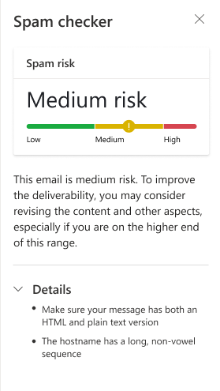

# Use AI to check your message-content spam score

The spam checker feature applies artificial intelligence to analyze the content of each marketing email message. Spam checker then generates a range that predicts how likely the message is to be flagged by content-based spam filters.

There are two ways to view your spam risk:

- **Automatically**: A spam check is always made as part of the standard **Check for errors** and **Go live** processes. Spam risk results are shown together with other results of the error check. Spam risk results are classified as high, medium, or low (lower is better). If you get a high or medium spam risk level, you should consider revising your content.
- **Manually**: As you are designing your email, you can check your spam risk at any time by going to the **Designer** tab. Unlike the automatic error-check results, this display also provides information about which types of issues are most likely responsible for increasing your risk level.

To manually view and interpret the spam risk for a message:

1. Go to **Outbound marketing** > **Channels** > **Emails**, and then either create or open an email message.

1. Design your email content as usual using the email designer.

1. Before you go live, open the designer, open the drop down menu to the right of **Check content** in the top toolbar, and select **Spam checker** to run the check on your current content. The check may take a couple of minutes but is usually faster.
    
    > [!div class="mx-imgBorder"]
    > 

1. When the analysis is finished, you get a low, medium, or high-risk result. If you click the **Details** panel, you are given recommendations on how to decrease your spam risk. A low risk is encouraged however due to the nature of marketing content, some errors are to be expected.

    > [!div class="mx-imgBorder"]
    > 

    Though exact thresholds may vary based on your topic and audience, here are a few guidelines for interpreting the score:

      - 0 – 40 (green): This is a good score, so congratulations! The content of your message is mostly free of red-flag terms and is likely to be both delivered to and appreciated by your recipients.
      - 40 – 80 (yellow): This is a medium score. You should consider revising the content, especially if you are on the higher end of this range.
      - 80 – 100 (red): This is a high score. Your message is likely to be blocked by spam filters, and messages that are delivered are likely to be badly received and may even be reported as spam by recipients.

    When you're revising your content, remove high-pressure words and phrases, plus any other content that you would consider spammy if you received this message yourself. Consider also the issues listed as the top factors affecting your risk results.
    
    If you would like to know more about how the scores are generated, you can visit this [website](https://spamassassin.apache.org/index.html).

1. When you are satisfied with your spam risk level, go live with your message as usual.

[!INCLUDE [footer-include](./includes/footer-banner.md)]
