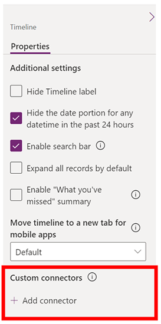
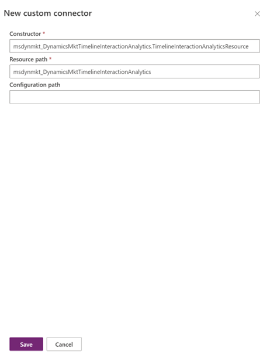
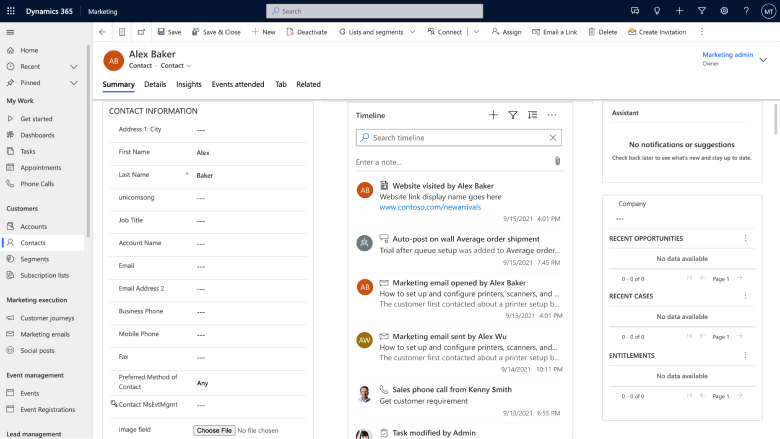

# Customer interactions timeline

[!INCLUDE[consolidated-sku-rtm-only](./includes/consolidated-sku-rtm-only.md)]

The interactions timeline for a contact or lead provides a unified view of historical interactions based on customer activities in Dynamics 365 Customer Insights - Journeys (both Customer Insights - Journeys and outbound), Sales, and Customer Service.

You can also view Customer Insights activities in the timeline. Learn more: [Integrate Customer Insights activities with Dynamics 365 timelines](/dynamics365/customer-insights/activities-in-d365-timeline)

> [!TIP]
> To learn how to configure the timeline and view interactions across Dynamics 365 Sales and Customer Service, see the [Use timeline](/power-apps/user/add-activities) article in the Power Apps documentation.

Having a single view of all the activities that a customer engages in enables you to get a complete understanding of your customer. Business stakeholders (marketers, sales agents, customer service agents, account managers, etc.) can use the unified view of customers' historical interactions with the business to create personalized experiences through both digital and non-digital channels. For instance, a sales agent could learn about the newsletters that a contact has subscribed to due to previous marketing campaigns as well as the product pages and blogs recently explored by the contact to personalize communication with them in the next sales call. Similarly, a service agent could investigate the latest email communications received by a customer as part of a customer journey to help with an escalation scenario.

## How to enable marketing interactions in your contact/lead timeline

If you use the out-of-the-box contact and lead forms provided with Customer Insights - Journeys, marketing interactions (based on Customer Insights - Journeys and outbound marketing activities) will automatically show up in the timeline. The timeline will only display interactions associated with the respective profile type (either contact or lead). For example, the timeline for a contact will include interactions for that contact only.

But if you use custom forms for contacts and leads, you’ll need to add a custom connector to the timeline component in your custom contact/lead form to see the marketing interactions.

The following steps show you how to add the custom connector to your timeline component through the [Power Apps maker experience](https://make.powerapps.com/):

1. Within the Power Apps maker experience, select **Tables**. Open the table you want (for example, Contact), and then select the **Forms** area.
1. Open your custom contact/lead form and select the timeline component in the form.
1. To add a new custom connector, in the **Properties** pane for the timeline component, go to **Custom connectors** and select **Add connector**.
    
    > [!div class="mx-imgBorder"]
    > 

1. The **New custom connector** pane is displayed. Add the following details and select **Save**:
    - **Constructor**: `msdynmkt_DynamicsMktTimelineInteractionAnalytics.TimelineInteractionAnalyticsResource`
    - **Resource path**: `msdynmkt_DynamicsMktTimelineInteractionAnalytics`

    > [!div class="mx-imgBorder"]
    > 

1. The custom connector is now added to the timeline component. **Save** and **Publish** your custom contact/lead form. The timeline in your custom contact or lead form will now show the marketing interactions.

For more information, see [Use custom connectors with the timeline control](/power-apps/maker/model-driven-apps/custom-connectors-timeline-control).

## Key capabilities of the timeline

> [!div class="mx-imgBorder"]
> 

- Along with activities from Dynamics 365 Sales and Customer Service, you can view interactions based on activities from both Customer Insights - Journeys and outbound marketing, including interactions across the following marketing activities:
    - Emails
    - Text messages
    - Push notifications
    - Web activity
    - Forms
    - Events
- You can use filtering to focus on specific types of marketing interactions like all emails that were opened by a contact
- You can search the timeline for interactions related to a specific marketing asset
- Preview the communications (emails, text messages, and push notifications) that a contact received or interacted with as part of your marketing campaigns within the timeline

> [!IMPORTANT]
> To see marketing interactions on the timeline, you need to enable the following read permissions:
>
> -	msdyncrm_marketingemail
> -	msevtmgt_event
> -	msdyncrm_marketingform
> -	msdyncrm_website
> -	msdynmkt_email
> -	msdynmkt_pushnotification
> -	msdynmkt_sms

> [!NOTE]
> Real-time - marketing activities from the past 12 months are shown in the timeline for the selected contact or lead. Historical interactions from outbound marketing activities are only shown after the real-time marketing installation date or May 2022, whichever is later.

[!INCLUDE[footer-include](./includes/footer-banner.md)]
