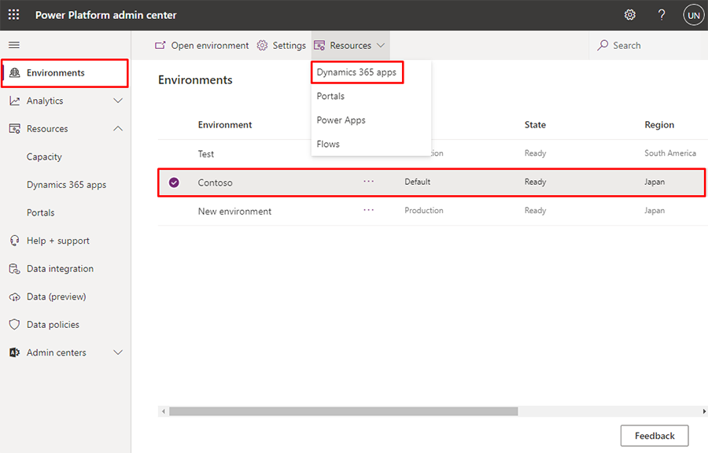
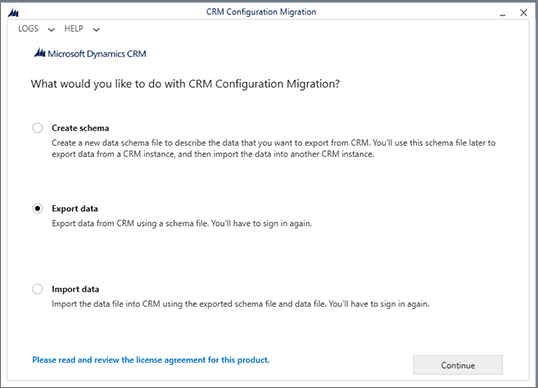
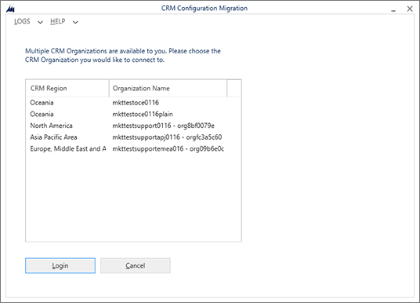
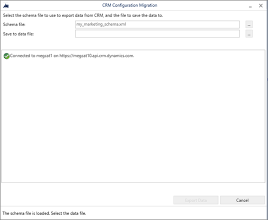
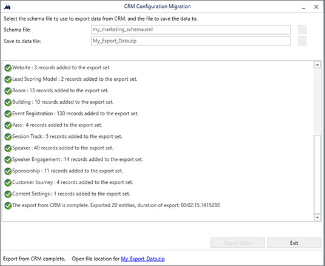
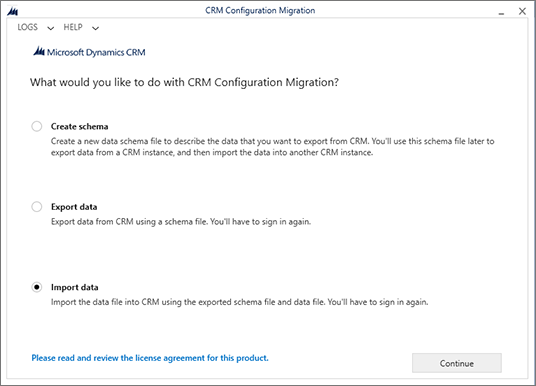
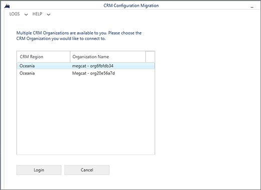
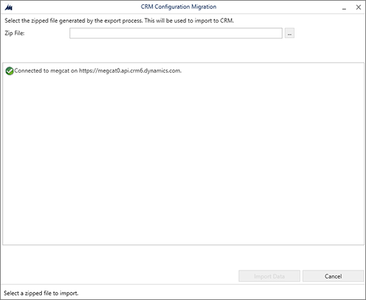
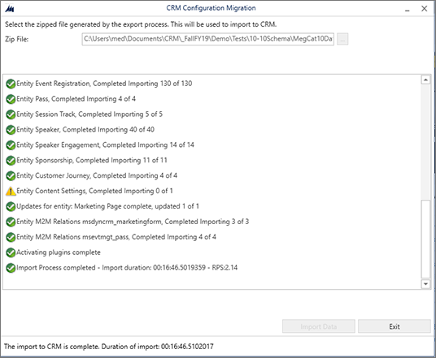

# Transfer data and configurations between environments using the Configuration Migration tool

[!INCLUDE [consolidated-sku-rtm-only](./includes/consolidated-sku-rtm-only.md)]

You can replicate Dynamics 365 Customer Insights - Journeys configurations and data across environments using the standard tools provided for Dynamics 365. Common scenarios where this comes in handy include:

- Move validated journeys, emails, and other content from a sandbox to a production environment
- Set up a demo with sample data on a trial or sandbox

The process works as follows:

1. Download the Configuration Migration tool for Dynamics 365 (if you don't already have it).
1. Make sure your source and destination environments are running the same version of Customer Insights - Journeys.
1. Use the Configuration Migration tool to generate a database schema based on your source environment.
1. Export data from the source environment using the Configuration Migration tool together with the schema.
1. Import the exported zip bundle onto the destination environment using the Configuration Migration tool.

## Prerequisites for the export/import process

Complete the following prerequisites before transferring data and configurations between environments:

1. Make sure no records are in a "live" state. The Configuration Migration tool will not transfer entities that are in a "live" state, thus import to the destination environment will be partial.

    > [!NOTE]
    > The Configuration Migration tool includes options to exclude or filter live records. The exclude functionality removes the **Status** field, exporting all entities regardless of status. The filter functionality limited the entities that are exported. [Contact technical support](/power-platform/admin/get-help-support) for assistance with these features.

1. Ensure that the source and destination environments are running the same version of Customer Insights - Journeys and are using an identical database schema (at least for the data you are transferring).

## Capabilities and limitations of the export/import process

The following notes apply when you use export/import to move data from one Customer Insights - Journeys to another:

- If you import (or reimport) a record that already exists on the destination environment, that record will end with a status of "draft" on the destination environment. Matching records won't be duplicated.
- Interaction data can't be exported or transferred to a new environment. It will never be included in the export file.
- If you export from a language not present on the destination environment, that language will simply be added to the destination environment.
- After a Customer Insights - Journeys journey is migrated, restored, or copied, its state is changed from **Live** to **Stopped**. To restart a migrated, restored, or copied journey, you need to first duplicate the journey, and then execute it.
- Triggers cannot be migrated when moving data between environments. Any events in the old environment need to be re-created in the new environment.

## Download the Configuration Migration tool

The Configuration Migration tool helps you extract your data and configuration details from one environment and then import them to another. To get the tool, follow the instructions given in [Download tools from NuGet](/dynamics365/customerengagement/on-premises/developer/download-tools-nuget).

## Make sure your source and destination are running the same version of Customer Insights - Journeys

Your source and destination environments must both be running identical versions of Customer Insights - Journeys. Use the following procedure to check the version on each environment. If they don't match, then update one or both of them to the most recent version as described in [Keep Customer Insights - Journeys up to date](apply-updates.md)

To find your Customer Insights - Journeys version number:

1. [Open the installation management area](uninstall.md) and go to **Environments**.  

1. If you have more than one Dynamics 365 environment, each of them is listed here. Select the environment where you have Customer Insights - Journeys installed and are planning to export data from.

1. Select the **Resources** drop down in the top ribbon, then select **Dynamics 365 apps**.

    > [!div class="mx-imgBorder"]
    > 

1. A list of solutions installed on your selected environment is shown. Select the solution called **Dynamics 365 Customer Insights - Journeys Application** then select **Details** in the top ribbon.

    > [!div class="mx-imgBorder"]
    > 

1. A pane will appear on the right side of the page titled **Dynamics 365 Customer Insights - Journeys Application Details**. Check the value shown in the **Version** column.

## Generate a database schema for your source environment

The Configuration Migration tool requires a database schema each time it exports or imports data. The tool itself can generate the required schema for you. The generated schema will specify the database structure of your source environment, including all customizations. The database on your destination environment must use an identical schema for all transferred data.

To generate the required schema:

1. Open the folder where you [installed the tools](#install-tools). Find and run the **DataMigrationUtility.exe** file here.

1. In the utility, select **Create schema** and then sign into your source environment.

1. Follow the instructions provided in [Create a schema to export configuration data](/power-platform/admin/create-schema-export-configuration-data) to generate the schema. Be sure to include all of the solutions, entities, and fields for which you want to transfer data, and also make sure all dependencies are included.

> [!TIP]
> Here are a few links and notes that may help you generate the schema you need:
> 
> - You can use the metadata browser tool to explore and understand your database structure. For details about how to install and use it, see the [Dynamics 365 Customer Insights - Journeys entity reference](developer/marketing-entity-reference.md).
> - While you're [creating your schema](/power-platform/admin/create-schema-export-configuration-data) with the Configuration Migration tool, you can check for relationships used by any selected entity by selecting the **Show the relationships for the selected entity** check box. This can help keep you from leaving out any dependencies.
> - When you're done [creating your schema](/power-platform/admin/create-schema-export-configuration-data) with the Configuration Migration tool, select **Tools** > **Validate Schema** from the menu bar. This will check for dependencies for all your selected entities, and can also help point out other common issues.

## Export data from your source environment

To export data from your source environment:

1. Open the folder where you [installed the tools](#install-tools). Find and run the **DataMigrationUtility.exe** file here.

1. The tool launches. Select **Export data** and then **Continue**.  

    

1. Set the **Deployment type** to **Microsoft 365** and then select **Login**.

    

1. Follow the instructions on your screen to sign in using the user name and password for the tenant where your source environment is running.

1. If multiple environments are available on the tenant you signed in to, then choose your source environment and select **Login** to continue. (If only one environment is available, then you'll skip this step.)

    

1. On successful sign in, you're asked to choose a schema and export file name.
  
    

    Make the following settings:
    - **Schema file**: Select the ellipsis button to open a file browser, and then navigate to and select the schema file that you generated for your source environment.
    - **Save to data file**: Select the ellipsis button to open a file browser, and then navigate to the folder where you want to save the exported data, together with a file name.

1. Select **Export data** to continue. The tool tracks the progress of your export and, when it's done, creates a zip file containing both the schema and your data.

    

1. When the export is done, select **Exit** to close the export page.

## Import data to your destination environment

To import data to your destination environment:

1. If the Configuration Migration tool isn't still running, then open the folder where you [installed the tools](#install-tools). Find and run the **DataMigrationUtility.exe** file here.

1. Select **Import data** and then **Continue**.

    

1. Set the **Deployment type** to **Microsoft 365** and then select **Login**.
 
    

1. Follow the instructions on your screen to sign in using the user name and password for the tenant where your destination environment is running.

1. If multiple environments are available on the tenant you signed in to, then choose your destination environment and select **Login** to continue. (If only one environment is available, then you'll skip this step.)

    

1. On successful sign in, you're asked to choose a file to import. Select the ellipsis button next to the **Zip file** field to open a file browser, and then navigate to the folder where you saved the export file from your source environment. This file contains both data and the schema you used for export
 
    

    > [!IMPORTANT]
    > As mentioned previously, your source and destination environments must use exactly the same schema for the data being transferred, so they must be running identical versions of Customer Insights - Journeys, and all relevant schema customizations must be identical on both environments. If the schemas don't match, you will get an error and the import will fail. <!-- but can we use just a partial schema? -->

1. Select **Import data** to continue. The tool tracks the progress of your import.

    

1. When the import is done, select **Exit** to close the import page.

[!INCLUDE [footer-include](./includes/footer-banner.md)]
