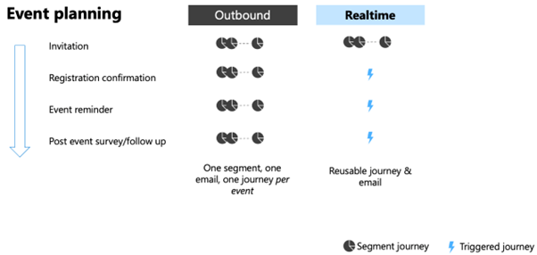

# Transition event management

Event management comprises three areas:
- Event setup (including tracks and sessions, speakers, registrants, etc.)
- Communication about events
- Publishing of information about events

More granularly, the event management areas can be broken down as follows:

| Event setup                                                       | Event communication                  | Event publishing          |
|-------------------------------------------------------------------|--------------------------------------|---------------------------|
| Events, speakers, tracks, sessions, registrants | Segments, emails, journeys | Forms, portal pages |

Creation and setup of events, tracks and sessions, speakers, and registrants is unaffected by the change to real-time journeys.

Communication about events is also largely unaffected by the transition to real-time journeys. New emails and journeys are required, but the process of inviting and registering attendees remains consistent. However, there are enhancements associated with the addition of triggers that should be considered when creating event invitation and registration real-time journeys.

Event-based communications in real-time journeys allow for more timely communication with attendees. This is illustrated below:

> [!div class="mx-imgBorder"]
> 

The one thing that changes with real-time journeys events is the publishing of event information now that the dependency on Power Pages is removed. With outbound marketing, Power Pages were used as a platform to present event data (sessions, speakers, etc.) and handle registrations.

With real-time journeys events, the Power Pages dependency changes and only the registration form is provided. Registration forms can be either self-hosted or embedded into a website. This allows you to create the online presence you require for events using your technology of choice while capturing event registrations into Customer Insights - Journeys. Your technology of choice can include Power Pages (as it did with outbound marketing) if so desired, but you need to create the necessary pages for the event.

<!--## Relevant upcoming features

The features listed below may be of interest as you transition from outbound marketing to real-time journeys. These features provide parity, equivalent, or better functionality than what was available in outbound marketing.
-->
> [!TIP]
> If you have questions or comments, visit the [Outbound to real-time transition community forum](https://community.dynamics.com/forums/thread/?partialUrl=Outbound-to-Real-Time-Transition)

[!INCLUDE [footer-include](./includes/footer-banner.md)]