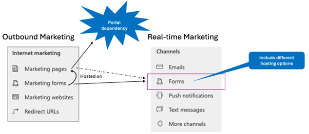

# Transition marketing pages and forms

> [!IMPORTANT]
> **The [outbound marketing](user-guide.md) module will be removed from Customer Insights - Journeys on June 30, 2025.** To avoid interruptions, transition to real-time journeys before this date. More information: [Transition overview](transition-overview.md)

Outbound marketing contains sitemap entries for "Internet Marketing." The entries and the corresponding real-time journeys equivalent are depicted in the following image:

> [!div class="mx-imgBorder"]
> 

Notice that there isn't a one-to-one relationship between the outbound marketing objects and the real-time journeys objects:

- Marketing pages in outbound marketing serve as a hosting container for outbound marketing forms. They have a dependency on Power Pages, which is removed in the real-time journeys module and therefore have no equivalent in real-time journeys.
-	Outbound marketing forms allow you to design forms for landing pages, event registrations, or subscription centers. This functionality is covered in real-time journeys forms, which can be published as a standalone page.
-	Marketing websites and redirect URLs allow you to track web activity. With web tracking, a feature that isn't yet available in real-time journeys but it's planned (see [Engage customers with content and follow-ups based on website interactions](/dynamics365/release-plan/2023wave2/marketing/dynamics365-marketing/engage-customers-content-follow-ups-based-website-interactions)) you'll be able to create customer experiences based on your customers' web behavior. There are no plans to support "Redirect URLs" in real-time journeys. 

> [!NOTE]
> Outbound marketing "Redirect URLs" capabilities will not be supported in real-time journeys.

Real-time journeys forms cover all functionality from outbound marketing forms and they also take over the publishing part from marketing pages (see [Deploy pages that contain Customer Insights - Journeys forms](real-time-marketing-deploy-pages.md)). Real-time journeys forms can also be used for event registration (in the **Website and form** tab in the event management module) and preference centers, which are equivalent to subscription centers in outbound marketing (see [Transition consent](transition-walkthrough-consent.md) and [Create branded, customized preference centers to manage customer consent](real-time-marketing-preference-centers.md)).

It's worth noting that real-time journeys forms are more advanced than an equivalent to the outbound marketing side. Real-time journeys forms have an intuitive, modern interface with an advanced form designer. Real-time journeys event registration forms also offer enhanced personalization options, allowing you to reuse forms by bringing in dynamic content (for example, for events).

Consider the following when transitioning forms:

-	Because the underlying concept for forms is different between the modules, there's no way to automatically transition an outbound marketing form to a real-time journeys form.
-	Real-time journeys forms are continuously improved. However, there are still details that aren't available in real-time journeys forms, for example, lead linked to parent contact, custom unmapped form fields, cascading forms fields, custom form templates, and web tracking.

#### Workaround for custom form templates

You can create a form and name it "template." Your users should avoid creating new forms from scratch. Instead, they should open the "template" form and save it as a new one.

## Relevant upcoming features

The following features may be of interest as you transition from outbound marketing to real-time journeys. These features provide parity, equivalent, or better functionality than what was available in outbound marketing.

- **Lead linked to parent contact** (2024, wave 2): When a lead is created upon form submission, it's linked to its contact. You can configure the form submission to avoid updating the lead or contact entity if you have a custom flow in place to handle these updates.
- **Custom unmapped fields** (2024, wave 2): Ability to include fields in a form that aren't connected to any table. Usually this is used for information that's temporary in nature and needed only during the current journey (for example, meals choices for attending an event).

## Blogs and workarounds

- Cascaded fields (where options provided in a field depend on a value in an earlier field) are not yet supported. See this blog for a workaround: [Implementing cascading dropdown fields in RTM forms - FastTrack blog](https://community.dynamics.com/blogs/post/?postid=ff86d88f-d892-ef11-ac21-6045bdd7e1ae)

[!INCLUDE [transition-comments](./includes/transition-comments.md)]

[!INCLUDE [footer-include](./includes/footer-banner.md)]
