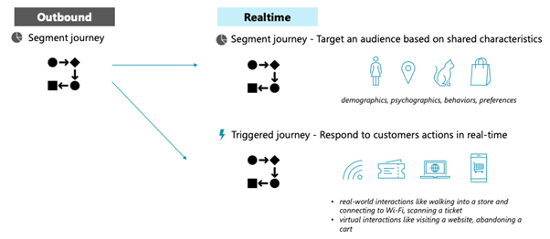

# High-level transition guidance

[!INCLUDE [consolidated-sku-rtm-only](./includes/consolidated-sku-rtm-only.md)]

Microsoft has already provided general information on transitioning to real-time journeys. The [playbook for transitioning from outbound marketing to real-time journeys](https://community.dynamics.com/blogs/post/?postid=1b4394d5-7764-4484-aba9-c7f972292c10) covers key information and guidelines. The articles in the "Transition from outbound marketing" section of the documentation provide further guidance.

This article explores some general concepts to think about before diving into transition details for individual feature areas.

## Don't approach tasks as if you're working in outbound marketing; think real-time

Real-time journeys can accomplish almost all of the tasks that outbound marketing can. It also has many features beyond outbound marketing's capabilities. A typical outbound journey looks like this:
-	Start with a segment of specific contacts 
-	Send a first e-mail
-	Monitor different events like “email delivered” or “e-mail opened”
-	React to specific events in the email, for example “button clicked” and use branches to direct the contact to a specific landing page

You can implement this same workflow using real-time journeys (see [Send a targeted email blast in Customer Insights - Journeys](real-time-marketing-email-get-started.md)). However, the playbook suggests using a slightly different mindset. A major benefit of the real-time journeys module is the ability to work with real-time event triggers. These triggers allow you to use nearly any event (Dataverse, external system) to trigger a journey (see [Identify and resolve errors with real-time customer care journeys](real-time-marketing-customer-care-journey.md)).

> [!div class="mx-imgBorder"]
> 

## Feature differences

Although Microsoft releases new additions to the real-time journeys module every month, there are still some features that exist in outbound marketing that aren't available in real-time journeys. Microsoft develops new functionality based on customer feedback. The result is that some features aren't scoped for real-time journeys, but often the same goal can be achieved differently in real-time journeys. The "Transition functional areas" sections of this guide walk through different feature areas and discuss any parity gaps.

Because the real-time journeys module is a new development and has no relation to outbound marketing from a technology perspective, there's no plan to have a 1:1 feature parity. Typically, requirements can be addressed in a different way in real-time journeys. If you're concerned about feature parity, make sure to take a close look at the "Transition functional areas" articles linked below to learn ways features are implemented in real-time journeys.

Transition functional areas articles:
- [Segments, emails, and journeys](transition-walkthrough-segments.md)
- [Consent](transition-walkthrough-consent.md)
- [Marketing pages and forms](transition-walkthrough-forms.md)
- [Event management](transition-walkthrough-events.md)
- [Lead management and scoring](transition-walkthrough-leads.md)
- [Insights and reports](transition-walkthrough-insights.md)
- [Social posts discontinued](transition-walkthrough-social-posts.md)

## Outbound marketing customizations

Some Dynamics 365 Marketing customers made customizations in outbound marketing tables like “e-mail” or “customer journey” in order to meet specific requirements. In some cases, the real-time journeys module uses its own tables to provide the functionality (for example, in email and journeys), while in other cases, it retains the same tables (for example, event planning tables). Tables like “e-mail” or “journey” are also customizable and new fields will also show up in the user interface. However, it's recommended to first look at the out-of-the-box capabilities. Many requirements that created a new for customization in the past can now be addressed by standard features.

In most scenarios, it's not possible to transfer outbound marketing customizations. Dynamics 365 Marketing customers are advised to review their requirements and consider that previous customizations may no longer be needed due to the enhancements provided by real-time journeys. Where customizations are still required, it's likely that they'll need to be re-implemented (for example, custom fields re-added).

[!INCLUDE [footer-include](./includes/footer-banner.md)]