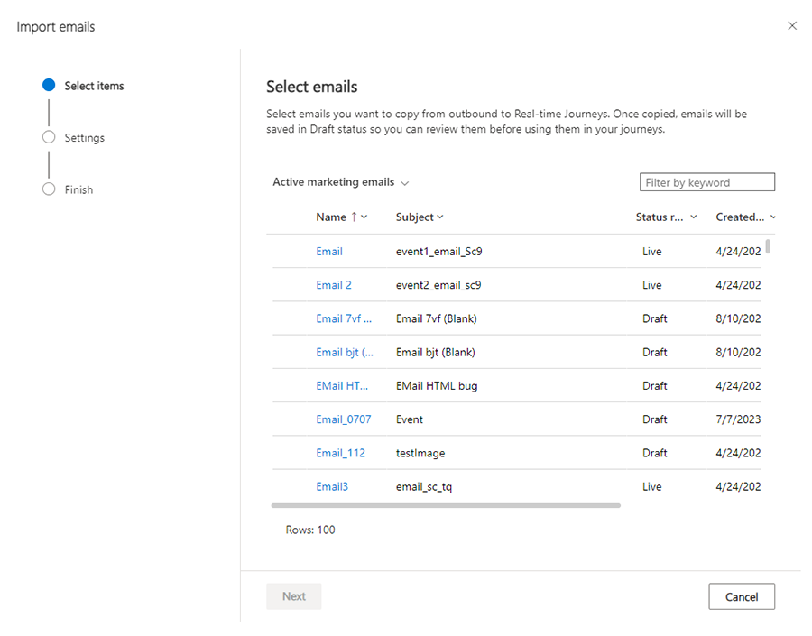

# Transition segments, emails, and journeys

[!INCLUDE [consolidated-sku-rtm-only](./includes/consolidated-sku-rtm-only.md)]

Segments, emails, and journeys are the most used components in Customer Insights - Journeys.

## Segments

You can use outbound marketing segments also in real-time journeys, however, it's recommended to rebuild the segments in real-time journeys for increased performance and smaller refresh cycles. There's no way to automatically create a real-time journeys segment from an outbound marketing segment, but it's possible to use [natural language and Copilot](real-time-marketing-natural-language-segments.md) to create a real-time journeys segment.

## Emails

It's not possible to use outbound marketing e-mails directly in real-time journeys. However, you can use the **Import emails** button in the real-time journeys email editor to select and transfer any outbound marketing emails you want to use.

> [!div class="mx-imgBorder"]
> 

Importing outbound marketing emails not only saves a lot of time, but also protects your investment in expensive designs and layouts. During the import, most of the functionality like personalization and content blocks is also transitioned. After the import, make sure to check to see if all settings and personalizations are correct. Also, you need to choose the right compliance settings for the email before you can go live and use the email in a journey.

While reviewing the imported emails, it's worth considering whether you should start using [brand profiles](brand-profiles.md). Brand profiles provide the ability to standardize content like links to your company’s LinkedIn in a similar manner that content settings do for outbound marketing.

## Journeys

Journeys in real-time journeys are the equivalent to customer journeys in outbound marketing. Journeys are the container that define the sequence of marketing actions that contacts are involved in. The underlying architecture for journeys in the real-time journeys module is fundamentally different from outbound marketing, which is why journeys can't be transferred automatically and manual recreation of the journey is required.

[!INCLUDE [footer-include](./includes/footer-banner.md)]